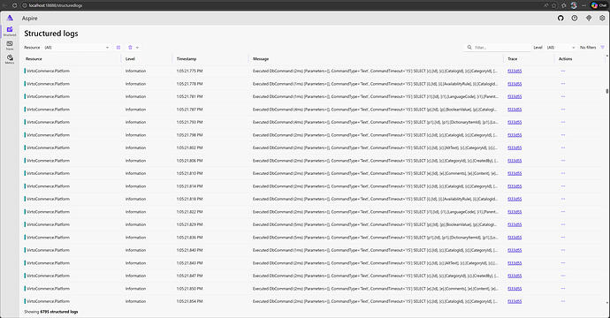

# Overview

The **Open Telemetry** module provides OpenTelemetry observability for Virto Commerce Platform (metrics, distributed tracing, and structured logging via OTLP exporter).

{: style="display: block; margin: 0 auto;" }

## Key features

- **Observability instrumentation**:

    <table border="1">
        <tr>
            <th>What is collected</th>
            <th>Source</th>
            <th>Description</th>
        </tr>
        <tr>
            <td rowspan="7">Metrics</td>
            <td>ASP.NET Core</td>
            <td>Request rate, duration, active connections.</td>
        </tr>
        <tr>
            <td>HTTP Client</td>
            <td>Outbound request duration and status.</td>
        </tr>
        <tr>
            <td>.NET Runtime</td>
            <td>GC, thread pool, memory.</td>
        </tr>
        <tr>
            <td>Process</td>
            <td>CPU, memory.</td>
        </tr>
        <tr>
            <td>EF Core</td>
            <td>Query counts and duration.</td>
        </tr>
        <tr>
            <td>Elasticsearch</td>
            <td>Transport-level metrics.</td>
        </tr>
        <tr>
            <td>Kestrel</td>
            <td>Connection and request metrics.</td>
        </tr>
        <tr>
            <td rowspan="6">Traces</td>
            <td>ASP.NET Core</td>
            <td>Incoming HTTP requests.</td>
        </tr>
        <tr>
            <td>HTTP Client</td>
            <td>Outbound HTTP calls.</td>
        </tr>
        <tr>
            <td>EF Core</td>
            <td>Database queries.</td>
        </tr>
        <tr>
            <td>Hangfire</td>
            <td>Background job execution.</td>
        </tr>
        <tr>
            <td>Elasticsearch</td>
            <td>Search and index operations.</td>
        </tr>
        <tr>
            <td>Redis</td>
            <td>Cache operations.</td>
        </tr>
    </table>

- **Logging**: Structured logs are forwarded to the OTLP endpoint via Serilog with trace/span ID fields for correlation with distributed traces.
- **Conditional activation**: Only enabled when explicitly configured.

The instrumentation table above maps to standard SRE metric taxonomies rather than a Virto-specific one: the ASP.NET Core and HTTP Client rows give RED signals (rate, errors, duration) for incoming and outgoing requests, and the .NET Runtime and Process rows give USE signals (utilization, saturation) for the host. There is no separate RED/USE dashboard; query the OTLP-exported metrics directly in your backend.

## Module structure

```
src/
└── VirtoCommerce.OpenTelemetry.Web/
    ├── Module.cs                                   # Module entry point
    ├── ServiceCollectionExtensions.cs              # OTel metrics and tracing registration
    ├── OpenTelemetryLoggerConfigurationService.cs  # Serilog → OTLP logging
    └── VirtoCommerce.OpenTelemetry.Web.csproj
```


## Prerequisites

* Virto Commerce Platform 3.1002.0 or higher.
* OTLP-compatible collector, for example:
    * [Grafana Alloy](https://grafana.com/docs/alloy/).
    * [OpenTelemetry Collector](https://opentelemetry.io/docs/collector/).
    * [Aspire Dashboard](https://learn.microsoft.com/en-us/dotnet/aspire/fundamentals/dashboard/overview).

## Installation

Copy the module to your platform **modules** directory. It will be automatically discovered and loaded by the Virto Commerce Platform.

## Configuration

Configure the **appsettings.json** file as follows:



## Viewing metrics in Prometheus and Grafana

The module exports metrics, traces, and logs over OTLP only. The Platform does not expose a native Prometheus scrape endpoint, so Prometheus and Grafana consume the data through a collector rather than scraping the Platform directly:

1. Point `OpenTelemetry:Endpoint` at an OTLP-capable collector, for example the OpenTelemetry Collector or Grafana Alloy.
1. In the collector, route each signal to your backend: metrics to Prometheus through the collector's Prometheus exporter, traces to a trace store such as Tempo, and logs to a log store such as Loki.
1. Query those backends from Grafana.

Metrics, traces, and logs from the Platform are now viewable in Prometheus and Grafana.

The exported metrics are infrastructure-level: request rate and duration, .NET runtime, process, database, and the other sources listed above. The module does not define custom business metrics, so application-level indicators are not emitted out of the box.

## Troubleshooting

| Problem | Solution |
|---------|----------|
| Module not activating | Verify `OpenTelemetry:Enabled` is `true` in configuration. |
| No data exported | Verify `OpenTelemetry:Endpoint` is set and the collector is reachable. |
| Traces missing correlations | Ensure the collector supports OTLP gRPC on the configured endpoint. |


<br>
<br>
********

<div style="display: flex; justify-content: space-between;">
    <a href="../including-module-data-in-backups">← Including module data in backups</a>
    <a href="../cms-integrations/cms-overview">CMS integrations  →</a>
</div>