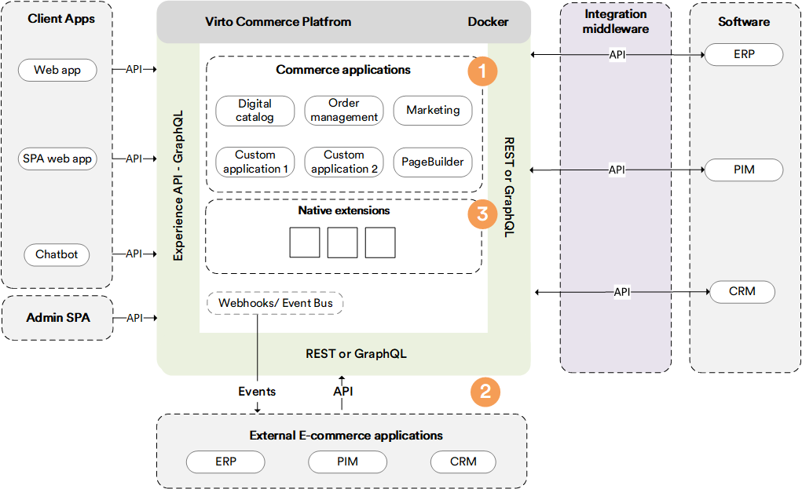
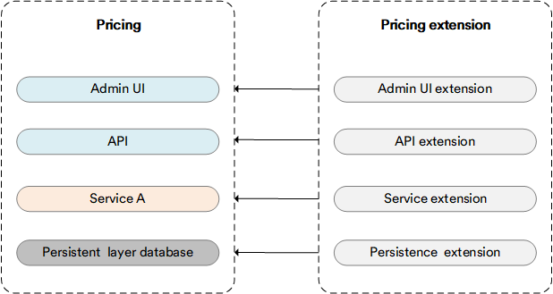
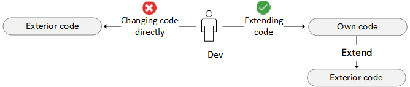
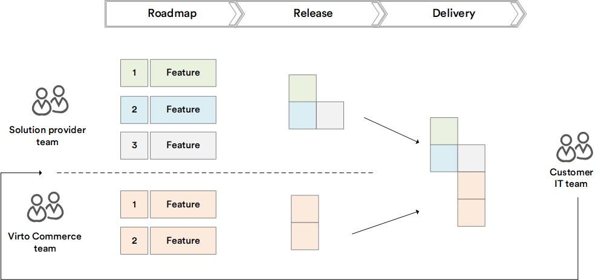

# Overview

Unlimited extensibility is an indisputable advantage of Virto Commerce. This means end-user solution developers can adapt or replace Virto Commerce modules with their own functionality. This adaptation can be done in an elegant and simple way without workarounds.

There are types of vendor-made extensions that guarantee 'seamless delivery'.  Virto Commerce, however, guarantees that these extensions are sufficient to build an e-commerce solution of any complexity on top of it:

* No-code extensions.
 
* API-based extensions. 
 
* Native extensions. 

## No-code extensions

Virto Commerce supports declarative extensions through the admin interface and API to extend the data model, UI, and workflow processing.

In particular, Virto Commerce supports:

* [Dynamic properties](../Fundamentals/Dynamic-Properties/overview.md): Extend entities, such as Cart, Order, Company, etc., with new properties.

* Statuses: Enable implementing any workflow.

* [Role-based security and permissions](../Fundamentals/Security/overview.md): Restrict access for a user (API) based on their role. For example, if you want a user to only be able to call the **Search products** API, you can achieve that. In a similar way, you can allow a user to have access to the **Orders** API for a specific store, only.

## API-based extensions

These are traditional cloud-based extensions based on API calls and events (hooks). With such extensions, you can use any language or framework for integration and reactive programming. 

Virto Commerce currently provides two types of API:

* [REST](https://virtostart-demo-admin.govirto.com/docs/index.html): Enables access to module business functionality, i.e. all CRUD operations and business logic are accessible via Rest API.

* [GraphQL](../GraphQL-Storefront-API-Reference-xAPI/index.md#graphql-core-ideas): A new generation of Business API for client applications, it provides you with additional capabilities. 

We also support two types of event providers:

* [Webhooks](../Fundamentals/Event-Driven-Development/webhooks.md): A good point for no development integration.
* [Event Bus](../Fundamentals/Event-Driven-Development/event-bus.md): Read for reactive programming and enterprise integrations.

## Native extensions

This is an advanced mode of modular extensions. It is called native because it is a way how Virto Commerce is built internally. 

Virto Commerce creates a unique extension framework based on .NET extension and dependency injection. It enables extending default implementation for the unique needs of each business.

Moreover, it simplifies DevOps processes and optimizes performance.

!!! warning
    Source code is available only for transparency purposes. Virto does not recommend extending the Platform through the source code, as it may breach the continuous delivery functionality.

With a custom module, you can extend every layer:

* Admin UI.
* API.
* Business Logic.
* Database.

!!! tip
    You can revert back to the original state by uninstalling the extension. 

For example, on the chart below, the Price module extension extends the default Virto Commerce Price module with the *Recommended price* property, with this new property being visible on every layer.

{: style="display: block; margin: 0 auto;" }

### Do not modify code you do not own

Despite the fact the Virto Platform is an open-source project, you should at all times avoid direct modification into the source code of modules developed by third parties or VC team. You also should always follow the **Open-Closed Principle** (open for extensions and closed for modifications).

{: style="display: block; margin: 0 auto;" }

Here are some benefits you get by following our **Extension concept** and using **Extensible points** our Platform provides for customizing your solution:

* **Seamless delivery:** If you don't have any modifications in the code you do not own, you will avoid merging hell during updates and be able to timely receive new fixes for bugs and security vulnerabilities, along with new functionality even for major updates. The Platform team makes every effort to simplify the updating process and not to introduce any breaking changes in new releases. This is a huge advantage, but it is only advantageous to you if you take action on the updates.

* **Easier support provision.** Virto's support team can easily reproduce your issues and quickly provide you with the right solutions and answers.

### Seamless delivery 

Usually, customization or extensibility means a complex update process. If you customize the default implementation, you need to support it by yourself. Getting updates from the vendor and redeveloping them to extend the functionality for the customers' needs becomes a time consuming task.

Here at Virto Commerce, we design the Platform with the **Keep up to date** and **Seamless delivery process** principles in mind:

Here are the basics of our seamless delivery strategy in action:

1. Virto Commerce has a flexible Price module. Let's assume you installed and use it as a binary package.
1. Your product owner asked you to display the `Recommended` price, as well as the `List` and `Sale` price.
Everything works properly, you just need to add a new property.
1. To achieve that, you create a new module called **Recommended Price Extension**, which extends current domain model, CRUD operations, and DB model.
1. Virto Commerce releases a new version of the Price module.
1. You install the new release of the Price module without modifying anything in the custom module.

This strategy allows you to receive updates and extend the default implementation.

!!! warning
    Seamless delivery works properly for all vendor updates, except for the cases when both you and your vendor use the same property name. Our recommendation for such cases is adding a custom prefix or suffix for your custom properties, e.g., `xxxStatus`, where `xxx` is the abbreviation for your solution. 
  
## Customization type comparison
The table below will help you understand the differences between various customization types, as well as the advantages and disadvantages of each:

| Type   	| Name             	| Purpose                                 	| When to use                                 	| Advantages                                     	| Disadvantages                     |
|--------	|------------------	|-----------------------------------------	|---------------------------------------------	|------------------------------------------------	|--------------------------------	|
| Native 	| Events           	| Customization                           	| React to status changes                     	| Synchronous performance                     	    | Base module is required           |
| Native 	| Extension points 	| Extend/ override default implementation 	| Extend default behavior                     	| Reuse VC features Painless update           	| Base module is required  Only extension   |
| Native 	| Custom points    	| Custom implementation                   	| Custom business logic                         |                                                	|                                   |
| API    	| Webhooks         	| Integration                             	| Trigger for another applications            	| Ready to use trigger for the 3rd party service 	| Performance                       |
| API    	| Events           	| Reactive programming                    	| React to status changes                     	| Asynchronous performance  Scalability   	    | Network latency                   |
| API    	| Messages         	| Integration                             	| Order processing and financial transactions 	| Transactions  Ready for price applications  	| Cost  Network latency          |

## Summary
+ Virto Commerce provides the best opportunities for customization. 
+ As a developer you can choose the best approach and balance between inside and outside integrations.
+ The Native approach simplifies the DevOps processes and optimizes performance, allowing you to reuse and improve Virto Commerce modules.
+ The API approach helps you to **glue** Virto Commerce's Platform into your e-commerce ecosystem. 
+ The open source principle enables developers to learn the code and fix issues.

 
 
********

    <a href="../../GraphQL-Storefront-API-Reference-xAPI">← GraphQL API overview </a>
    <a href="../key-extensibility-points">Key extensibility points  →</a>

