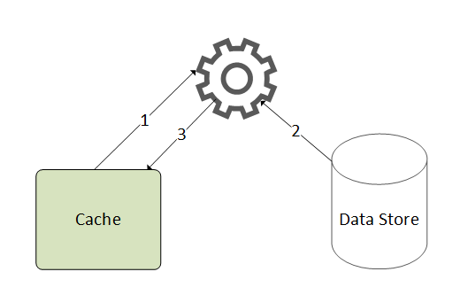

# Overview

Caching is one of the most effective ways to improve website performance. At Virto Commerce, we have used a number of different ways to cache application data to reduce the load on external services and the database, and to minimize application latency when processing API requests. This article describes the technical details and the best caching practices we use in our platform.

## Cache-aside pattern overview

We chose [Cache-Aside](https://docs.microsoft.com/en-us/azure/architecture/patterns/cache-aside) as the main pattern for all caching logic because it is very simple and straightforward to implement and test.  

The pattern enables applications to load data on demand:

1. When we need specific data, we first try to get it from the cache.
1. If the data is not in the cache, we get it from the source. 
1. Then the data is added to the cache. Next time, this data will be returned from the cache.



This pattern improves performance and also helps maintain consistency between the data held in the cache and data in the underlying storage.

For more information on why we do not use distributed cache and how we improved the performance of the B2B eCommerce platform in the platform code, read the [article](https://virtocommerce.medium.com/how-we-improved-the-performance-of-b2b-ecommerce-platform-by-data-caching-in-azure-cloud-71b27995066c).

## IMemoryCacheExtensions by Virto Commerce

[IMemoryCacheExtensions](https://github.com/VirtoCommerce/vc-platform/blob/master/src/VirtoCommerce.Platform.Core/Caching/MemoryCacheExtensions.cs) by Virto Commerce:

* Ensure that cached delegates (cache misses) are called only once, even if multiple threads access the cache concurrently under race conditions. 
* Provide a more compact syntax for client code.

The code with a our extension looks as follows:

``` csharp linenums="1" hl_lines="4 5 7"
  public object GetDataById(string objectId)
  {
      object data;
      var cacheKey = CacheKey.With(GetType(), nameof(GetDataById), id);
      var data = _memoryCache.GetOrCreateExclusive(cacheKey, cacheEntry =>
          {
            cacheEntry.AddExpirationToken(MyCacheRegion.CreateChangeToken()); 
            return this.GetObjectFromDatabase(objectId);
          });
      return data;
 }
```

### Cache key generation
`CacheKey` (line 4 in the above code), a special static class, provides a method for generating:

* Unique string cache keys according to the arguments, type, and method of the information being transferred:

    ``` csharp
    CacheKey.With(GetType(), nameof(GetDataById), "123"); /* => "TypeName:GetDataById-123" */
    ```

* Cache keys for complex object types. Most of the platform types are derived from the `Entity` or `ValueObject` classes. They implement the `ICacheKey` interface that contains the `GetCacheKey()` method. It can be used for cache key generation:

    ``` csharp
    class ComplexValueObject : ValueObject
    {
        public string Prop1 { get; set; }
        public string Prop2 { get; set; }
    }

    var valueObj = new ComplexValueObject { Prop1 = "Prop1Value", Prop2 = "Prop2Value" };
    var data = CacheKey.With(valueObj.GetCacheKey());
    //cacheKey will take the "Prop1Value-Prop2Value" value
    ```

### Thread-safe caching and avoiding race conditions
The `MemoryCache.GetOrCreateExclusive()` method (line 5 in the above code) calls a thread-safe caching extension. It guarantees that the cacheable delegate (cache miss) should run only once in a multiple thread race:

``` csharp 
 public void GetOrCreateExclusive()
        {
            var sut = new MemoryCache();
            int counter = 0;
            Parallel.ForEach(Enumerable.Range(1, 10), i =>
            {
               var item = sut.GetOrCreateExclusive("test-key", cacheEntry =>
                {
                    cacheEntry.SlidingExpiration = TimeSpan.FromSeconds(10);
                    return Interlocked.Increment(ref counter);
                });
               Console.Write($"{item} ");
            });
        }
```

This will output the following:

```
1 1 1 1 1 1 1 1 1 1
```

An asynchronous version of this extension method, `MemoryCache.GetOrCreateExclusiveAsync()`, is also available.

### Cache expiration and eviction

The `CancellationTokenSource` object (line 7 in the above code) is associated with the cache data and a strongly typed cache region. It allows multiple cache entries to be cleared as a group (see [ASP.NET Core Memory Cache Dependencies](https://docs.microsoft.com/en-us/aspnet/core/performance/caching/memory?view=aspnetcore-3.1#cache-dependencies)).

!!! warning
    We intentionally disable inheritance for cached entry expiration tokens and time-based expiration settings. If a cached entry is used to create another, the child will copy the expiration settings of the parent entry and cannot expire by manually removing or updating the parent entry. This leads to unpredictable side effects, and it is difficult to maintain and debug such cache dependencies.

We avoid manual control of the cached data lifetime in our code. The platform has a special `CachingOptions` object that contains the settings for **Absolute** or **Sliding** lifetimes for all cached data (see below).

We can always keep the cache updated and evict modified data from it explicitly thanks to the _Clean Architecture_ and the _Bounded_ contexts. Each boundary controls all read and change operations for the data belonging to the domain.

## Strongly typed cache regions

The platform supports the strongly typed cache regions construct. It is used:

* To control a set of cache keys. 
* To provide the tools to evict grouped or related data from the cache to keep the latter consistent. 

To define your own cache region, derive it from `CancellableCacheRegion<>`. Then use the `ExpireRegion` method to remove all keys within a single region:

``` csharp
  //Region definition
  public static class MyCacheRegion : CancellableCacheRegion<MyCacheRegion>
  {    
  }

  //Usage
  cacheEntry.AddExpirationToken(MyCacheRegion.CreateChangeToken()); 

  //Expire all data associated with the region
 MyCacheRegion.ExpireRegion();
```

A special `GlobalCacheRegion` can be used to expire all cached data of the entire application:

``` csharp
 //Expire all cached data for entire application
 GlobalCacheRegion.ExpireRegion();
```

## Caching null values

By default, the platform caches null values. If you choose to use negative caching, change this default behavior by passing the value `false` to `cacheNullValue` in the `GetOrCreateExclusive` method:

``` csharp
 var data = _memoryCache.GetOrCreateExclusive(cacheKey, cacheEntry => {}, cacheNullValue: false);
```

## Cache settings

{: width="25"} [Cache configuration](02-cache-configuration.md)

## Scaling

Running multiple platform instances, each with its own local cache, and which in turn must be consistent with the cache of other instances, can be challenging. Without solving this problem, each instance of the application will have inconsistent data, which will definitely frustrate Virto Commerce customers.

Read [this article by Virto Commerce](https://docs.virtocommerce.org/techniques/how-scale-out-platform-on-azure/) to learn how to configure the Redis service as a cache backplane to synchronize the local cache for multiple platform instances.

{: width="25"} [Caching in ASP.NET by Microsoft](https://docs.microsoft.com/en-us/aspnet/core/performance/caching/memory?view=aspnetcore-6.0)
    
{: width="25"} [Caching in Azure by Microsoft](https://docs.microsoft.com/en-us/azure/architecture/patterns/cache-aside)
    
{: width="25"} [Cache configuration by Virto Commerce](02-cache-configuration.md)
