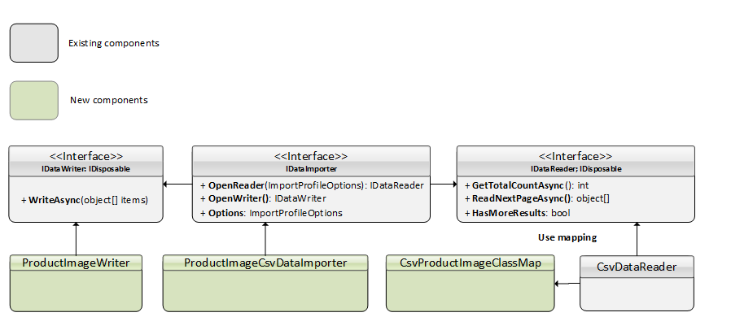

# Building Custom Data Importer

Follow the intructions below to build your own data importer of a specific type. They describe importing product images from a CSV file.

1. Сheck which components need to be implemented into a new importer:

    

1. Create a CSV file.

    Let's say you have a CSV file to import your data from with two columns:

    * `productId`
    * `img_url`

    In order to import multiple images for a single product, you need to use multiple rows with the same product ID.

    Since only CSV format is currently supported for out-of-the-box import, there are two options to solve the issue:

    * Create a CSV file in any preferred editor.
    * Use this sample:

        ``` title=".csv file"
        productId, img_url
        1, https://i.picsum.photos/id/537/200/300.jpg?hmac=LG3kZs5AdrMmsgeVOdrfP0C5KT3WmP-q5TauEZdR4vk
        1, https://i.picsum.photos/id/514/200/300.jpg?hmac=2SFAKrM0w5MkU7I_tQM9mq1m6POUDSPrTYu5tb5Sqlg
        ```

1. Custom CSV mapping to use with default CsvDataReader.

    There's no need to define any new custom reader because:

    * A built-in CsvDataReader is used to read the data from the CSV file.
    * It uses the [CsvHelper](https://joshclose.github.io/CsvHelper/) library to read and parse data.  

    Define `ClassMap` by creating a new file CsvProductImageClassMap.cs with the following content:

    ```cs title="CsvProductImageClassMap.cs"
    1 public class CsvProductImageClassMap : ClassMap<ProductImage>
    2    {
    3        public CsvProductImageClassMap()
    4        {
    5            Map(m => m.ProductId);
    6            Map(m => m.ImageUrl);
    7        }
    8    }
    ```

    This will map the class properties to the column headers of the CSV file. This example is identical to not using any class mapping at all when the headers match the property names.
    For more information, see [Class Maps](https://joshclose.github.io/CsvHelper/examples/configuration/class-maps/).

1. Define settings for custom importer. For any given import profile instance, each importer can provide settings that can be modified by the user. Define the settings that will be used by our importer in the ProductImageImporterSettings.cs file:

    ```cs title="ProductImageImporterSettings.cs"
    1 public class ProductImageImporterSettings
    2    {
    3        public static SettingDescriptor DebugSetting { get; } = new SettingDescriptor
    4        {
    5            Name = "Vcmp.Import.ProductImage.Debug",
    6            ValueType = SettingValueType.Boolean,
    7            GroupName = "Import",
    8            DefaultValue = false
    9        };
    10
    11        public static IEnumerable<SettingDescriptor> AllSettings
    12        {
    13            get
    14            {
    15                yield return DebugSetting;
    16            }
    17        }
    18    }
    ```

1. Create DataWriter in the new CsvProductImageWriter.cs file:

    ```cs title="CsvProductImageWriter.cs" linenums="1"
    public sealed class CsvProductImageWriter : IImportDataWriter
    {
            private readonly bool _debug;
            public CsvProductImageWriter(ImportContext context)
            {
                _debug = Convert.ToBoolean(context.ImportProfile.Settings.FirstOrDefault(x => x.Name == ProductImageImporterSettings.DebugSetting.Name)?.Value ?? false);
            }
            public Task WriteAsync(object[] items, ImportContext context)
            {
                var index = 0;
                try
                {
                    foreach (var image in items.OfType<ProductImage>())
                    {
                        var line = context.ProgressInfo.ProcessedCount + index;
                        //TODO: Add code for adding image to product
                    if (_debug)
                        {
                            Debug.WriteLine($"Line {line}: {image.ImageUrl} is added to product #{image.ProductId}");
                        }
                        index++;
                    }
                }
                catch (Exception ex)
                {
                    var errorInfo = new ErrorInfo
                    {
                        ErrorLine = context.ProgressInfo.ProcessedCount + index,
                        ErrorMessage = ex.Message,
                    };
                    context.ErrorCallback(errorInfo);
                }
                return Task.CompletedTask;
            }

            public void Dispose()
            {
                //nothing to dispose
            }
    }
    ```

    **Line 6** gets a value for setting from the profile. This setting value can be provided by user for the particular import profile instance.
        
    **Line 13** creates a loop between passed objects of the `ProductImage` type. Inside this loop, you can add a piece of code that saves the passed object within the system.
        
    **Line 31** notifies the one who runs the importer about any possible error when writing the data being imported  through `context.ErrorCallback`.

1. Create custom importer. This is the central object in the DataImport extension system, as the object of this type is called by the system for all import operations. To define a new importer, create CsvProductImageImporter with the following content:

    ```cs title="CsvProductImageImporter.cs" linenums="1"
    public sealed class CsvProductImageImporter : IDataImporter
    {
        private readonly IBlobStorageProvider _blobStorageProvider;
        public CsvProductImageImporter(IBlobStorageProvider blobStorageProvider)
        {
            _blobStorageProvider = blobStorageProvider;
        }
            /// <summary>
            /// Descrimiator
            /// </summary>
            public string TypeName { get; } = nameof(CsvProductImageImporter);

            /// <summary>
            /// Uses to pass some extra data fror importer to outside 
            /// </summary>
            public Dictionary<string, string> Metadata { get; private set; }

            /// <summary>
            /// Avail settings that importer exposes and allows to edit by users
            /// </summary>
            public SettingDescriptor[] AvailSettings { get; set; }

            public IImportDataReader OpenReader(ImportContext context)
            {
                if (string.IsNullOrEmpty(context.ImportProfile.ImportFileUrl))
                {
                    throw new OperationCanceledException($"Import file must be set");
                }
                var importStream = _blobStorageProvider.OpenRead(context.ImportProfile.ImportFileUrl);  

                return new CsvDataReader<ProductImage, CsvProductImageClassMap>(importStream, context);
            }

            public IImportDataWriter OpenWriter(ImportContext context)
            {
                return new CsvProductImageWriter(context);
            }
            public object Clone()
            {
                var result = MemberwiseClone() as CsvProductImageImporter;
                return result;
            }

    }
    ```

    **Lines 23 and 34** return both the reader and writer and get executed by the import process manager.

1. Register data importer by adding the following content to the module.cs file:

    ```cs title="module.cs" linenums="1"
    public void Initialize(IServiceCollection serviceCollection)
    {
    serviceCollection.AddTransient<CsvProductImageImporter>();
    }
    public void PostInitialize(IApplicationBuilder appBuilder)
    {
    var importerRegistrar = appBuilder.ApplicationServices.GetService<IDataImporterRegistrar>();
    importerRegistrar.Register<CsvProductImageImporter>(() => appBuilder.ApplicationServices.GetService<CsvProductImageImporter>())
                        .WithSettings(CsvSettings.AllSettings)
                        .WithSettings(ProductImageImporterSettings.AllSettings);
    }
    ```

    **Line 3** registers `CsvProductImageImporter` in the DI.
        
    **Line 8** registers `CsvProductImageImporter` in the global importer registry, so that the new importer may become available for import profile creation and for running the import process.

1. Run data importer:

    === "From the interface"
        
        To run data importer from the user interface as `ImportProfile` that has an assigned `CsvProductImageImporter`:

        1. Manually select a profile on the blade.
        1. Specify the file for import. The preview is availabe. 
        1. Manually start the import process and observe the progress. 
        1. Interrupt the import, if needed. 
        1. See the summary information at the end. 
        
        The user gets all the information on the current import process and can control it.

    === "Using API methods"

        To run data importer using API methods from the third-party code, for example, for integrations through LogicApps:
            
        1. Specifiy the profile to be used.
        1. Configure the path to the file. 
        1. Trigger the import on a schedule (with the set parameters). 
    
        The import is managed automatically without user input.
    
!!! note 
    VC supports CSV for out-of-the-box import. You can create your own file reader to use a different format.

{: width="25"} [ImportSampleModule](https://github.com/VirtoCommerce/vc-module-import/tree/dev/samples/VirtoCommerce.ImportSampleModule.Web)