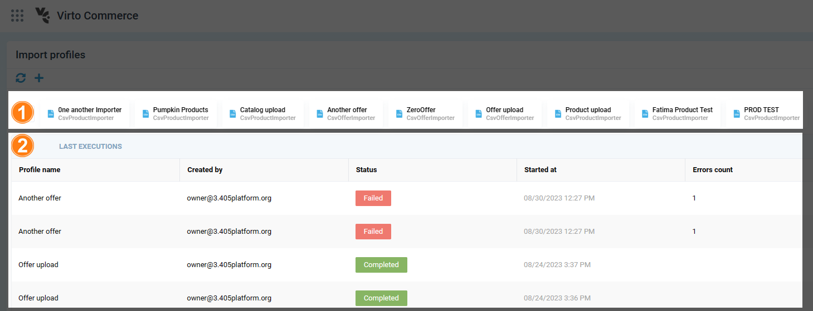
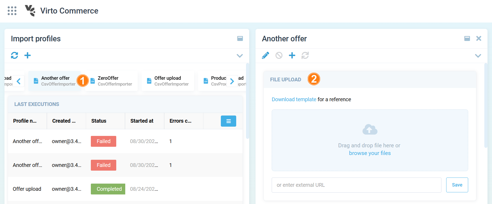
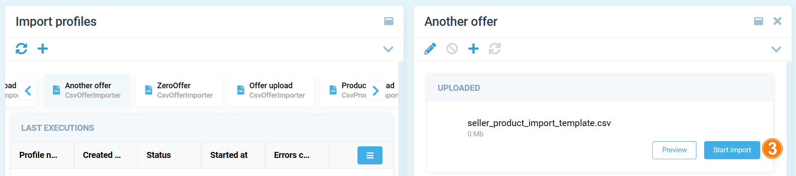
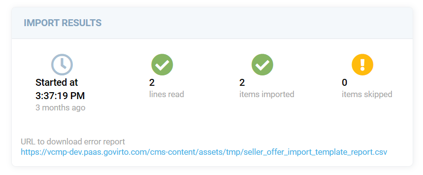

# Import App

The Import App is an application integrated into the work environment, offering users access to the main functionalities of the Import Module.

## Key capabilities

* Create and edit Import Profiles with flexible settings based on the data source format.
* Use files from the local workplace or download them via URL as data sources.
* Initiate an import job with detailed information available during execution, allowing users to interrupt the job.
* Re-run import jobs without changing parameters in case of issues.
* View import history for each profile.
* Download a template for the import file. 

    {: width="25"} [Instructions on developing your own importers](02-building-custom-importer.md)

* Access statistics on completed imports, including the count of records in the source, imported records, and errors.
* View detailed information about errors, with the option to download a file containing a list of errors for each record when using large data sources (if provided by the Importer developer).

## Access permissions

After installing the Import Module, users can switch to the Import App from the Applications menu.

The Import App does not provide the authorization tools to user, as it is an embedded Virto App. Authorization is inherited from the user's work environment.

To perform certain actions the user should be granted corresponding permissions:

| Actions                                     	| Permission                                      	|
|---------------------------------------------	|-------------------------------------------------	|
| Access Import App                           	| import:access                                   	|
| Create and edit import profiles permissions 	| import:create import:update import:delete 	|
| Access import history                       	| import:read                                     	|
| Start import from external sources          	| import:execute                                  	|

!!! note
    If launched from the VC Marketplace environment, the Import App provides access to work profiles and import history of the vendor to which the user belongs. 
    If launched from the VC Platform environment, the user can access work profiles and import history for groups in which they are a member with the Vendor Admin role. The developer can grant administrator access to the Import App group of another user if needed.

## User interface and work scenarios

When starting the Import App, the following tools are available to the user:

1. List of Profiles for import. Users can create new profiles based on the available Importers. Selection of an element from the list allows users to start importing with the chosen Profile.
1. Import run history. It displays a list of import operations. Selection of an element from the list provides detailed information about the launch.

To start importing:

1. Select a profile from the list. 
1. In the right blade, choose a data source for import. You can upload files from your computer or via URL. 

    

1. After uploading the file, click **Start import**.

    

Statistics and information on task completion are displayed in the blade or as Notifications in the application:

{: style="display: block; margin: 0 auto;" }

## Extend app

Import App is based on VC Shell and can be extended as a usual custom app. 
 
 
{: width="25"} [VC Shell extensibility](../../custom-apps-development/vc-shell/Extensibility/overview.md)
