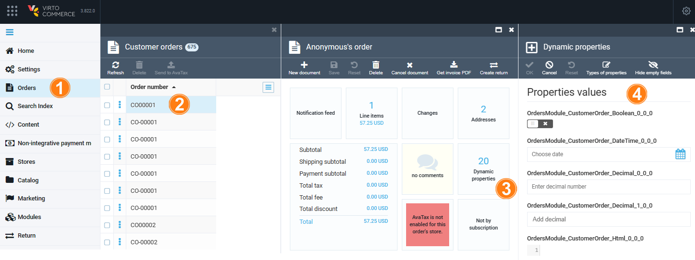

VirtoCommerce Platform enables adding new properties to entities at runtime. 

## Add New Dynamic Property for Existing Type from UI

To add a new dynamic property:

1. Open Platform and click **Dynamic properties** in the main menu. 
1. In the next blade, select the desired object type.
1. In the next blade, click **Add new property** in the toolbar.
1. Fill in the property name, its value type, display order, etc. Then enable the switches as follows:

    

1. Click **Create** to save the changes.

## Edit Object Values

The dynamic properties are edited via the **Dynamic properties** widget. For example, to edit dynamic properties of a specific order:

1. Open Platform and click **Orders** in the main menu.
1. In the next blade, select the desired order.
1. In the next blade, click on the dynamic properties widget.
1. The next blade lists the available properties to edit:

    

1. Click **OK** in the toolbar to save the changes.

