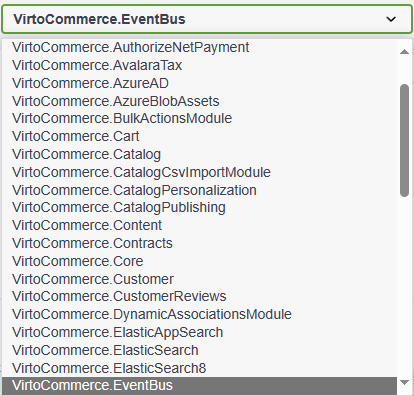

# Configure Event Translation

To configure event translation within the Event Bus module, you have two options:

* **Configuration options**: Configure translation settings via predefined options.
* **API Endpoints**: Use REST API endpoints to manage translation settings programmatically.

Both methods utilize the same data structures for options.

!!! note
    Accessing API endpoints requires [creating an API Key and granting permissions beforehand](https://virtocommerce.com/docs/latest/user-guide/security/#generate-api-key).


## Provider connections

Provider connections define links between provider types and connection options, enabling connections to various destinations:

```json title="appsettings.json"
"Auth": {
    "Name": "AzureEventGrid cloud",
    "ProviderName": "AzureEventGrid",
    "ConnectionOptionsSerialized": "{\"ConnectionString\": \"https://*.*.eventgrid.azure.net/api/events\", \"AccessKey\": \"kvpXffggvvMiNjBeBKdroX1r45UvZloXMwlM7i1TyqoiI=\"}"
}
```

This setting uses the following parameters:

| Node               | Default or Sample Value          | Description                                                                                        |
| ------------------ | ------------------------------   | -------------------------------------------------------------------------------------------------- |
| Name               | "AzureEventGrid cloud"           | A human-readable name to distinguish the authentication provider.                                  |
| ProviderName       | "AzureEventGrid"                 | The name of the authentication provider.                                                           |
| ConnectionOptionsSerialized |                         | Serialized connection options containing the URL and access key for the Azure Event Grid provider. |

### Management via configuration

To manage provider connections via configuration, add a connections array under the `EventBus:Connections` key. Connections configured in this way cannot be removed or updated via REST API.

If you have connections with the same name in the DB and in the configuration options, the one specified in the configuration options is preferred.

### Management via REST API

Access the [REST API endpoint](https://virtostart-demo-admin.govirto.com/docs/index.html) and select **VirtoCommerce.EventBus** from the dropdown list.

{: style="display: block; margin: 0 auto;" }

Use REST API functionality to:

* Search for connections: **POST /api/eventbus/connections/search**
* Get connections by name: **GET /api/eventbus/connections/{name}**
* Delete connection by name: **DELETE /api/eventbus/connections/{name}**
* Add new connection: **POST /api/eventbus/connections**
* Update connections: **PUT /api/eventbus/connections** 


## Subscriptions

Subscriptions define rules for capturing and forwarding events to a selected provider connection, with optional event body transformation:


```json title="appsettings.json"
{
  "ConnectionName": "AzureEventGrid",
  "Name": "Eventgrid forwarder",
  "JsonPathFilter": "$",
  "PayloadTransformationTemplate": "",
  "EventSettingsSerialized": null,
  "Events": [
      {
          "EventId": "VirtoCommerce.YourModule.Web.Events.NewCompanyRegistrationRequestEvent"
      }
  ]
}
```

This setting uses the following parameters:

| Node                           | Default or Sample Value                                         | Description                                                                                                    |
| ------------------------------ | -----------------------------------------                       | -------------------------------------------------------------------------------------------------------------- |
| Name                           | "New Order Notification"                                        | A human-readable name to distinguish the subscription.                                                          |
| ConnectionName                 | "AzureEventGrid"                                                | The name of the provider connection where the event data will be forwarded.                                     |
| JsonPathFilter                 | `$.eventType == 'order.created'`                                | A JSONPath filter expression to filter events based on their properties.                                          |
| PayloadTransformationTemplate  |                                                                 | A Scriban template to transform event data before forwarding it to the provider.                                  |
| EventSettingsSerialized        |                                                                 | Serialized metadata for the subscription, such as priority or additional settings specific to the provider.       |
| Events                         | Array of event full names (`"EventId"`) the subscription should catch | An array of event full names specifying the events the subscription will forward to the provider connection.     |

### Management via configuration

To manage subscriptions via configuration, add the subscription settings under the `EventBus:Subscriptions` key in the configuration file.

If there are conflicting subscriptions with the same name in both the database and configuration options, the configuration option is preferred.

### Management via REST API

Access the [REST API endpoint](https://virtostart-demo-admin.govirto.com/docs/index.html) and choose **VirtoCommerce.EventBus** from the dropdown list.

{: style="display: block; margin: 0 auto;" }

Use the REST API to perform the following actions:

* Search for subscriptions: **POST /api/eventbus/subscriptions/search**
* Get subscription by name: **GET /api/eventbus/subscriptions/{name}**
* Delete subscription by name: **DELETE /api/eventbus/subscriptions/{name}**
* Register new subscription: **POST /api/eventbus/subscriptions**
* Update existing subscription: **PUT /api/eventbus/subscriptions**

## Health status. Fail logs

To view the fail log:

1. Select **POST /api//eventbus/logs/search** from the menu.
1. Fill in the request body as follows: 

    ```json
    {
        "providerConnectionName": "string", // Optional. Pass to filter the log by provider connection
        "startCreatedDate": "2022-08-29T12:42:07.944Z", // Start date of event occurrence
        "endCreatedDate": "2022-08-29T12:42:07.944Z", // Start date of event occurrence
        "skip": 0, // errors to skip in paged loading
        "take": 0 // errors to take in paged loading
    }
    ```

1. Click **Execute** to receive the following response:
    
    ```json
    {
      "totalCount": 0,
      "results": [
        {
          "providerName": "string", // Provider connection name
          "status": 0, // Error status
          "errorMessage": "string", // Error message
          "createdDate": "2022-08-29T12:47:07.793Z", // Date of occurrence
        }
      ]
    }
    ```

Response records are always sorted by date of occurrence in descending order.

## Current list of events

To see the full list of the existing events to properly create a subscription:

1. Select **GET /api/eventbus/events** from the menu.
1. Request **/api/eventbus/events?skip=0&take=20**.
1. The response will be as follows:

    ```json
    [
      {
        "id": "VirtoCommerce.CatalogModule.Core.Events.ProductChangedEvent"
      },
    ...
    ]
    ```

## Destination providers. Azure Event grid

Destination Providers are integral components of the Event Bus module, enabling seamless communication and event delivery to various endpoints. Among these providers, the Azure Event Grid is a robust solution for real-time event processing and distribution. In this section, we explore the capabilities and configuration requirements of Azure Event Grid Provider.

[Azure Event Grid](https://azure.microsoft.com/en-us/services/event-grid/) can be used to push messages to Azure Functions, HTTP endpoints (webhooks), and some other Azure tools.

Azure Event Grid supports CloudEvents 1.0 and higher, while the Azure Event Grid client library also supports sending and receiving events in the form of CloudEvents.

The Event Bus module contains Azure Event Grid provider, which is ready to use. To connect to it, you need to define the provider connection with the `AzureEventGrid` provider name, and fill connection option data structure (the `ConnectionOptionsSerialized` field) with the following value:

```json
{
  "ConnectionString": "https://*.*.eventgrid.azure.net/api/events", 
  "AccessKey": "kvpXffggvvMiNjBeBKdroX1r45UvZloXMwlM7i1TyqoiI="
}
```

This setting uses the following parameters:

| Node                           |  Description                                      |
| ------------------------------ |  -------------------------------------------------|
| `connectionString`             |  String that defines the URI of the topic.        |
| `accessKey`                    |  String that is partially hidden on retrieval.    |

### Set up subscription to Azure Event Grid

To set up a subscription with Azure Event Grid:

1. Create a topic in the [Azure Portal](https://azure.microsoft.com/en-us/services/event-grid/). 
1. Set the input schema to `CloudEvents v1.0` in the **Advanced** tab. 
1. To allow Virto Commerce Platform to push messages to your topic, you need to provide an access key. You can find it in the Azure Portal after creating the topic in the **Access Keys** section.
1. Skip the **EventSettingsSerialized** option of the subscription as it is not used by this provider.

The subscription has been set.

### Handle errors

Event Grid ensures reliable delivery of messages by employing a durable delivery mechanism. Each message is guaranteed to be delivered at least once for every subscription. Events are promptly dispatched to the registered endpoint of each subscription. In case an endpoint fails to acknowledge the receipt of an event, Event Grid initiates retries to ensure successful delivery.

{: width="25"} [Event Grid. Delivery and Retry](https://docs.microsoft.com/en-us/azure/event-grid/delivery-and-retry)

### Default event data model for Azure Event Grid

You can specify the payload transformation via the Scriban-template with the `payloadTransformationTemplate` option. If you skip this option, the Event Grid provider will apply the following structure as a payload in the `CloudEvents` format:

```json
{​​​​​
    "ObjectId": "4038511b-604a-4031-9aba-775bbac43a39",
    "ObjectType": "VirtoCommerce.OrdersModule.Core.Model.CustomerOrder",
    "EventId": "VirtoCommerce.OrdersModule.Core.Events.OrderChangedEvent"
}
```

This setting uses the following parameters:

| Node                              |  Description                                      |
| ------------------------------    |  -------------------------------------------------|
| `ObjectId` ==String==             | Object unique Id.                                 |
| `ObjectType` ==String==           | Full name of a related object type.               |
| `EventId` ==String==              | Full name of the Event ID. Required.              |

The Event Grid provider discovers all objects related to the event being transferred and generates payloads for each of them.

#### Sample event in `CloudEvents` 1.0 JSON Format

```json
{​​​​​
  "id": "9ec0a767-5789-4149-83ea-bd227570e54a",
  "source": "399c9dda-aff9-4bd9-87b4-326dbe2815a9",
  "data": {​​​​​
    "ObjectId": "4038511b-604a-4031-9aba-775bbac43a39",
    "ObjectType": "VirtoCommerce.OrdersModule.Core.Model.CustomerOrder",
    "EventId": "VirtoCommerce.OrdersModule.Core.Events.OrderChangedEvent"
  }​​​​​,
  "type": "VirtoCommerce.OrdersModule.Core.Events.OrderChangedEvent",
  "time": "2021-02-26T08:45:57.3896153Z",
  "specversion": "1.0",
  "traceparent": "00-22fb7c5208a34c41811cca2715e8d71e-d856ef9e25234f41-00"
}​​​​​
```

## Send custom event from Virto Commerce

The module reads the list of the events from installed modules. If you want to send a new event, you need to create a new module and [raise a Virto Commerce event](https://virtocommerce.com/docs/latest/fundamentals/extensibility/extending-using-events/). After this, the event will be accessible via API, and you will be able to create a subscription.  

## Custom destination providers 

[Contact us if you need a new destination.](https://virtocommerce.com/contact-us)

## Examples

### Additional event filtering

Consider the subscription example below, forwarding the order changed event only if the state changed to specified:

```json
"Subscriptions": [
    {
        "ConnectionName": "AzureEventGrid",
        "Name": "Eventgrid forwarder",
        "JsonPathFilter": "$.ChangedEntries[?(@.NewEntry.Status == 'Processing' && @.OldEntry.Status != 'Processing')]",
        "Events": [
            {
                "EventId": "VirtoCommerce.OrdersModule.Core.Events.OrderChangedEvent"
            }
        ]
    }
]
```

Please note the `JsonPathFilter` expression above. The event data will be forwarded to the connection if the selection with the specified `JsonPathFilter` yields any value.

For example, any order transitioning to status `Processing` from any other non-processing state will trigger this subscription. In other words, the filter checks if the new status in the event body is `Processing` and the old status value is different.

You can construct more sophisticated expressions for event filtering. For learning JsonPath, refer to [Newtonsoft JsonNet documentation: Querying JSON with JSON Path](https://www.newtonsoft.com/json/help/html/QueryJsonSelectToken.htm).

### Payload transformation template

The transformation template allows you to customize the event data payload for your specific requirements. It is also useful for reducing the amount of transferred data.

Consider the following subscription example:

```json
"Subscriptions": [
    {
        "ConnectionName": "AzureEventGrid",
        "Name": "Eventgrid forwarder",
        "JsonPathFilter": "$.ChangedEntries[?(@.NewEntry.Status == 'Processing' && @.OldEntry.Status != 'Processing')]",
        "PayloadTransformationTemplate": "{ \"EventId\": \"{{ id }}\", \"OrderInfo\": [ {{for entry in changed_entries}} { \"NewStatus\": \"{{ entry.new_entry.status }}\", \"OldStatus\": \"{{ entry.old_entry.status }}\", \"Items\":[ {{for item in entry.new_entry.items}} { \"Name\": \"{{item.name}}\", \"Sku\": \"{{item.sku}}\" }, {{end}} ] }, {{end}} ] }",
        "Events": [
            {
                "EventId": "VirtoCommerce.OrdersModule.Core.Events.OrderChangedEvent"
            }
        ]
    }
]
```

In this example, the `PayloadTransformationTemplate` is set to a Scriban template. It generates a custom payload structure based on the event data.

The template extracts the old and new statuses of the changed order and lists item names and SKUs.

Here's the resulting payload after applying the template to the data in `OrderChangedEvent` for an order with 2 items:

```json
{
  "EventId": "f90bcd6b-e32b-4d53-9e32-69b9b7fef584",
  "OrderInfo": [
    {
      "NewStatus": "Processing",
      "OldStatus": "New",
      "Items": [
        {
          "Name": "Samsung Galaxy S6 SM-G920F 32GB, White Pearl, 1.5 GHz ARM Cortex A53 Quad-Core, 3, 32",
          "Sku": "IZZ-25623049"
        },
        {
          "Name": "Microsoft Lumia 640 XL RM-1065 8GB Dual SIM, Black, true, true, 1.2 GHz ARM Cortex A7 Quad-Core, 1, 8",
          "Sku": "UWT-27354339"
        }
      ]
    }
  ]
}
```

Only this selected payload will be sent to the provider, allowing for efficient data transfer and processing.

{: width="25"} [Scriban syntax](https://github.com/scriban/scriban/tree/master/doc)

{: width="25"} [Test your Scriban-template](https://scribanonline.azurewebsites.net)


<br>
<br>
********

<div style="display: flex; justify-content: space-between;">
    <a href="../event-bus">← Event Bus overview </a>
    <a href="../../Testing/testing">Testing →</a>
</div>
