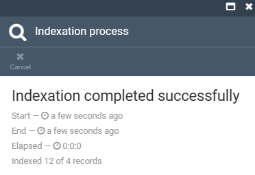
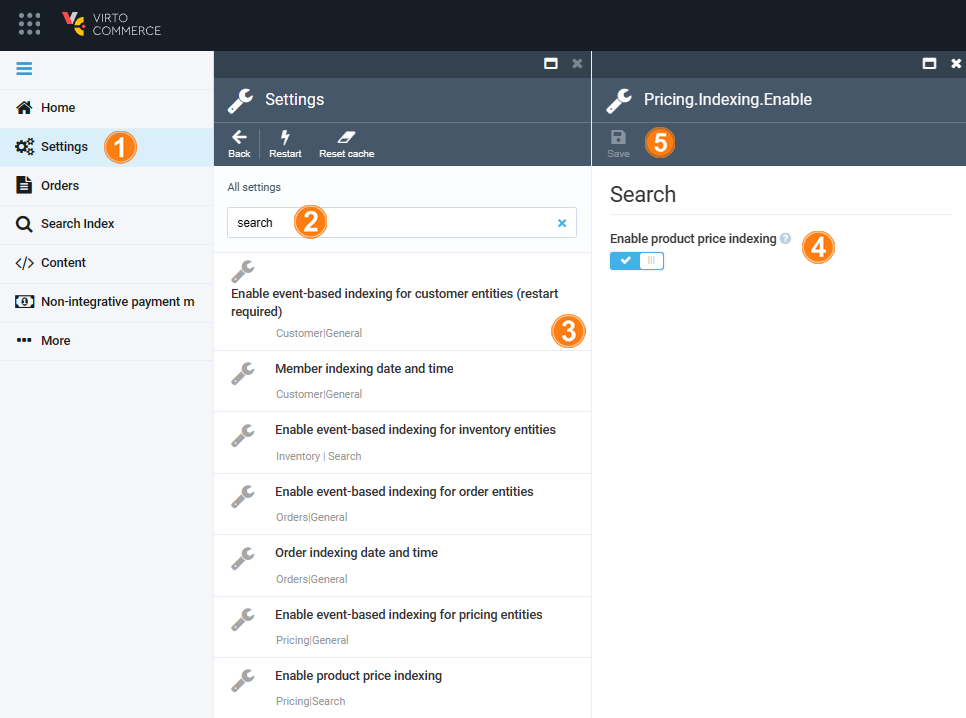

# Indexing via Platform Manager

To initiate the indexing process:

1. Click **Search Index** in the main menu.
1. The next blade displays:
    * The managed record types:
        * **Members**: Users or entities that have access to the platform.
        * **Content files**: Any type of digital content stored within the platform.
        * **Product**: The goods or services offered for sale within the Virto Commerce platform.
        * **Category**: Similar characteristics used to organize and classify products within the platform.
        * **Customer order**: Transactions where customers purchase products or services from the platform.

    * The search provider for each record type:
        * Elastic App Search.
        * Elasticsearch 8.
        * Lucene.
        * Elasticsearch.
        * Azure Cognitive Search.
        * Algolia.

        !!! note
            You can [tailor the search provider per document type](https://docs.virtocommerce.org/platform/developer-guide/Configuration-Reference/appsettingsjson/#search) to optimize search performance and functionality.

    * Last indexed date, record count, and scope if specified by the user:

    {: style="display: block; margin: 0 auto;" }

1. Check the required record types from the list.
1. Click **Build index** in the top toolbar.
1. In the popup window, choose how you want to update the search index. There are two options available:
    * **Build**: Index all data without recreating.
    * **Delete and build**: Delete the existing search index and build a new one from scratch. 
     
     
    {: width="25"} [Blue-green indexing](blue-green-indexing.md)
    
    !!! Note
        No search results will be available until the build process is over.

The next blade displays the result of indexation:

{: style="display: block; margin: 0 auto;" }

## Index document view

The Platform Manager allows you to preview index document data without writing any code:

1. Click **Catalog** in the main menu.
1. In the next blade, select the required store, then select the required product.
1. In the product blade, click on the index widget.
1. In the next blade you can preview a raw JSON data being used for the document that is stored in the index storage.

{: style="display: block; margin: 0 auto;" }

## Incremental index updates

Virto Commerce can update search indexes incrementally in the background by tracking entity changes and injecting changed entities into the index.

Various modules have their own jobs and settings. For example, the Catalog module has two types for incremental indexing:

* **Event-based**: Indexing is triggered when a product gets changed.
* **Time-based**: A background job checks and re-indexes modified objects every X minutes (5 by default). This type is disabled by default.

To disable/ enable event-based indexing:

1. Click **Settings** in the main menu.
1. In the next blade, type **Search** to find settings related to the module.
1. Select **Enable event-based indexing** for the required module.
1. In the next blade, switch the option to off or on.
1. Click **Save** in the top toolbar to save the changes.

{: style="display: block; margin: 0 auto;" }

Your settings have been saved.

