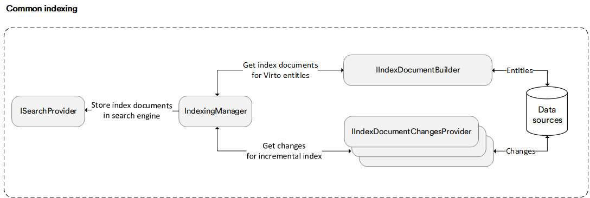

# Overview

Common Indexing is a search engine agnostic process for data indexation as illustrated by the chart below:

The indexing process involves several steps. The `IndexingManager`:

1. Starts the indexing process for each entity that falls within the scope of the requested document types.

1. Obtains a list of identifiers for entities that require indexing. This is achieved by running the `IIndexDocumentChangesProvider`, which retrieves the identifiers of entities that have changed since the last incremental indexing or all entities for a complete index rebuild.

1. Gets the resulting index documents for entity identifiers by calling `IIndexDocumentBuilder` instances.

1. Collects index documents and saves them in the search index storage through `ISearchProvider`.

The indexing features of Virto Commerce include:

* [Specialized UI and API in Platform Manager](indexing-in-platform-manager.md): Enable users to perform routine indexing tasks.

* **Index document enrichment**: Allows users to compose an index document from fields taken from multiple data sources.<!---(TODO: Link how to create a new indexer# Enrichment )-->

* **Custom indexers**: Enable developers to specify a data source and a search index (destination) for an indexer. Note that creating a custom indexer requires development efforts. However, the search engine agnostic capabilities allow the indexer to work with all search providers without any changes.<!---(TODO: Link how to create a new indexer)-->

* [Manual and incremental index updates](indexing-in-platform-manager.md#incremental-index-updates): Enable users to run indexers on demand or on a recurring basis. Virto Commerce updates search indexes periodically by adding or removing data entities that have changed in the Commerce Engine. Thanks to incremental index updates, the search engine updates the indexes with index documents based on new, changed, or deleted items in the data sources.<!---TODO: Link Incremental index updates-->

* [Blue-green indexing](blue-green-indexing.md): allows users to perform zero downtime upgrades of their index. This feature enables users to run full index rebuilds or long-time indexing tasks on other index instances and switch them to the published index that the production environment is connected to when these tasks are complete.

 
 
********

    <a href="../../search-query-syntax-reference">← Search query syntax</a>
    <a href="../indexing-in-platform-manager">Indexing in Platform manager →</a>

