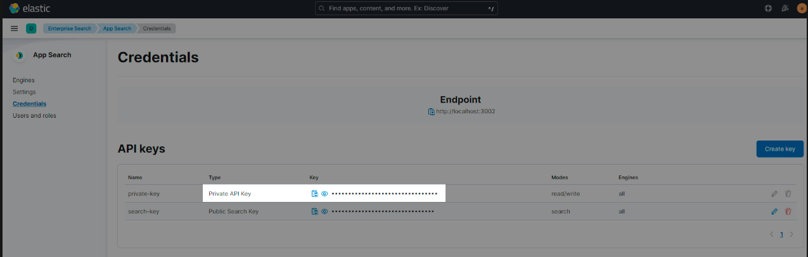
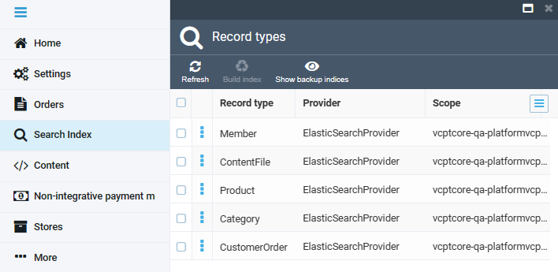

# Elastic App Search Configuration

This guide will explain how to configure and run Elastic App Search for your environment.

## Prerequisites

* Install the latest version of the Platform:
    * [On Windows.](../../../Getting-Started/Installation-Guide/windows.md)
    * [On Linux.](../../../Getting-Started/Installation-Guide/linux.md)
    * [On MacOS.](../../../Getting-Started/Installation-Guide/macOS.md)
* [Install the xAPI module.](../../../GraphQL-Storefront-API-Reference-xAPI/getting-started.md)
* Install the [Profile module.](https://github.com/VirtoCommerce/vc-module-profile-experience-api)
* Install [Node.js v.16.X.](https://nodejs.org/en/download/)
* Install [Yarn](https://classic.yarnpkg.com/lang/en/docs/install/#windows-stable) Package Manager by running `npm install --global yarn`.

## Set up Frontend Application 

Set up Virto Commerce Frontend Application as described [in this instruction](/storefront/developer-guide/latest/deployment)

## Set up Elastic App Search

This guide explores the process of setting up Elastic App Search, including:

* [Deploying it using Docker.](configuring-elastic-app-search.md#deploy-elastic-app-search-using-docker)
* [Configuring it within the Virto Platform.](configuring-elastic-app-search.md#set-up-elastic-app-search-on-platform)

### Deploy Elastic App Search using Docker

To deploy Elastic App Search using Docker: 

1. Install `Docker` for [Windows](https://docs.docker.com/desktop/install/windows-install/) or [Linux](https://www.docker.com/get-started/).

1. Install Elastic App Search container using **Docker-Compose** as follows:

    1. Create a directory and with a file named `.env` inside:

    ```
    STACK_VERSION=8.3.3
    ELASTIC_PASSWORD=!!!changeme!!!
    KIBANA_PASSWORD=!!!changeme!!!
    ES_PORT=9200
    CLUSTER_NAME=es-cluster
    LICENSE=basic
    MEM_LIMIT=1073741824
    KIBANA_PORT=5601
    ENTERPRISE_SEARCH_PORT=3002
    ENCRYPTION_KEYS=secret
    ```

    1. Create a strong password and place it instead of `!!!changeme!!!`.

    1. Create a file named **docker-compose.yml** and place it with the **.env file**:

    ??? "View code"
        ``` yaml
        version: "2.2"

        services:
                setup:
                    image: docker.elastic.co/elasticsearch/elasticsearch:${STACK_VERSION}
                    volumes:
                    - certs:/usr/share/elasticsearch/config/certs
                    user: "0"
                    command: >
                    bash -c '
                        if [ x${ELASTIC_PASSWORD} == x ]; then
                        echo "Set the ELASTIC_PASSWORD environment variable in the .env file";
                        exit 1;
                        elif [ x${KIBANA_PASSWORD} == x ]; then
                        echo "Set the KIBANA_PASSWORD environment variable in the .env file";
                        exit 1;
                        fi;
                        if [ ! -f certs/ca.zip ]; then
                        echo "Creating CA";
                        bin/elasticsearch-certutil ca --silent --pem -out config/certs/ca.zip;
                        unzip config/certs/ca.zip -d config/certs;
                        fi;
                        if [ ! -f certs/certs.zip ]; then
                        echo "Creating certs";
                        echo -ne \
                        "instances:\n"\
                        "  - name: es01\n"\
                        "    dns:\n"\
                        "      - es01\n"\
                        "      - localhost\n"\
                        "    ip:\n"\
                        "      - 127.0.0.1\n"\
                        > config/certs/instances.yml;
                        bin/elasticsearch-certutil cert --silent --pem -out config/certs/certs.zip --in config/certs/instances.yml --ca-cert config/certs/ca/ca.crt --ca-key config/certs/ca/ca.key;
                        unzip config/certs/certs.zip -d config/certs;
                        fi;
                        echo "Setting file permissions"
                        chown -R root:root config/certs;
                        find . -type d -exec chmod 750 \{\} \;;
                        find . -type f -exec chmod 640 \{\} \;;
                        echo "Waiting for Elasticsearch availability";
                        until curl -s --cacert config/certs/ca/ca.crt https://es01:9200 | grep -q "missing authentication credentials"; do sleep 30; done;
                        echo "Setting kibana_system password";
                        until curl -s -X POST --cacert config/certs/ca/ca.crt -u elastic:${ELASTIC_PASSWORD} -H "Content-Type: application/json" https://es01:9200/_security/user/kibana_system/_password -d "{\"password\":\"${KIBANA_PASSWORD}\"}" | grep -q "^{}"; do sleep 10; done;
                        echo "All done!";
                    '
                    healthcheck:
                    test: ["CMD-SHELL", "[ -f config/certs/es01/es01.crt ]"]
                    interval: 1s
                    timeout: 5s
                    retries: 120

                es01:
                    depends_on:
                    setup:
                        condition: service_healthy
                    image: docker.elastic.co/elasticsearch/elasticsearch:${STACK_VERSION}
                    volumes:
                    - certs:/usr/share/elasticsearch/config/certs
                    - esdata01:/usr/share/elasticsearch/data
                    ports:
                    - ${ES_PORT}:9200
                    environment:
                    - node.name=es01
                    - cluster.name=${CLUSTER_NAME}
                    - cluster.initial_master_nodes=es01
                    - ELASTIC_PASSWORD=${ELASTIC_PASSWORD}
                    - bootstrap.memory_lock=true
                    - xpack.security.enabled=true
                    - xpack.security.http.ssl.enabled=true
                    - xpack.security.http.ssl.key=certs/es01/es01.key
                    - xpack.security.http.ssl.certificate=certs/es01/es01.crt
                    - xpack.security.http.ssl.certificate_authorities=certs/ca/ca.crt
                    - xpack.security.http.ssl.verification_mode=certificate
                    - xpack.security.transport.ssl.enabled=true
                    - xpack.security.transport.ssl.key=certs/es01/es01.key
                    - xpack.security.transport.ssl.certificate=certs/es01/es01.crt
                    - xpack.security.transport.ssl.certificate_authorities=certs/ca/ca.crt
                    - xpack.security.transport.ssl.verification_mode=certificate
                    - xpack.license.self_generated.type=${LICENSE}
                    mem_limit: ${MEM_LIMIT}
                    ulimits:
                    memlock:
                        soft: -1
                        hard: -1
                    healthcheck:
                    test:
                        [
                            "CMD-SHELL",
                            "curl -s --cacert config/certs/ca/ca.crt https://localhost:9200 | grep -q 'missing authentication credentials'",
                        ]
                    interval: 10s
                    timeout: 10s
                    retries: 120

                kibana:
                    depends_on:
                    es01:
                        condition: service_healthy
                    image: docker.elastic.co/kibana/kibana:${STACK_VERSION}
                    volumes:
                    - certs:/usr/share/kibana/config/certs
                    - kibanadata:/usr/share/kibana/data
                    ports:
                    - ${KIBANA_PORT}:5601
                    environment:
                    - SERVERNAME=kibana
                    - ELASTICSEARCH_HOSTS=https://es01:9200
                    - ELASTICSEARCH_USERNAME=kibana_system
                    - ELASTICSEARCH_PASSWORD=${KIBANA_PASSWORD}
                    - ELASTICSEARCH_SSL_CERTIFICATEAUTHORITIES=config/certs/ca/ca.crt
                    - ENTERPRISESEARCH_HOST=http://enterprisesearch:${ENTERPRISE_SEARCH_PORT}
                    mem_limit: ${MEM_LIMIT}
                    healthcheck:
                    test:
                        [
                            "CMD-SHELL",
                            "curl -s -I http://localhost:5601 | grep -q 'HTTP/1.1 302 Found'",
                        ]
                    interval: 10s
                    timeout: 10s
                    retries: 120

                enterprisesearch:
                    depends_on:
                    es01:
                        condition: service_healthy
                    kibana:
                        condition: service_healthy
                    image: docker.elastic.co/enterprise-search/enterprise-search:${STACK_VERSION}
                    volumes:
                    - certs:/usr/share/enterprise-search/config/certs
                    - enterprisesearchdata:/usr/share/enterprise-search/config
                    ports:
                    - ${ENTERPRISE_SEARCH_PORT}:3002
                    environment:
                    - SERVERNAME=enterprisesearch
                    - secret_management.encryption_keys=[${ENCRYPTION_KEYS}]
                    - allow_es_settings_modification=true
                    - elasticsearch.host=https://es01:9200
                    - elasticsearch.username=elastic
                    - elasticsearch.password=${ELASTIC_PASSWORD}
                    - elasticsearch.ssl.enabled=true
                    - app_search.engine.total_fields.limit=128
                    - elasticsearch.ssl.certificate_authority=/usr/share/enterprise-search/config/certs/ca/ca.crt
                    - kibana.external_url=http://kibana:5601
                    mem_limit: ${MEM_LIMIT}
                    healthcheck:
                    test:
                        [
                            "CMD-SHELL",
                            "curl -s -I http://localhost:3002 | grep -q 'HTTP/1.1 302 Found'",
                        ]
                    interval: 10s
                    timeout: 10s
                    retries: 120

                volumes:
                certs:
                    driver: local
                enterprisesearchdata:
                    driver: local
                esdata01:
                    driver: local
                kibanadata:
                    driver: local
        ```

    !!! note
	    There are custom settings for `enterprisesearch` in the `.yml` file:
	 
        ```     
        app_search.engine.total_fields.limit=128
        ```
  
1. Bring up the Elastic cluster with the following command (run it from the directory containing the **.yml file**):
  
    ```
    docker-compose up
    ``` 
    
1. Access Kibana at http://localhost:5601. 
1. Log in as `elastic` for username, your password being the value you provided for ELASTIC_PASSWORD in your **.env file**. 
1. Access Elasticsearch at http://localhost:9200.

{: width="25"} [Deploying Elastic App Search with Docker](https://www.elastic.co/guide/en/enterprise-search/8.3/docker.html)

### Set up Elastic App Search on Platform

To install Elastic App Search on Virto Commerce Platform:

1. Install the [Elastic App Search](https://github.com/VirtoCommerce/vc-module-elastic-app-search) module.
1. Modify the Platform configuration to use Elastic App Search:

    ```json title="appsettings.json"
    "Search": {
        "Provider": "ElasticAppSearch",
        "Scope": "default",
        "ElasticAppSearch": {
            "Endpoint": "https://localhost:3002",
            "PrivateApiKey": "private-key"
        }
    }
    ```

1. Open **Kibana** (localhost:5601).
1. Go to **Enterprise Search** --> **Open App Search** --> **Credentials**.
1. Copy **Private Key**, and assign it to the `PrivateApiKey` setting:

    

1. Run Platform and build the indexes. You will see **ElasticAppSearch** as a **Provider**: 

    

1. Go back to **Kibana** and confirm that engines (indexes) are created:

    

## Run Virto Commerce Frontend Application

1. Navigate to the Frontend Application root directory:

1. Build and run the Frontend Application application:

    ```bash
    dotnet run
    ```


<br>
<br>
********

<div style="display: flex; justify-content: space-between;">
    <a href="../elastic-app-search-overview">← Elastic App Search overview</a>
    <a href="../using-analytics">Using analytics →</a>
</div>