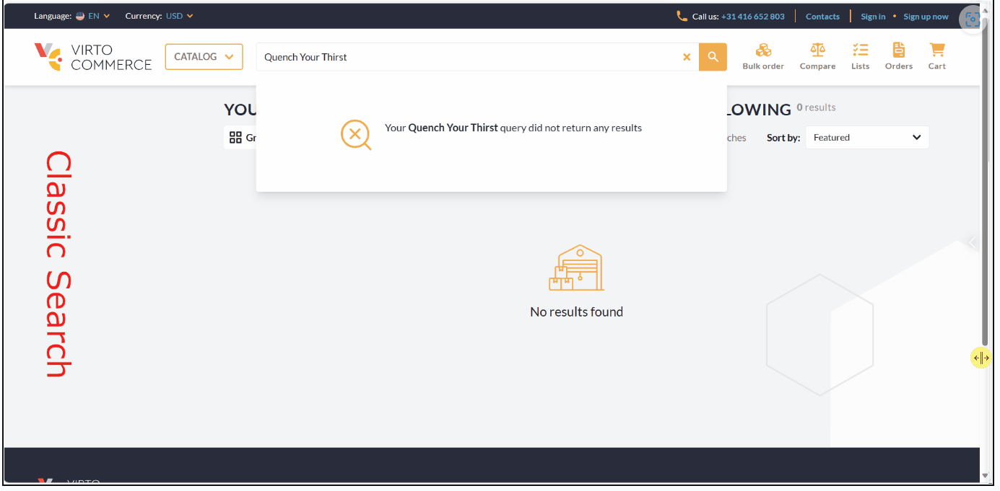
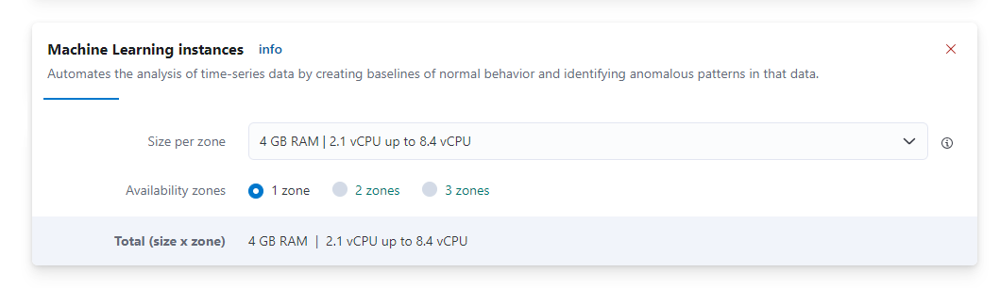
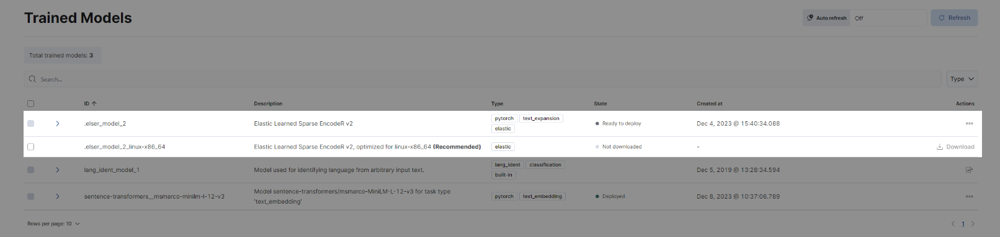
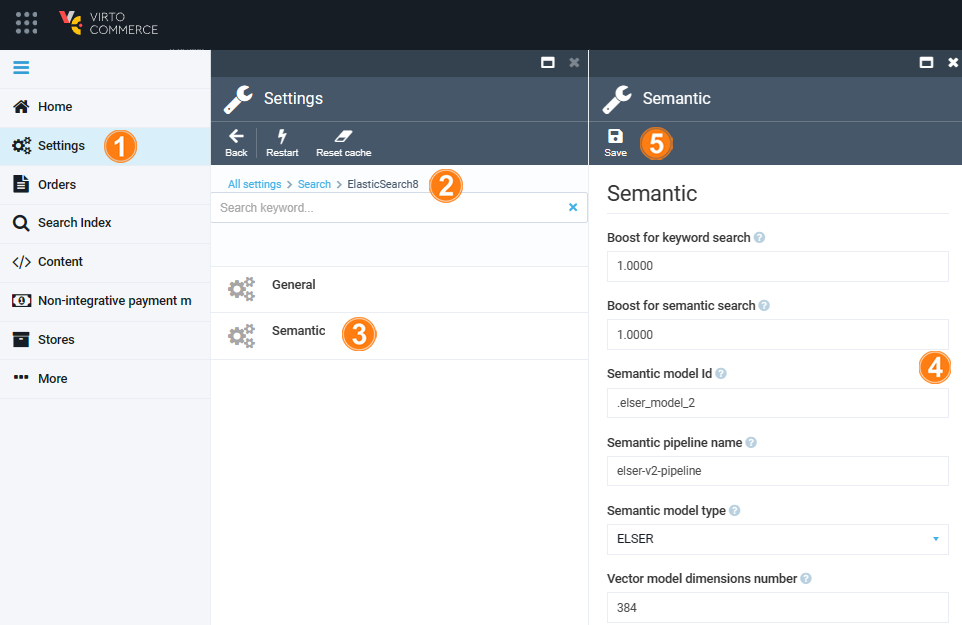
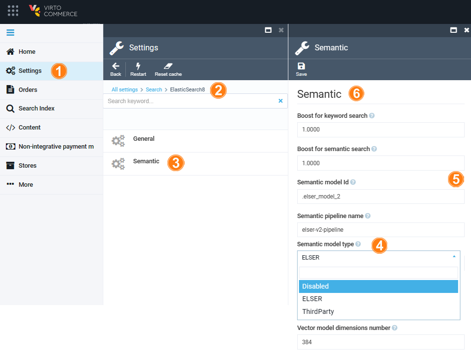

# Semantic Search 

Semantic search is a search method that helps you find data based on the intent and contextual meaning of a search query, instead of a match on query terms (lexical search).



Elasticsearch provides semantic search capabilities using natural language processing (NLP) and vector search. Deploying an NLP model to Elasticsearch enables it to extract text embeddings out of text. Embeddings are vectors that provide a numeric representation of a text. Pieces of content with similar meaning have similar representations.

Examples below compare classic and semantic search for the same query: **Quench Your Thirst**.


## NLP models

Elasticsearch offers the usage of a wide range of NLP models, including both dense and sparse vector models. Your choice of the language model is critical for implementing semantic search successfully. 

By default, we recommend using ELSER model. Elastic Learned Sparse EncodeR (ELSER) - is an NLP model trained by Elastic that enables you to perform semantic search by using sparse vector representation.


## Semantic search and ELSER model setup

Setting up semantic search and ELSER model includes the following steps:

1. [Enabling machine learning instances](semantic-search.md#enable-machine-learning-instances)
1. [Activating machine-learning model](semantic-search.md#activate-machine-learning-model)
1. [Configuring pipeline ingester](semantic-search.md#configure-pipeline-ingester)
1. [Reindexing](semantic-search.md#reindex)

### Prerequisites

* **Elastic Cloud 8.9** or higher should be deployed and configured

### Enable machine learning instances

After deploying the Elastic Cloud, enable machine learning capabilities:

1. Open the [deployments page](https://cloud.elastic.co/home).
1. In your deployment list, click **Manage**. 
1. Click **Actions**, then **Edit Deployment**. 
1. Find **Machine Learning instances** and click **Add Capacity: 4 GB RAM, 1 zone**.

    

1. Click **Save** and wait till configuration apply.

The machine learning has been enabled.

### Activate machine learning model

To activate Machine trained model:

1. Open **Kibana**.
1. In your deployment, go to **Analytics** --> **Machine learning** --> **Trained models**.
1. Find **.elser_model_2** and click **Download**. There are two versions available: one version which runs on any hardware and one version which is `linux-x86_64` optimized. You can see which model is recommended for your cluster's hardware configuration:

    

1. After the download is finished, start the deployment by clicking the Start deployment button.
1. Provide deployment ID, select the priority, set the number of allocations and threads per allocation:

    

1. Click **Start**.

### Configure pipeline ingester

To implement the ELSER v2 model:

1. Go to **Management** --> **Dev Tools**.
1. Create an ingest pipeline with an inference processor to use ELSER to infer against the data that is being ingested in the pipeline:

    ```json
    PUT _ingest/pipeline/elser-v2-pipeline
    {
    "processors": [
        {
        "script": {
            "source": "ctx['__content'] = ctx['__content'].join('. ')" // Merge content fields into one
        }
        },
        {
        "inference": {
            "model_id": ".elser_model_2", // TODO: Replace with your model_id
            "ignore_failure": false,
            "input_output": [ 
            {
                "input_field": "__content", // TODO: Replace with your actual field
                "output_field": "__ml.tokens"
            }
            ]
        }
        }
    ]
    }
    ```

1. To configure different field for a different document type, create a pipeline for each index with if condition inside it:

    ```json
    PUT _ingest/pipeline/elser-v2-pipeline
    {
    "processors": [
        {
        "script": {
            "source": "ctx['__content'] = ctx['__content'].join('. ')"
        }
        },
        {
        "inference": {
            "if": "ctx['_index'] == 'default-product'", // TODO: Replace with your actual index name
            "model_id": ".elser_model_2_virtostart",
            "ignore_failure": false,
            "input_output": [ 
            {
                "input_field": "semantic_description", // TODO: Replace with your actual field
                "output_field": "__ml.tokens"
            }
            ]
        }
        },
        {
        "inference": {
            "if": "ctx['_index'] == 'default-customerorder'", // TODO: Replace with your actual index name
            "model_id": ".elser_model_2_virtostart",
            "ignore_failure": false,
            "input_output": [ 
            {
                "input_field": "__content", // TODO: Replace with your actual field
                "output_field": "__ml.tokens"
            }
            ]
        }
        }
    ]
    }
    ```

### Reindex

To reindex data, open Platform:

1. Click **Settings** in the main menu.
1. In the next blade, type **ElasticSearch8** to find settings related to the module.
1. Click **Semantic**.
1. In the next blade, fill in the fields. Make sure that semantic model ID, semantic field name, and pipeline name are the same as above.
1. Click **Save** in the top toolbar to save the settings.

    


1. Go to **Search Index** and [rebuild](../indexing/indexing-in-platform-manager.md) them.

After the indexation is finished, you can use semantic search.

## Semantic search and third-party ML model setup

Setting up semantic search and integrating a third-party ML model includes the following steps:

1. [Selecting text embedding model.](semantic-search.md#select-text-embedding-model)
1. [Adding trained model.](semantic-search.md#add-trained-model)
1. [Deploying trained model](semantic-search.md#deploy-trained-model)
1. [Configuring pipeline ingester](semantic-search.md#configure-pipeline-ingester-1)
1. [Reindexing](semantic-search.md#reindex-1)

### Select text embedding model

Select a **text embedding model** from the [third-party model reference list](https://www.elastic.co/guide/en/machine-learning/8.12/ml-nlp-model-ref.html).

### Add trained model

To add a trained model:

1. Install the Eland Python Client. Eland can be installed with [pip](https://pypi.org/project/pip/):

    ```cmd
    pip install eland
    ```

1. Import your third-party model. Follow the instructions on importing compatible third-party models:

    ```cmd
    eland_import_hub_model --cloud-id <cloud-id> -u <username> -p <password> --hub-model-id <model-id> --task-type text_embedding
    ```

!!! note
    For demo purpose, you can use [sentence-transformers/msmarco-MiniLM-L-12-v3](https://huggingface.co/sentence-transformers/msmarco-MiniLM-L-12-v3) model.

{: width="25"} [Import models with Eland](https://www.elastic.co/guide/en/machine-learning/8.12/ml-nlp-import-model.html)

### Deploy trained model

To deploy a trained model:

1. Go to **Machine Learning** --> **Model Management** --> **Trained Models section**.
1. Click **Start deployment** in the table row containing your new model to deploy and use it.

### Configure pipeline ingester

To create the pipeline similar to ELSER model (`__ml` property is predefined in the Elastic8 provider now):

  ```
  PUT _ingest/pipeline/my-text-embeddings-pipeline
  {
    "processors": [
      {
        "inference": {
          "model_id": "sentence-transformers__msmarco-minilm-l-12-v3",
          "target_field": "__ml",
          "ignore_failure": true,
          "field_map": {
            "name": "text_field"
          }
        }
      }
    ]
  }
  ```

### Reindex

To reindex data, open Platform:

1. Click **Settings** in the main menu.
1. In the next blade, type **ElasticSearch8** to find settings related to the module.
1. Click **Semantic**.
1. In the next blade, select **ThirdParty** model type from a dropdown list.
1. Fill in the required fields. Make sure that semantic model ID, semantic field name, and pipeline name are the same as above.
1. Click **Save** in the top toolbar to save the settings.

    

1. Go to **Search Index** and [rebuild](../indexing/indexing-in-platform-manager.md) them.

After the indexation is finished, you can use semantic search.

!!! note
    Depending on the number of dimensions of your model you might need to adjust Semantic Vector Model Dimensions settings.

## Use explain API

The Elastic provides an explain API that computes a score explanation for a query and a specific document. This can give useful feedback whether a document matches a specific query or not.

This provided script serves as a versatile tool for testing and exploring the capabilities of Elasticsearch, specifically tailored for a Virto Commerce Elastic Search 8 release. It combines several features to demonstrate querying and scoring mechanisms.

| Query Parameter | Description                                                                                                                                                         |
|-----------------|---------------------------------------------------------------------------------------------------------------------------------------------------------------------|
| `explain`       | This parameter instructs Elasticsearch to compute a score explanation for each document,<br>providing insight into how well each document matches the query.           |
| `track_total_hits` | Ensures that the total number of hits for the query is accurately tracked.                                                                                       |
| `min_score`     | Specifies the minimum score a document must have to be considered a match. <br>Documents with scores below this threshold will not be included in the results.          |
| `size`          | Specifies the number of documents to return in the results.                                                                                                         |
| `_source`       | Specifies the fields to be included in the result set. In this case, the name, <br>code, score, and description of each document.                                       |
| `boost`         | Applies a boost factor to both the text expansion and multi-match conditions. <br>Boosting allows emphasizing certain conditions over others, influencing the final score. |


```json
POST default-product/_search
{
  "explain": true,
  "track_total_hits": true,
  "min_score": 0.2,
  
  "size": 10, 
  "_source": ["name", "code", "_score"], // Replace with your actual fields
  
  "query":{
    "bool": {
      "filter": [ // Replace with your actual filters
        {
          "term": {
            "__outline": "fc596540864a41bf8ab78734ee7353a3/e55de15e-ff39-4b05-bc7e-c57aede725f5"
          }
        }       ], 
        "should": [
          {
            "text_expansion":{
              "__ml.tokens":{
                "model_id": ".elser_model_2_virtostart", // model_id
                "model_text": "Cat",  // Replace with your query
                "boost": 1
              }
            }
          },
          {
            "multi_match": {
              "query": "Cat", // Replace with your query
              "fields": ["__content"],  
              "analyzer": "standard",
              "operator": "and",
              "boost": 1
            }
          }
          ]
    }
  }
}

```

## Optimize performance

The tokens generated by ELSER must be indexed for use in the `text_expansion` query. However, it is not necessary to retain those terms in the document source.

You can save disk space by using the source exclude mapping to remove the ELSER terms from the document source.

{: width="25"} [Saving disk space by excluding the ELSER tokens from document source](https://www.elastic.co/guide/en/elasticsearch/reference/current/semantic-search-elser.html#optimization)


<br>
<br>
********

<div style="display: flex; justify-content: space-between;">
    <a href="../elastic-search-8">← Elasticsearch 8 overview</a>
    <a href="../elastic-app-search-overview">Elastic App Search →</a>
</div>