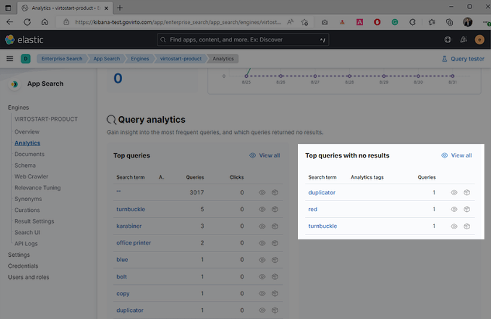
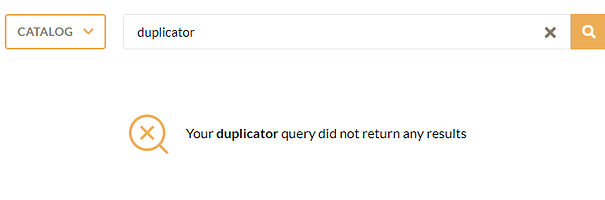
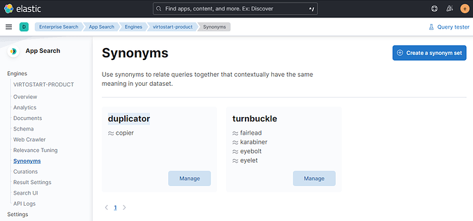
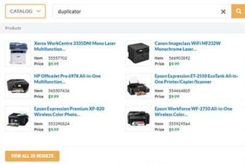
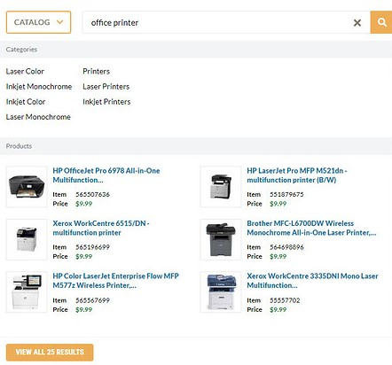

# Use Analytics

Every time a customer searches for something on your website, they provide your business with valuable information about what they are looking for.

To view analytics:

1. Use Kibana and open  **Enterprise Search**  -->  **App Search**  -->  **Engines**:

	

	By default, Virto Commerce adds five engines: **Product**, **Category**, **CustomerOrder**, **ContentFile**, and **Member**.

1. Let's explore the **Product** section. Click **Overview** to find basic information on product queries and API requests per day:

	

1. Click **Analytics** to dive into customer experience and query data: 

	

	Out-of-the-box data collection, metrics, and visualizations on search keywords give you all you need to glean insights from the user behavior:

	

## Improve search relevance

With Elastic App Search, you can make relevance and tune adjustments, or promote/demote results based on your findings in a few clicks, right from the management interface using:

*  [Synonyms.](elastic-app-search-overview.md#synonyms)
*  [Curations.](elastic-app-search-overview.md#curations)
*  [Relevance tuning.](elastic-app-search-overview.md#relevance-tuning)

### Synonyms

Sometimes, users use different terminology than your context might expect. In the **Top queries with no results** section, you can find query results:

For example, your customers might search for a **duplicator** in the Frontend Application, but don't find any matching product:

It is a common mistake that may lead to poor search relevance and can be avoided using the Synonyms feature. The Synonym feature builds  **synonym sets** containing two or more queries that have similar meanings. Each synonym set can contain up to 32 words. 

To manage synonyms via the App Search dashboard:

1. Go to **Synonyms**
1. Click  **Create a synonym set** and add a synonym set:

	

1. Click **Save** to apply the synonym set.

Now, if your customers search for a **duplicator**, they see the appropriate product set:

Configuring  **Synonyms**  is a useful way to guide your users to the most relevant content. It is most efficient when you know the precise terms they are searching for. For that, explore the **Analytics** section.

For even more precise and curated results, explore the **Curations** section.

### Curations

Curations allow search operators to customize search results for specific queries.

For example, you can use promoted products to ensure that the specified products always match a query and receive the highest relevance scores. Imagine an ecommerce store with featured product results.

Similarly, use **hidden documents** to exclude particular products from the results.

Here is how you can boost product search score for **office printer** search query.

To manage curations using Kibana:

1. Go to  **Enterprise Search** --> **App Search** --> **Engines** --> **product_  engine** --> **Curations**.
1. Add a curation for **office printer**.
1. In our example, we promote two products: **565507636 - HP OfficeJet Pro 6978 All-in-One Multifunction** and **551879675 - HP LaserJet Pro MFP M521dn - multifunction printer (B/W)**:

	

1. Click **Save** to apply the curation:

	

!!! note
	Currently, Elastic App Search offers an upgrade to the ***Platinum*** subscription to harness the power of machine learning. By analyzing your engine’s analytics, App Search is able to suggest new or updated curations. This way, you can effortlessly help your users find exactly what they are looking for.

For even more advanced results, refer to the **Relevance Tuning** section.

### Relevance tuning

Out of the box, App Search provides quality search relevance.

Built on top of Elasticsearch, App Search is a managed, the expertly crafted distillation of its finest points. It provides tools to help you further tune the search experience to optimize for your own needs.

{: width="25"} [Relevance tuning guide](https://www.elastic.co/guide/en/app-search/8.3/relevance-tuning-guide.html)
