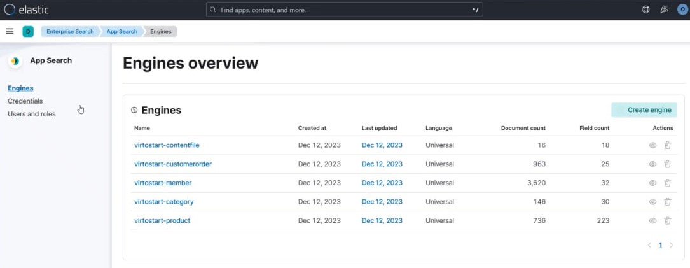
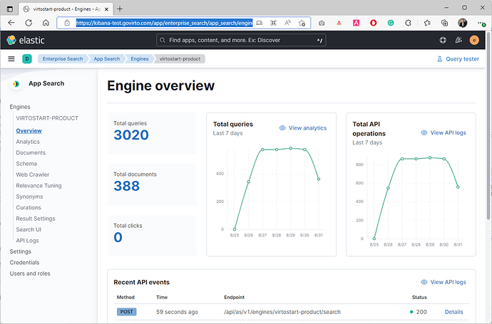
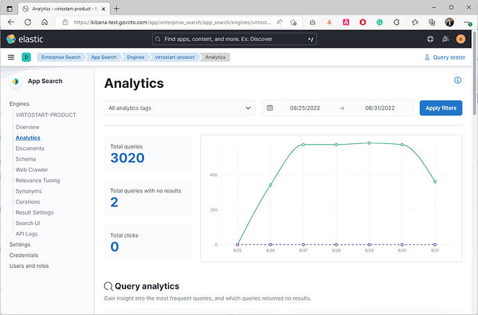
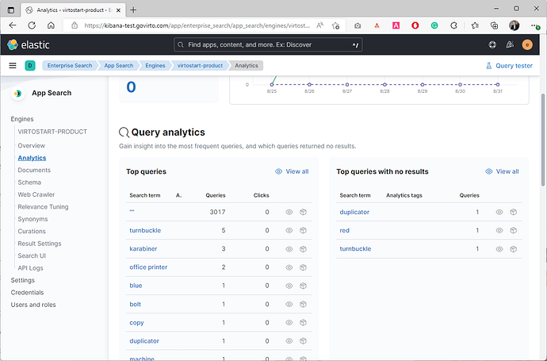

# Use Analytics

Every time a customer searches for something on your website, they provide your business with valuable information about what they are looking for.

To view analytics:

1. Click {: width="25"} in the top left corner of the Platform.
1. Select  **App Search**

	

1. The **App Search** application opens in the new window. Select **Engines** in the left menu:

	

	By default, Virto Commerce adds five engines: **Product**, **Category**, **CustomerOrder**, **ContentFile**, and **Member**.

1. Let's explore the **Product** section. Click **Overview** to find basic information on product queries and API requests per day:

	

1. Click **Analytics** to dive into customer experience and query data: 

	

	Out-of-the-box data collection, metrics, and visualizations on search keywords give you all you need to glean insights from the user behavior:

	

 
 
********

    <a href="../configuring-elastic-app-search">← Elastic App Search configuration</a>
    <a href="../search_relevance_tuning">Improve search relevance →</a>

