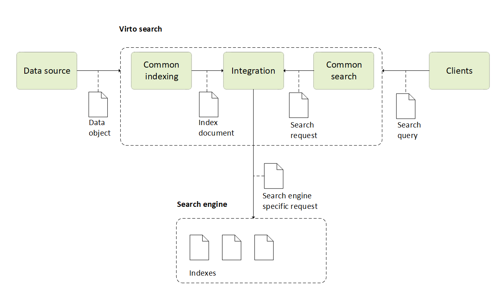

# Indexed Search

This article provides an overview of indexed search that is one of the key features of any e-commerce solution. Search is fundamental to any e-commerce application that presents textual content to users, with common scenarios including catalog or entity search or data exploration.

A search service is an intermediary between: 

* **Data stores** to contain your unindexed data.
* **Client application** to sends query requests to a search index and handles the response.
* **External search engines**, which manage all index and search requests.

{: style="display: block; margin: 0 auto;"}

## Main concepts

Virto Search is a search component that gives developers infrastructure, APIs, and tools for building a rich search experience over heterogeneous Platform entities. The main Virto Commerce Indexed Search concepts are: 

* **Search index**: A logical group (container) that contains all documents (rows) of a single document (type). Each document also has fields (columns). Typically, it is mapped to a specific index within the index provider, such as the Elasticsearch index. In Virto there are the following indexes by default:

    * **Member:** Searches for customer data.
    * **ContentFile**: Searches for files or documents associated with content management.
    * **Product:** Searches for catalog item .
    * **Category:** Searches for catalog category.
    * **CustomerOrder:** Searches for order.

    {: style="display: block; margin: 0 auto;" }

* **Index document:** A single unit of searchable data in your index. There can be one document for each product in the catalog. Mapping these concepts to more familiar database equivalents, we can say that a search index is equivalent to a table, while documents are roughly equivalent to rows in the table. The document structure is determined by the index schema. Fields are typically the largest part of an index, where each field is named, assigned a value type, and attributed with allowable behaviors that determine how it is used.

    {: style="display: block; margin: 0 auto;" }

    The index document can look as follows:
    
    {: style="display: block; margin: 0 auto;" }

* [Indexing](indexing/overview.md): A process for data indexing that extracts searchable content from various data sources and populates a search index within the specific search provider with instances of  index documents created from the source data by index document builders.

* [Search query](search-query-syntax-reference.md): A string consisting of keywords and terms that is processed by custom query syntax parser, which transforms it to a common search request. In other words, it is a complete specification of what should be returned as a result, for example:

    ```
    `Asus color:Black,Blue price.usd:[100 TO 200)`
    ```

* **Search:** Enables performing search tasks with the indexed data, receives the search phrase in a special query language and interprets the string into a Virto common search request object that can be supplied to a specific search engine through the integration connector. The key search features include:

    * **Full text search** with extensions for fuzzy search, proximity search, term boosting, and regular expressions.

    * **Faceted navigation and filters** that allow users to navigate through a website by applying filters for categories, attributes, price ranges, and so on. This can be used to incorporate faceted navigation into your application's UI, enhance query formulation, and filter based on user or developer-specified criteria. 

* **Integration:** Middleware providing integration to a specific search engine that enables mapping for objects of internal intermediated types, index documents and search requests, into the respective document and query objects a particular search engine expects to receive.     

* **Search Engine:** A specific index search engine that handles all indexing and search requests. Virto has ready-made integrations with the following services:

    * [Elastic Search 8](https://github.com/VirtoCommerce/vc-module-elastic-search-8): Version compatible with Elasticsearch 8.x. For driving innovation like semantic and hybrid search.
    * [Elastic App Search](https://github.com/VirtoCommerce/vc-module-elastic-app-search): Preferred search provider with rich no-code search customization and analytics tools.
    * [Lucene](https://github.com/VirtoCommerce/vc-module-lucene-search): Recommended for local development mode.
    * [Elastic Search](https://github.com/VirtoCommerce/vc-module-elastic-search): Version compatible with Elasticsearch 7.x.
    * [Azure Cognitive Search](https://github.com/VirtoCommerce/vc-module-azure-search): A fully managed cloud search service offered by Microsoft Azure that enables developers to build powerful search capabilities into applications without the need for managing infrastructure. 
    * [Algolia](https://github.com/VirtoCommerce/vc-module-algolia-search): A cloud-based search platform that provides developers with a set of APIs to easily implement fast and relevant search experiences in their applications. 

    !!! note
        There should be at least one search engine installed.

    !!! note
        You have two installation options for search providers:

        1. Begin by installing the **Search** module, then add the required search provider module.
        1. Alternatively, install the required search provider module, and the **Search** module will be automatically installed alongside it.


<br>
<br>
********

<div style="display: flex; justify-content: space-between;">
    <a href="../../data-import/01-main-concept">← Data import</a>
    <a href="../search-query-syntax-reference">Search query syntax →</a>
</div>
