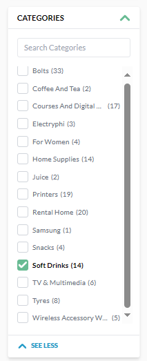
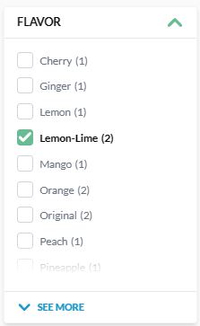
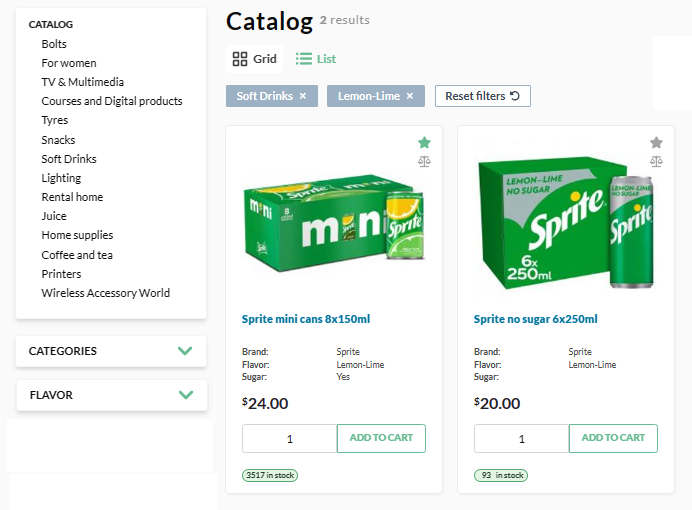
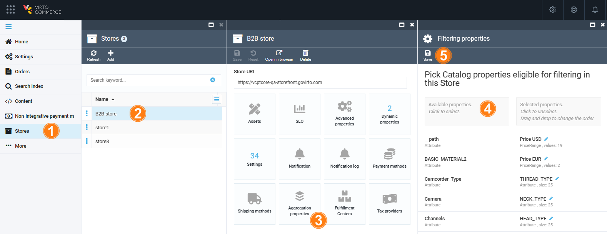
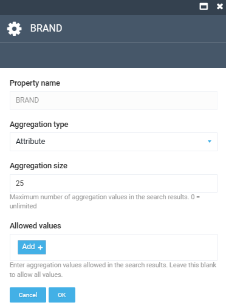

# Faceted Search

Faceted search (sometimes also called faceted navigation) allows users to navigate through a website by applying filters for categories, attributes, price ranges, and so on. The main idea behind faceted search is to present the attributes of the documents of the previous search result as filters, which can be used by the user to narrow down search results, along with calculating statistical counts to aid.

For example, let's search for all the lemon-lime drinks available:

1. Check **Soft Drinks** in the **Category** facet: 

    {: style="display: block; margin: 0 auto;" }

1. Check **Lemon-Lime** in the **Flavor** facet:

    {: style="display: block; margin: 0 auto;" }

1. The search query is executed using these two facets. The search result returns the entries that are aggregated both in the Category facet and in the Flavor facet:

    {: style="display: block; margin: 0 auto;" }

## Multi-select faceted search

This policy allows you to select multiple values of the same facet, for example, using a checkbox.

{: width="25"} [How to implement multi-select faceting for nested documents in Solr](https://blog.griddynamics.com/multi-select-faceting-for-nested-documents-in-solr)

{: width="25"} [Elastic Search post filter](https://www.elastic.co/guide/en/elasticsearch/reference/7.6/search-request-body.html#request-body-search-post-filter)

The multi-select faceted search policy is enabled by default and you do not need to activate it.

## Faceted search configuration

To configure properties available for faceted search via Platform Manager:

1. Click **Stores** in the main menu.
1. In the next blade, select the required store.
1. In the next blade, click on the **Aggregation properties** widget.
1. Click on the available properties to be applied to filtering. There are two types of properties:
    * **Attributes**: Displays and enables using all or selected values of the selected property for facet filters.
    * **Range**: Enables aggregating facet counts across ranges of values. This type is applicable to the date, time, datetime, number, and money type fields.
1. Click **Save** in the top toolbar to save the changes.

{: style="display: block; margin: 0 auto;" }

To edit the selected property, click on it and configure the following fields:

{: style="display: block; margin: 0 auto;" }

