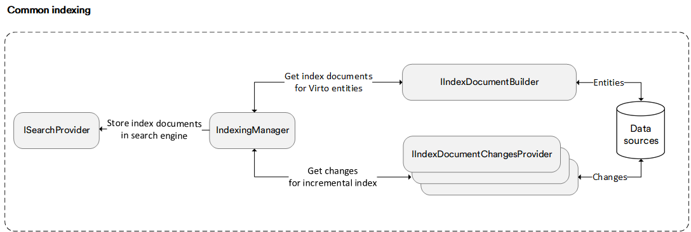

# Overview

The common search component is an entry point in Virto commerce application that is used to perform search request. 

The chart below shows the components used to process a search request:



The search process involves a specific search service, like `ProductIndexedSearchService`, which is tailored to handle search requests for particular domain entities such as catalog products or customers. It includes the following steps:

1. **Parsing the query**: The search service begins by parsing the query text to convert it into a search request object. This conversion is facilitated by calling `ISearchRequestBuilder`.
1. **Sending the search request**: Once the search request object is constructed, it is sent to the specific search engine through the `ISearchProvider` abstraction. The search engine utilizes an index to retrieve documents that match the specified terms.
1. **Materialization of search services**: Following the search execution, the specific search service materializes all located documents by fetching the entities based on their identifiers from the data source (e.g., database). Subsequently, the resulting entities are returned to the requester.


!!! note
	In Virto search, we use an additional roundtrip call to the data source to get the actual entity data for the resulting documents the index engine returns.

Restated, query execution includes three stages:

1. Query parsing.
1. Index document retrieval.
1. Resulting documented enrichment with entities are taken from data source. 

## Anatomy of search request and query parsing

A search request is a complete specification of what should be returned in the result set. It has search engine agnostic nature. This generic form enables easily switching between different search engines without any business logic changes. At its simplest, it is an empty query with no criteria.

The following example shows how a query string saying `black brand:Asus` will be converted into the search request: 

```cs
new SearchRequest
            {
                SearchKeywords = new [] { "black" },
                Filter = new[] { new TermFilter { FieldName : new [] { "brand", "Asus"} },,
                Sorting = "name:desc",
                Skip = 0,
                Take = 20
             };
```

