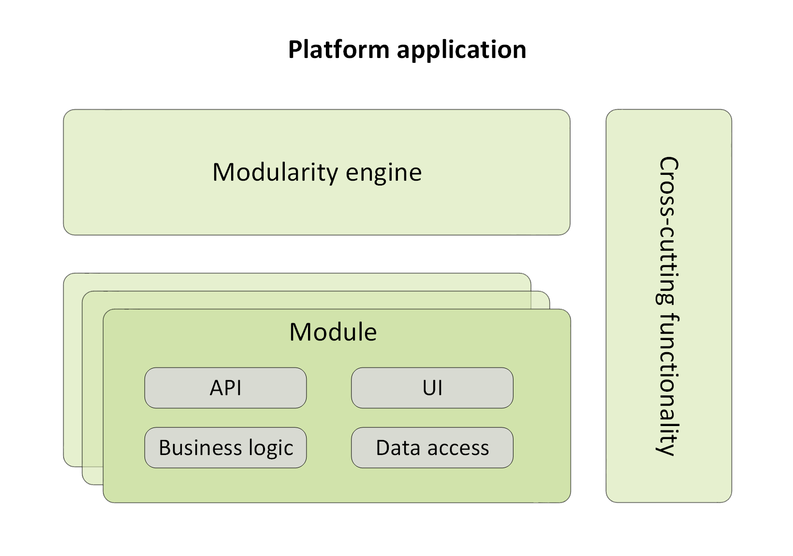
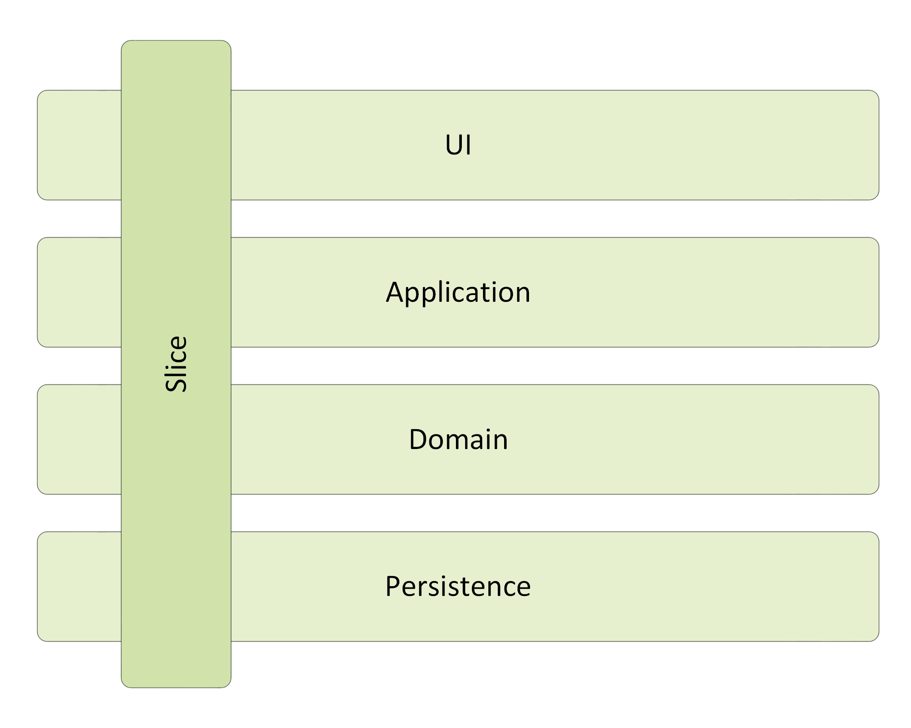
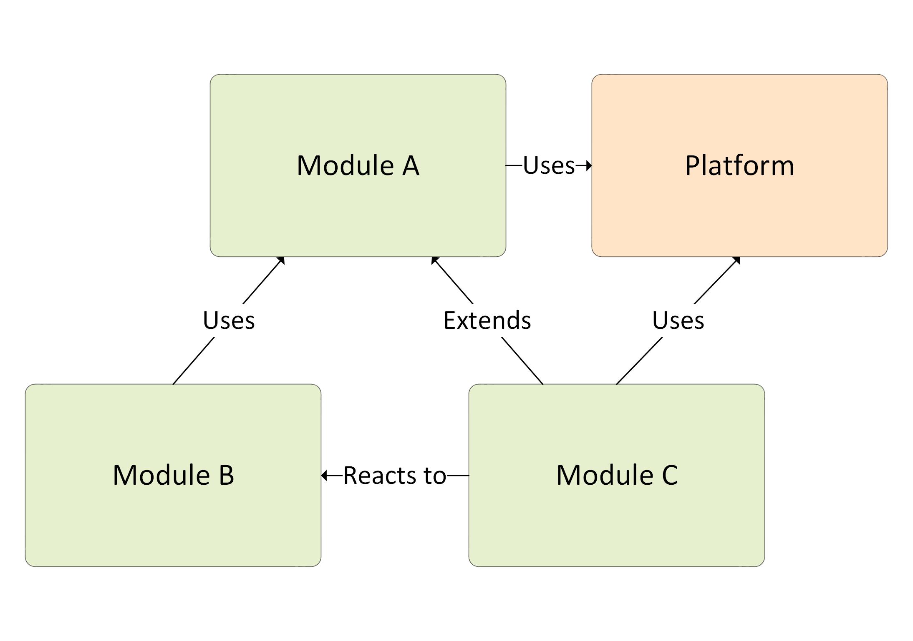

# Modular Architecture Overview

This article provides an overview of modular architecture, a core principle of any Virto Commerce solution.

Virto Commerce is a modular Platform that consists of various loosely coupled components that are loaded into the Platform. It is a good way of tackling complexity for large applications by breaking it up into separate conceptual modules.

A module encapsulates a portion of the application's overall functionality and typically contains a set of related components, such as domain features, including user interface and business logic, or pieces of application infrastructure and REST API methods.

Modules are independent of one another but can communicate with each other in a loosely coupled fashion. Either way, it is important to keep the communication between modules to a minimum to avoid dependency issues. Overall, modular architecture makes it easier for you to develop, test, deploy, and maintain your application.

!!! note
    When designing your modules, you have to stick to the the loosely coupled and shared-nothing infrastructure principles.

The following chart shows the overall design concept of the Platform application:

{: style="display: block; margin: 0 auto;" width="600"}

Notes to the chart:

* **Platform application:** Works as a runtime environment that hosts the modules running within the same process and having access to shared resources and dependencies.
    
* **Modularity engine:** A software component that is responsible for module discovery, initialization, and loading into the main [ASP.NET](http://asp.net/) app process.
    
* **Module:** A piece of functionality that can be added into the Platform app at runtime.
    
* **Cross-cutting functionality:** Common or shared logic that can be reused from any program level or component. e.g., caching, security, logging, etc.

## Virto architecture: plugins or modules?

Traditionally, **module** and **plugin** are defined as follows:

* A **Module** is a self-contained piece of software, which may contain types, data structure, functions, or otherwise, and can be combined with other modules to construct more complex software.

* In the meantime, a **Plugin** is a ready to use software component that can be added to an existing software to change or add features.

As a module, any Virto component can have dependencies to other modules, while, as a plugin, it can be added to an existing application without any recompilation.

A well known design pattern, **Modular Monolith**, does also apply to Virto, with monolith referring to the hosting or runtime model. This means that all services and parts exist in the same solution (not in the same project), are running in the same process, and are therefore deployed at the same time. However, each service or part is located in its own module (.NET project) and is thus decoupled from other modules.

At the same time, the Platform cannot be considered as a pure **Modular Monolith** based entity, since the Virto modules are not parts of a single Platform solution. Each module is an isolated project that can be developed, deployed, and installed into a running Platform instance independently.

## Modular architecture benefits

Virto uses modular architecture since it provides our solutions with various benefits, such as:

* **Reduced complexity**: Each module only gets linked to the code it specifically needs.
    
* **Easier to refactor**: Changing a module has less or no effect on other modules.
    
* **Better for teams**: It is easier for developers to work on different parts of the code.
    
* **Enforcing boundaries**: Once each component has achieved one hundred percent isolation, boundaries will be enforced between them.
    
* **Scaling the development process up to multiple teams**: You can have independent development and release cycles for each module implemented by different dev teams.

## Module structure

Each Virto module breaks down into multiple layers and encapsulates and groups all aspects, from front end to back end, that are in charge of proving the necessary features. Such layers are in line with the **Vertical Slices** design principle, which, at a high level, may be depicted as follows:

{: style="display: block; margin: 0 auto;" width="600"}

Instead of being coupled across a layer, a module is coupled vertically along a slice, while minimizing coupling between slices and maximizing it within a slice. This architecture is very convenient, as, when it comes to adding or changing a feature in an module, logically, e.g., changing the user interface, adding fields to models, modifying validation, and so on, you can do it all on each layer and then couple it vertically along a slice.

{: width="25"} [Folder structure](02-folder-structure.md)

## Modules relationships

Even though the modules should not have much coupling between each other, it is common for them to communicate with one another, and since all modules are loaded into the Platform application process, they also have access to the Platform functionality.

A particular module can have the following types of relationships with another module and the Platform:

* **Use:** Module A uses module B.
    
* **Extend:** Module A extends module B by modifying the behavior of module B or using special extensions points defined in module B.

* **React:** Module A reacts to module B when its behavior is triggered by an integration event in module B without module B being aware of module A.

The chart below shows all possible types of relationships between modules and the Platform:

{: style="display: block; margin: 0 auto;" width="600"}

Apart from the above, there are several loosely coupled communication patterns, each with their own strong points. Typically, combinations of such patterns (see below) are used to create the resulting solution:

* **Integration events:** A module may log events, while other modules can subscribe to such events and get notified when it occurs. Integration events are a lightweight manner of setting up communication between two modules; therefore, they are easily implemented.

* **Program and UI extension points:** Certain extension points each module can expose to tasks to extend or supplement the existing module functionality with a new one.

* **UI widgets and navigations**.
    
* **Domain model overriding**.
    
* **Persistent layer extensions**.
    
* **Shared services:** A shared service is a class that can be accessed through a common interface. Typically, shared services are located in shared assemblies and provide system-wide services, such as authentication, logging, or configuration.

{: width="25"} [Versioning and Dependencies](03-versioning-and-dependencies.md)

## Module installation, update, and deployment processes

Virto offers two different ways to install and update modules: 

* [Runtime mode.](01-overview.md#runtime-mode)
* [Design-time mode.](01-overview.md#design-time-mode)

### Runtime mode

The **Runtime** mode is used to update and install modules on a working system or at the first time setup. This process is based on requesting the `modules.json` file, a registry that can be either public or internal and contains information on all modules and their latest major versions (minor and patch versions history is not stored). You can set the path to this file with the `module.manifest` setting in the `appsettings.json` file (see string 7):

```json title="appsettings.json" linenums="1"
...
"ExternalModules": {
        //flag indicates to display and be able to install pre-release versions of modules
       "IncludePrerelease": true,
       //url to json that contains all information about all available virto modules versions
       //This URL can be changed to point into a file with modules versions specific for your solution
       "ModulesManifestUrl": "https://raw.githubusercontent.com/VirtoCommerce/vc-modules/master/modules_v3.json",
       ...
}
...
```

When using Virto Commerce in your production environment, you will rather have to deal with a list of your custom modules that have dependencies to the Virto modules that are not upgraded to the latest version. If this is the case, it is better to define your own version of the `modules.json` file that will contain a list of your custom and Virto modules with specific versions for your solution. Having your own `modules.json` file is basically the same as having `package.json` for NPM dependencies; the difference lies in the shared nature and the option to use it globally.

### Design-time mode

The **Design time** mode is often leveraged during the development process, when you manage the installed versions of modules, or install or update them manually on the local computer or in any other public environment. Virto provides a [special CLI tool](../../CLI-tools/package-management.md) for this that.

Here are some examples of interface commands you can use to perform various operations:

* Installing the latest version of a particular module:

```
vc-build install -Module VirtoCommerce.Store
``` 

* Updating the Platform and all installed modules to the latest version:

```
vc-build update
``` 

For the **module deployment process**, use our  [Virto Commerce Global Tool](../../CLI-tools/overview.md), which helps bundle your module solution to the deployment package. 

{: width="25"} [Build automation](../../CLI-tools/build-automation.md)

{: width="25"} [How to create new module](../../Tutorials-and-How-tos/Tutorials/creating-custom-module.md) 

{: width="25"} [Modular monolith by Kamil Grzybek](https://www.kamilgrzybek.com/design/modular-monolith-primer/ "https://www.kamilgrzybek.com/design/modular-monolith-primer/")
    
{: width="25"} [Vertical slice architecture by Jimmy Bogard](https://jimmybogard.com/vertical-slice-architecture/ "https://jimmybogard.com/vertical-slice-architecture/")
    
{: width="25"} [Software architecture patterns by Mark Richards (Microkernel Architecture)](https://www.oreilly.com/library/view/software-architecture-patterns/9781491971437/ch03.html "https://www.oreilly.com/library/view/software-architecture-patterns/9781491971437/ch03.html")
    
{: width="25"} [Bounded context by Martin Fowler](https://martinfowler.com/bliki/BoundedContext.html "https://martinfowler.com/bliki/BoundedContext.html")
    
{: width="25"} [Context mapping pattern](https://www.infoq.com/articles/ddd-contextmapping/ "https://www.infoq.com/articles/ddd-contextmapping/")

