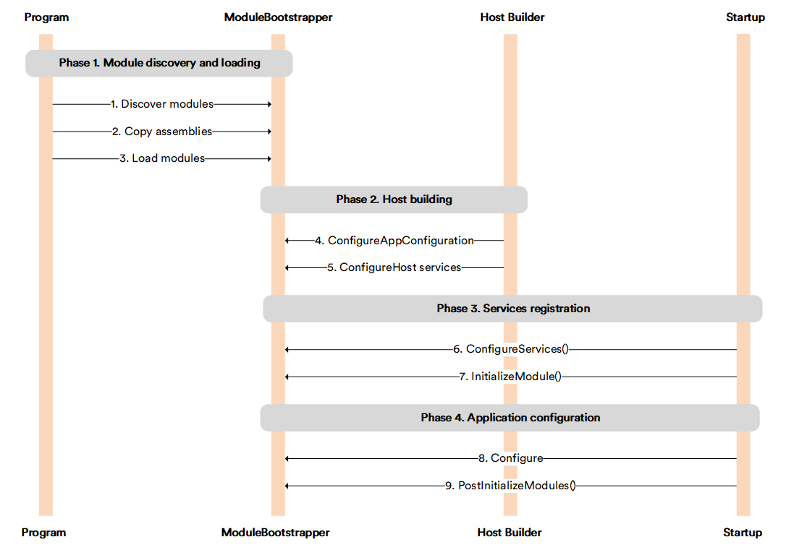

# Load Modules into Application Process

The process of loading modules into the Virto Platform application process is managed by a single `ModuleBootstrapper` class. It runs a fluent pipeline in `Program.Main()` before the ASP.NET Core host is built, which allows modules to participate in the earliest startup phases, including adding configuration sources and registering host-level services.

After the pipeline completes, the host is built and the remaining initialization phases run in sequence. The full process consists of four phases:

{: style="display: block; margin: 0 auto;" width="800"}

* [Module discovery and loading.](#module-discovery-and-loading)
* [Host building.](#host-building)
* [Services registration.](#services-registration)
* [Application configuration.](#application-configuration)


## Module discovery and loading

This phase runs entirely before the ASP.NET Core host is built and before the DI container is available. It consists of three sequential steps executed as a fluent pipeline on the `ModuleBootstrapper` instance:

```csharp
ModuleBootstrapper.Instance = new ModuleBootstrapper(loggerFactory, options, boostOptions)
    .Discover(PlatformVersion.CurrentVersion)
    .Copy(RuntimeInformation.ProcessArchitecture)
    .Load(isDevelopment);
```

### Discover modules
`Discover()` reads all **module.manifest** files from the discovery folder (**~/modules**). Each manifest describes the module's identity, version, platform version requirement, and dependencies. After reading, modules are sorted by their dependency graph and validated against the current Platform version. Once this step completes, the full module registry is available via `GetModules()` and `GetInstalledModules()`.

### Copy assemblies
`Copy()` copies module assemblies from the discovery folder into a flat probing folder. This intermediate step exists to apply version conflict resolution before any assembly is loaded:

!!! note
    The assembly with the latest version or latest date of modification always prevails when copying.

If a `.rebuild` marker file is present in the probing folder, `Copy()` clears the folder entirely before copying. This marker is written automatically by `InvalidateProbingFolder()` when a module is installed or uninstalled at runtime. Because the DLLs are locked by the running process, they cannot be replaced immediately. The rebuild is deferred to the next startup.

!!! note
    In multi-instance Platform configurations, only one instance checks or copies assemblies into the probing folder. This is achieved by distributed locking between instances through Redis: the first instance copies the files, while subsequent instances skip this process.

### Load modules
`Load()` loads the module assemblies from the probing folder into `AssemblyLoadContext.Default`. Loading from the probing folder, rather than directly from the discovery folder, prevents assembly lock issues that might occur when assemblies are modified during development or deployment. After loading, `Load()` also scans the assemblies for any `IPlatformStartup` implementations declared in the module manifests via the `<startupType>` element.

!!! note
    A module that fails to load does not block platform startup. Errors are accumulated in `ManifestModuleInfo.Errors` and reported after startup completes, while the platform remains operational with the remaining modules.

`IPlatformStartup` is an extension point that allows a module to hook into startup phases earlier than the standard `IModule` lifecycle, for example, to add a configuration source such as Azure App Configuration or Consul, or to register a background job server. An implementation is declared in the module manifest as follows:

```xml
<startupType>VirtoCommerce.MyModule.MyModuleStartup</startupType>
```

<br>
{: width="25"} [IPlatformStartup](IPlatformStartup.md)

## Host building

Once the `ModuleBootstrapper` pipeline completes, the ASP.NET Core host is built. During this phase the bootstrapper invokes any discovered `IPlatformStartup` implementations at two points:

* `ConfigureAppConfiguration` called inside the host's `ConfigureAppConfiguration` callback. Modules use this to add configuration sources that must be available before the DI container is built.
* `ConfigureHostServices` called inside the host-level `ConfigureServices` callback. Modules use this to register hosted services or background job servers at the host level.

## Services registration

This phase corresponds to `Startup.ConfigureServices()`. The bootstrapper performs two operations in order:

* `RunConfigureServices` invokes `IPlatformStartup.ConfigureServices()` on each startup implementation. This runs before any module is initialized, making it suitable for application-level DI registrations that modules may depend on.
* `InitializeModules` creates an instance of each module class and calls `IModule.Initialize()` on them in dependency order (modules with no dependencies first). At this point each module registers its own services into the DI container.

After module initialization, API controllers are registered as application parts and the backward-compatibility adapter for `ILocalModuleCatalog` is registered in DI.

## Application configuration

This phase corresponds to `Startup.Configure()`. The bootstrapper performs two operations:

* `RunConfigure` invokes `IPlatformStartup.Configure()` on each startup implementation. This runs before routing middleware is added and is used to insert early middleware into the HTTP pipeline.
* `PostInitializeModules` calls `IModule.PostInitialize()` on all initialized modules in dependency order. This runs inside a distributed lock (`ExecuteSynchronized`) together with platform database migrations and Hangfire setup, ensuring that post-initialization is performed by only one instance in a multi-instance deployment.

## IModuleService

`ModuleBootstrapper` implements the `IModuleService` interface and is registered in DI as a singleton after the pipeline completes:

```csharp
services.AddSingleton<IModuleService>(ModuleBootstrapper.Instance);
```

This allows controllers, health checks, and other services to query the module registry at runtime. The key methods available through `IModuleService` are listed below.

| Method                              | Description                                                         |
|-------------------------------------|---------------------------------------------------------------------|
| `GetModules()`                      | Returns all modules sorted in dependency order.                     |
| `GetInstalledModules()`             | Returns installed modules with no errors.                           |
| `GetFailedModules()`                | Returns modules that failed to load.                                |
| `IsInstalled(moduleId)`             | Checks whether a module is installed.                               |
| `IsInstalled(moduleId, minVersion)` | Checks whether a module is installed at or above a minimum version. |
| `GetModule(moduleId)`               | Returns `ManifestModuleInfo` for the given module, or `null`.       |

## Diagnostics

The Platform provides several ways to monitor module loading and diagnose issues at runtime.

### Logging

All module operations are logged through `ILoggerFactory`. The log output covers the full pipeline from discovery through initialization:

```
[INF] ModuleBootstrapper: Discovered modules: 12, with errors: 2
[DBG] ModuleBootstrapper: Copying assemblies from /app/modules/VirtoCommerce.Catalog/bin
[DBG] ModuleBootstrapper: Loading module VirtoCommerce.Catalog 3.800.0
[WRN] ModuleBootstrapper: Module VirtoCommerce.Broken has errors: incompatible platform version
[INF] ModuleBootstrapper: Loaded modules: 12, with errors: 2
```

### Failed modules

Modules that fail to load are available through `IModuleService` after startup completes:

```csharp
var failed = moduleService.GetFailedModules();
```

Each entry in the result contains the module identity and the errors accumulated during the pipeline, which can be used to diagnose version conflicts, missing dependencies, or assembly load failures.

### Health check

The Platform exposes a built-in health check endpoint that reports the overall module status:

```
GET /health
```

If any modules have errors, the response reflects an unhealthy state:

```json
{
  "Modules health": {
    "status": "Unhealthy",
    "description": "Some modules have errors"
  }
}
```


<br>
<br>
********

<div style="display: flex; justify-content: space-between;">
    <a href="../optional-dependency">← Optional dependency between modules</a>
    <a href="../IPlatformStartup">IPlatformStartup →</a>
</div>