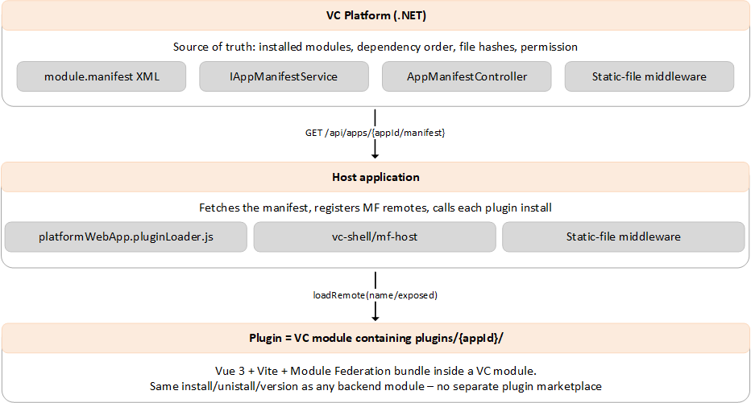
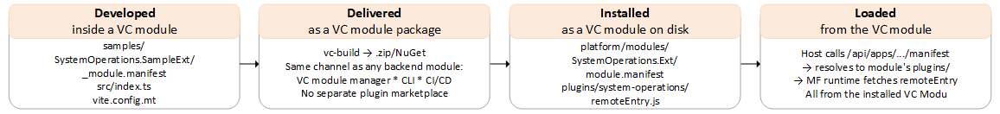
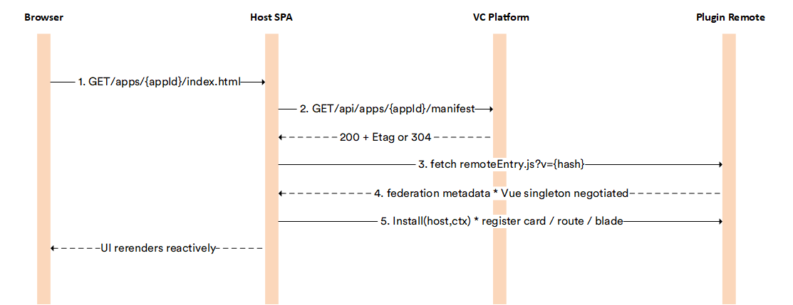

# Back-Office UI Modularity

This article describes how back-office user interfaces are extended at runtime by plugins that ship inside ordinary Virto Commerce modules.

Virto Commerce ships three back-office UI hosts. A single Platform-wide contract lets any of them be extended by plugins delivered inside other modules. Plugins are discovered through the existing module dependency graph, with Module Federation 2.0 as the default loading mechanism. There is no new manifest registry and no separate plugin store.

The same contract serves three host flavors, so a module author targets one toolchain regardless of the host.

* **Platform admin**. The mature AngularJS admin used in production for years. Each module ships **dist/app.js** and **dist/style.css**, loaded by the Platform.
* **VC-Shell**. The Vue 3 admin that loads plugins over Module Federation through `defineAppModule`, blades, and extension points.
* **Custom SPAs**. Self-contained applications served through the Platform `<apps>` mechanism, for example System Operations.

## Architecture

Responsibilities are split across three tiers:

{: style="display: block; margin: 0 auto;" }

The Platform knows which modules are installed, their dependency order, and their file hashes. The host fetches that information and loads the plugins it is allowed to use. The plugin lives inside a module and follows the same install, uninstall, and version rules as any backend module.

### Plugins

A plugin is not a separate artifact. It is delivered as a file inside a normal module package and moves through the same lifecycle as the rest of the module.

{: style="display: block; margin: 0 auto;" }


Plugins are discovered by convention. A module declares no extra registry entry. It only places its plugin bundle in a folder named after the target host app.

```
plugins/
  platform/             # for the legacy admin
  vc-shell-marketplace/ # for the VC-Shell Marketplace host
  system-operations/    # for the System Operations SPA
```

At boot, the Platform walks the topologically sorted module list and probes each module for **plugins/{appId}/remoteEntry.js**. When the file is present, the plugin is registered for that host. The folder name is the target app id, not the plugin id, so one module can ship plugins for several hosts. A frontend-only module can leave `<assemblyFile>` empty and still contribute a plugin.

## App manifest endpoint

Every host fetches its plugins from one endpoint, resolved by app id.

```
GET /api/apps/{appId}/manifest
```

The response lists the plugins for that host in module-dependency order, with the Module Federation coordinates, the permission metadata, and the cache-busting hashes the host needs to load them.

```json
{
  "appId": "vc-shell-marketplace",
  "version": "3.1000.0",
  "title": "Marketplace",
  "hash": "8DBA4F3C9E2A",
  "plugins": [
    {
      "id": "VirtoCommerce.MarketplaceReviews",
      "version": "3.1001.0",
      "permission": null,
      "entry": { "type": "script", "path": "/modules/.../remoteEntry.js", "hash": "8DBA4F3C" },
      "remote": { "name": "marketplaceReviews", "exposed": "./Module" }
    }
  ]
}
```

The endpoint is backed by `IAppManifestService` and served by `AppManifestController`. Plugins are returned topologically sorted, so a plugin never loads before the plugin it depends on.

## Loading plugins

A plugin loads in a short sequence at host boot. The host fetches the manifest, negotiates shared dependencies, then installs each plugin.

{: style="display: block; margin: 0 auto;" }

The host shares singleton instances of core dependencies, for example Vue, Vue Router, and the framework package, so remote plugins use the same runtime. Each plugin registers its cards, routes, or blades during `install`, and the UI rerenders.

## Permission model

Permissions apply in two layers. This keeps the manifest cacheable once for all users while still gating access.

* **Server-side app permission**. Declared in **module.manifest** as `<app permission="my-app:access">` and validated when the manifest is requested. A user without the permission receives `403 Forbidden`.
* **Client-side plugin permission**. Declared per plugin and evaluated by the host before each remote loads. The check runs in the browser because the manifest is cached once across all users, so a server-side per-user filter would multiply the cache by the number of users.

## Caching and invalidation

The manifest is cacheable, which keeps boot fast in production.

* In production, the Platform caches the manifest for the process lifetime and returns an `ETag`. A request with a matching `If-None-Match` returns `304 Not Modified` in microseconds.
* In development, the cache is bypassed so a plugin rebuild is visible on the next reload.
* To force a refresh without a restart, call `POST /api/apps/manifest/invalidate`. The next request rebuilds the manifest.

## Compatibility model

Compatibility is settled before a plugin ever reaches the browser. There is no second registry and no client-side version filter.

* **Module dependency.** Declared with `<dependency id version>` and validated when the module is installed. This decides whether the plugin module is allowed to install at all.
* **Shared runtime.** Declared in the plugin's Module Federation config through `shared`. This decides, at load time, whether a plugin uses the host's Vue and Router or its own copy.

Upgrading the host framework does not silently drop older plugins. If a plugin becomes incompatible, the Platform administrator sees an install-time error first.

<br>
<br>
{: width="20"} [Loading modules into the application process](04-loading-modules-into-app-process.md)

{: width="20"} [Module.manifest file](06-module-manifest-file.md)

{: width="20"} [Module Federation guide](/platform/developer-guide/latest/custom-apps-development/vc-shell/guides/module-federation/)

<br>
<br>
********

<div style="display: flex; justify-content: space-between;">
    <a href="../06-module-manifest-file">← Module.manifest file</a>
    <a href="../05-best-practices">Best practices →</a>
</div>
