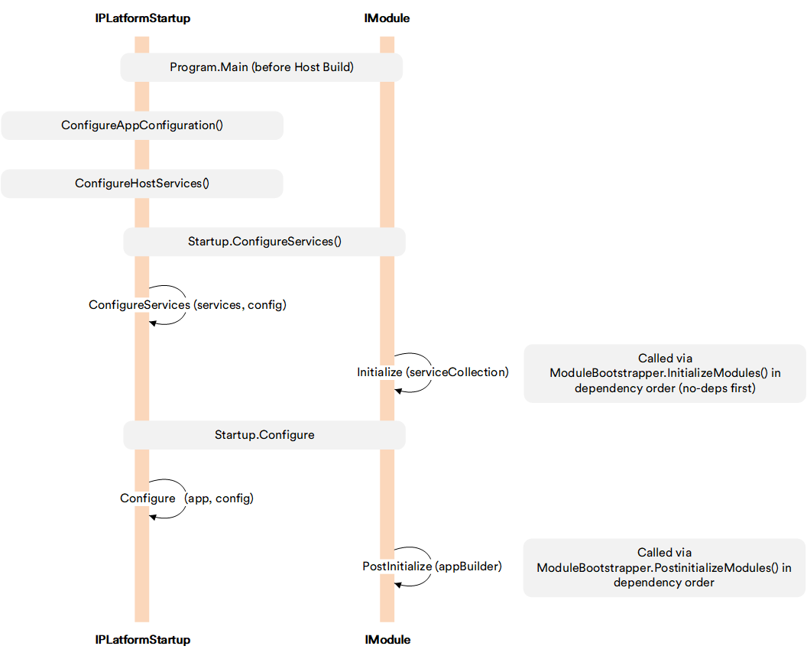

# IPlatformStartup

`IPlatformStartup` is an extension point that allows a module to participate in platform startup phases that occur before the standard `IModule` lifecycle. While `IModule.Initialize()` runs inside `Startup.ConfigureServices()` after the DI container is being built, `IPlatformStartup` methods run earlier — starting from before the ASP.NET Core host is built — making them suitable for configuration sources, host-level services, and early middleware that modules cannot register through `IModule` alone.

## Register implementation

To register an `IPlatformStartup` implementation, declare the `<startupType>` element in the module's **module.manifest** file:

```xml
<startupType>VirtoCommerce.MyModule.MyModuleStartup, VirtoCommerce.MyModule</startupType>
```

The Platform discovers the implementation during the `Load()` step of the `ModuleBootstrapper` pipeline and invokes its methods at the appropriate startup phases automatically.

<br>
{: width="25"} [Module.manifest file](06-module-manifest-file.md)

## Methods

`IPlatformStartup` defines four methods. Each runs at a distinct point in the startup sequence:

```csharp
public interface IPlatformStartup
{
    void ConfigureAppConfiguration(IConfigurationBuilder builder, IHostEnvironment env);
    void ConfigureHostServices(IServiceCollection services, IConfiguration config);
    void ConfigureServices(IServiceCollection services, IConfiguration config);
    void Configure(IApplicationBuilder app, IConfiguration config);
}
```

## Execution order

The diagram below shows when each `IPlatformStartup` method runs relative to the `IModule` lifecycle:

{: style="display: block; margin: 0 auto;" width="800"}

<br>
<br>
********

<div style="display: flex; justify-content: space-between;">
    <a href="../04-loading-modules-into-app-process">← Loading modules into application process</a>
    <a href="../06-module-manifest-file">Module.manifest file →</a>
</div>