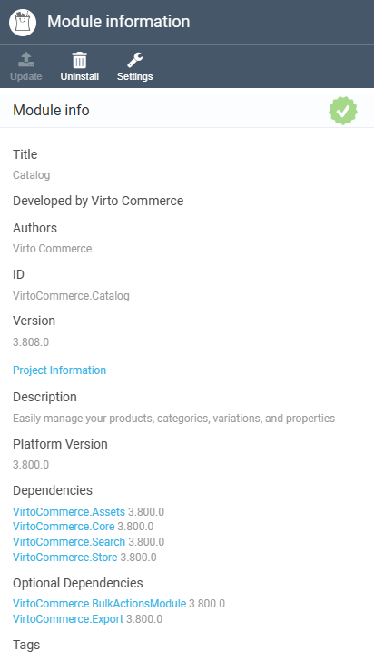

# Optional Dependency between VC Modules 

Virto Commerce adds the ability to define optional dependencies between VC modules. This feature allows administrators to install modules based on specific demands and requirements. 

By implementing optional dependencies, developers can establish relationships between different VC modules, indicating which modules are needed for the proper functioning of others. This setup provides flexibility during installation, enabling administrators to selectively install modules based on their use cases and preferences. 

Virto Commerce provides a complete development kit for resolving optional dependencies in C# and AngularJS code. 

## Key features 

Optional dependencies are particularly beneficial in the following scenarios within the Virto Commerce ecosystem: 

* **Customized solution configurations**: When creating customized e-commerce solutions, certain modules may enhance specific functionalities based on business requirements. Optional dependencies enable developers to tailor solutions by adding or omitting modules as needed. 
* **Modular system architecture**: Virto Commerce employs a modular architecture where different modules interact to deliver comprehensive functionalities. Optional dependencies facilitate a modular approach by defining relationships between modules, ensuring that the system remains flexible and scalable. 
* **Resource optimization**: In resource-constrained environments, installing unnecessary modules can lead to inefficient resource allocation. Optional dependencies allow for resource optimization by enabling administrators to install only the essential modules required for desired functionalities. 
* **Feature expansion**: As new features and capabilities are added to Virto Commerce, optional dependencies offer a way to integrate these features seamlessly without imposing unnecessary dependencies on existing modules. 
* **Selective module installation**: Administrators may prefer to install a core set of modules initially and then add additional functionalities as needed. Optional dependencies empower administrators to manage module installations efficiently. 

For example, you can now install **Catalog** module without **Export** or **BulkActionsModule** if they are not required for your deployment.  



## Add optional dependency 

In this guide, we will configure a module within Virto Commerce Platform to have optional dependencies. This setup will allow the module to function properly even if these optional dependencies are not installed, while enabling additional features when the dependencies are present. 

To add an optional dependency:

1. [Register optional dependency configuration in module.manifest.](optional-dependency.md#register-optional-dependency-configuration-in-modulemanifest)
1. [Resolve optional dependency in C# code.](optional-dependency.md#resolve-optional-dependency-in-c-code)
1. [Resolve optional dependency in AngularJS code.](optional-dependency.md#resolve-optional-dependency-in-angularjs-code)
1. [Resolve optional dependency in vc-shell code.](optional-dependency.md#resolve-optional-dependency-in-vc-shell-code)
1. [Configure Virto Commerce CLI package.](optional-dependency.md#configurу-virto-commerce-cli-package)


### Register optional dependency configuration in **module.manifest**

1. Open the **module.config** configuration file. 
1. Find the `<dependencies>` section.  
1. To add an optional attribute, identify the `<dependencies>` section in the XML file, which lists all the required dependencies for the Catalog module: 

    ```
    <dependencies> 

    … 

        <dependency id="VirtoCommerce.BulkActionsModule" version="3.800.0" optional="True"/> 

        <dependency id="VirtoCommerce.Export" version="3.800.0" optional="True"/> 

    </dependencies> 
    ```

### Resolve optional dependency in C# code

!!! info 
    Virto Commerce offers a set of optional dependencies extensions: 

    * `IModuleCatalog.IsModuleInstalled`: Allows checking if module is installed. 
    * `IOptionalDependency<T>`: Allows resolving optional dependencies via DI. 

1. Resolve optional dependencies during the module initialization: 

    1. Add the `IHasModuleCatalog` interface into the Module class. This will allow you to use `ModuleCatalog` service instance inside `Initialize`/`PostInitialize`. 
    1. Call `if (ModuleCatalog.IsModuleInstalled(OptionalModuleId))` to check if module is installed before registering implementations of your optional module interfaces in the **Module.cs** `Initialize` method or before registering utility types such as export types/bulk action types/search providers inside `PostInitialize` method. 

1. Resolve optional dependencies in DI: 

    1. Replace `ISomeService` with `IOptionalDependency<ISomeService>` in a constructor declaration to prevent exception from DI. 
    1. Then in C# code you can call `HasValue` and `Value` to resolve optional dependency by demand.
    1. Alternatively, you can add default null value to the parameter in the constructor `ctor(ISomeService someService = null)` to mark this service as optional in DI. Note that all optional parameters must appear after all required parameters 

 
### Resolve optional dependency in AngularJS code

There are 2 common ways a dependent module can use AngularJS services, factories, or controllers in an optional module: 

* A module, controller, or another service uses DI to inject a service or factory declared in an optional module. 
* Inside a controller (or module), there is a code that uses a controller from an optional module, for example, a widget or a toolbar button that opens a blade from the optional module. 

You can resolve these dependencies as follows: 

1. In case of DI, use manual injection instead of automat injection: remove all dependencies to optional module services and inject `$injector` service instead.  
1. Use `$injector.modules['angularModuleName']` to check if the optional module is installed. Note that 'angularModuleName' can be different from the Module Id declared in the **module.manifest** file.  
1. Use `injector.get('optionalService')` to return an instance of the service if optional module is installed. 

    !!! note
        You cannot create controller instances with the `$injector` service.

1. In case of button/widgets/etc. which use controllers from the optional module, you can declare them after the `$injector.modules['angularModuleName']`check. 

### Resolve optional dependency in vc-shell code

In progress... 

### Configure Virto Commerce CLI package 

To keep optional NuGet references as a part of the package, add a **.keep** file into the solution with a reference to optional dll, usually Core.  

By following these steps, you can configure optional dependencies between modules in the Virto Commerce Platform, providing flexibility and modular functionality to meet varying business requirements.

Optional dependencies enhance the scalability and customization of Virto Commerce modules, allowing developers and administrators to tailor solutions based on specific needs.