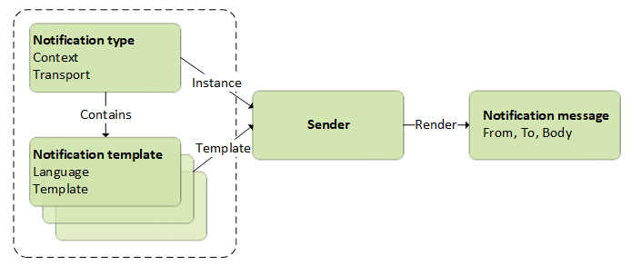

# Overview

Virto Commerce provides a customizable logic for managing and sending end user notifications via different channels, such as email or text messages. This guide will explain technical details of the notifications logic data model and outline some basic development scenarios.

## Notification data model

The chart below shows how notification data is sent:

Each notification sent by the system is represented with an individual notification type. Each Notification type, in its turn, can contain multiple notification templates, each being individual per language.

At the time of sending, the system converts the object belonging to a specific notification type and having a notification template into a notification message, and then forwards it through one of the channels, e.g. email or text.

For data modeling purposes, the notification data model contains the following elements:

* **Notification type:** A custom class derived from `EmailNotification` or `SmsNotifcation`. The type defines a set of attribute data properties that can be used when rendering a specific instance of the notification type and notification template into the resulting Notification message.

* **Notification template:** Houses notification content with syntax based on [Liquid by Shopify](https://shopify.github.io/liquid/). The Liquid elements in templates act as placeholders: just before the message is sent to the recipient, Liquid is replaced and interpreted using the data taken from properties, which in their turn come from the incoming notification type instance; the data is then output into the resulting message text.

	!!! note
		To edit the notifications sent from your store, you can [provide basic customization](/platform/user-guide/latest/notifications/notification-templates) to your notification templates.

* **Notification message:** The resulting text or email message scheduled or sent by a specific sender and stored in the notification feed within the system.

 
 

{: width="25"} [Notifications module overview](/platform/user-guide/latest/notifications/overview)

{: width="25"} [Scriban Liquid Reference](https://github.com/scriban/scriban/blob/master/doc/liquid-support.md)

 
 
********

    <a href="../../Dynamic-Properties/overview">← Managing dynamic properties </a>
    <a href="../registering-new-notification-type">Registering new notification type →</a>

