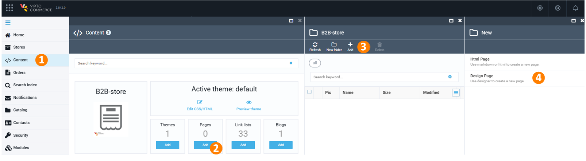

# Getting Started

This guide helps you set up the Page Builder for Virto Commerce Platform and Frontend, ensuring content creation works smoothly.

## Prerequisites

Before you begin, ensure that the following components are installed:

* [Virto Commerce 3.253.0+](https://github.com/VirtoCommerce/vc-platform/releases/)  
    {: width="25"} [Platform deployment guide](../../Getting-Started/Installation-Guide/windows.md)

* [Virto Frontend 2.2.0+](https://github.com/VirtoCommerce/vc-frontend/releases/)  
    {: width="25"} [Frontend deployment guide](../../../../../storefront/developer-guide/deployment)

* [Page Builder module 3.201+](https://github.com/VirtoCommerce/vc-module-pagebuilder/releases)

## Setup content

Verify that the Virto Commerce Platform and Frontend are using the same **Shared content** folder for proper page synchronization.

## Setup store

Configure the public store URL to ensure pages are accessible correctly.

1. Open Platform.
1. In the main menu, select **Stores**.
1. In the next blade, select your store.
1. In the next blade, set up the public store URL, if it is empty.
1. Click **Save** in the toolbar to save the changes.

You store URL has been set.

## Run

Now you are ready to create and manage content pages:

=== "via the Content module"

    1. Click **Content** in the main menu.
    1. In the next blade, find the required store and click on the **Pages** widget.
    1. In the next blade, click **Add** in the toolbar. 
    1. In the next blade, select **Design page**.

        {: style="display: block; margin: 0 auto;" }

    1. In the next blade, fill in the following fields:

        {: style="display: block; margin: 0 auto;" width="600"}

    1. Click **Create**. The Page Builder opens the newly created page in a new window. It contains uneditable header and footer by default.  

        {: style="display: block; margin: 0 auto;" }

    1. Click **Save** in the top right corner. 

    You can open it in the browser using the specified permalink.

=== "via the Page Builder Office"

    1. Click **Stores** in the main menu.
    1. In the next blade, select the required store.
    1. In the next blade, click on the **Page Builder** widget to open the Page Builder Office:

        {: style="display: block; margin: 0 auto;" }

    1. Click **Add** in the toolbar.
    1. In the next blade, fill in the following fields:

        {: style="display: block; margin: 0 auto;" }

    1. Click **Save** in the toolbar. 

    Your new page appears in the list of pages with the **Draft** status.

