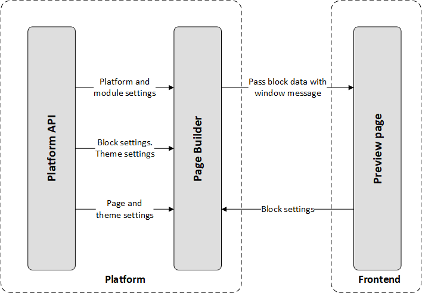

# Virto Commerce Page Builder

The Virto Commerce Page Builder enables users to create e-commerce pages by assembling and customizing blocks through a visual editor. Each page is composed of multiple blocks, with each block’s appearance and settings tailored to the specific needs of the web page. Pages are configured as a list of blocks, each with individual settings, and all data is stored in JSON format.

Page Builder offers the following benefits:

* For business users:
    * Fast landing page creation with a visual editor.
    * Content preview exactly as seen by customers.
    * Mobile optimization by default.
    * Ready-to-use building blocks and best practice tips.

* For developers:

    * Integration into custom designs.
    * Configurable favorites block set.
    * Block creation with flexible JSON schema.
    * Builder integration with existing websites and apps.
    * DevOps and publishing workflow readiness.

## Key features
- Visual landing page creation without developer involvement.
- Theme editor for easy styling adjustments.
- eCommerce-focused page customization with real-time previews.
- Mobile responsiveness built in by default.
- SEO-friendly page structures.
- Comprehensive block library.
- Drag-and-drop block management, including copy, paste, hide, and reorder actions.
- Native integration with the Virto Frontend.
- Extensible architecture through the Native Extendability Framework.
- Fine-grained permissions and role management.

## Architecture

The Page Builder consists of two primary subsystems:

- **Creation logic script:** Handles page and theme editing within the administrative interface. It connects with the Virto Commerce Platform to fetch and save page data.
- **Preview visualization script:** Runs on the Frontend, where it renders pages based on templates and ensures accurate visual representation for customers.

The two subsystems communicate via `window.postMessage()` to synchronize edits and previews across the Admin and Frontend environments.

