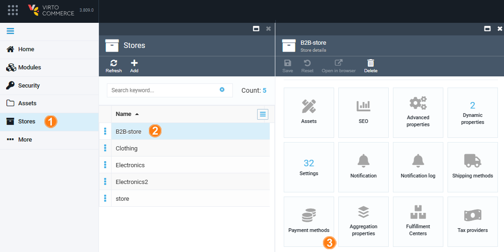

# Integration with Authorize.net

Authorize.Net payment module provides integration with Authorize.Net using [Accept.js](https://developer.authorize.net/api/reference/features/acceptjs.html) and the [Authorize.Net API](http://developer.authorize.net/api).

## Setup

To integrate CyberSource with Virto Commerce for secure payment processing:

1. [Configure appsettings.json](#configure-appsettingsjson)
1. [Configure Platform](#configure-platform)

## Configure appsettings.json

Confidential Authorize.Net account settings should be configured in the **appsetting.json** file as follows:



{: width="25"} [Configuring non-confidential settings](/platform/user-guide/latest/authorize-net/manage-authorize-net-module#configure-settings)

## Configure Platform

To setup Virto Commerce Platform:

1. Click **Stores** in the main menu. 
1. In the next blade, select a store.
1. In the **Store details** blade, click on the **Payment methods** widget.

    !!! note
        You can set the order in which payment methods appear in the web store. Drag and drop them to change the order.

1. In the **Payment methods** blade, select **Authorize.net**.

    

1. In the **Edit payment method** blade, configure the following fields:

    

1. Click **Save** in the toolbar to save the changes.

Your modifications have been saved.

 
 
********

    <a href="../simplified-integration">← Simplified integration via CSV files </a>
    <a href="../CyberSource">CyberSource payment method →</a>

