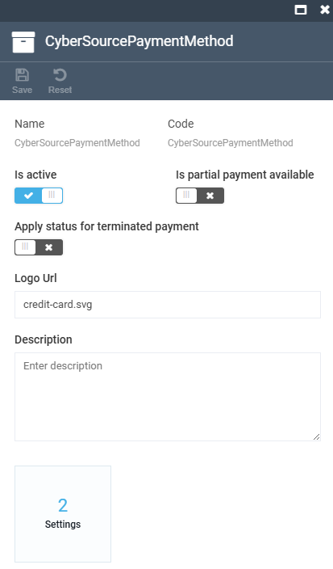

# Integration with CyberSource

The **CyberSource** module integrates CyberSource payment solutions with your Virto Commerce Platform.

It enables secure and seamless payment processing, using CyberSource's Flex Microform technology for enhanced user experience and PCI compliance. This module is designed for businesses seeking to integrate a robust and scalable payment gateway into the ecommerce platform.

## Key features

* CyberSource-based payment methods like Card Payment, 3D Secure, Visa Click to Pay, Google Pay, eCheck, and Apple Pay. Google Pay and Apple Pay are enabled and domain-verified through your CyberSource merchant account, not through separate Virto Commerce configuration; see CyberSource's own Google Pay and Apple Pay setup documentation.
* Tokenization to create, update, and delete a card token.  
* Authorization and capture of a payment.  
* Refunding a payment back to the merchant.  
* *(Coming Soon)* Manual capture of a payment.  
* *(Coming Soon)* Synchronization of payments to track missing and fraudulent transactions based on merchant decisions.

3D Secure above is CyberSource's implementation of Strong Customer Authentication (SCA) under 3DS2; Virto Commerce does not add a separate SCA layer on top of it.

Tokenization here is CyberSource's own card tokenization, separate from the [Skyflow](skyflow.md) vault. The two modules do not share a token format, and using both together means handling two independent tokenization schemes.

## Setup

To integrate CyberSource with Virto Commerce for secure payment processing:

1. [Configure appsettings.json](#configure-appsettingsjson)
1. [Configure Platform](#configure-platform)

### Configure appsettings.json

Configure the **appsettings.json** file as follows:



### Configure Platform 

To setup Virto Commerce Platform:

1. Go to Virto Commerce Platform and click **Stores** in the main menu. 
1. In the next blade, select your store.
1. In the **Store details** blade, click the **Payment methods** widget.
1. In the next blade, select **CyberSource** payment method. It automatically appears in the list after the module is installed.
1. In the next blade, enable the CyberSource payment method and configure other settings (optionally):

    {: style="display: block; margin: 0 auto;" }

1. Click **Save** in the toolbar to save the changes.

The CyberSource payment method has been enabled for your Store.

 
 
********

    <a href="../authorize-net">← Authorize.net payment method </a>
    <a href="../datatrans">Datatrans payment method →</a>

