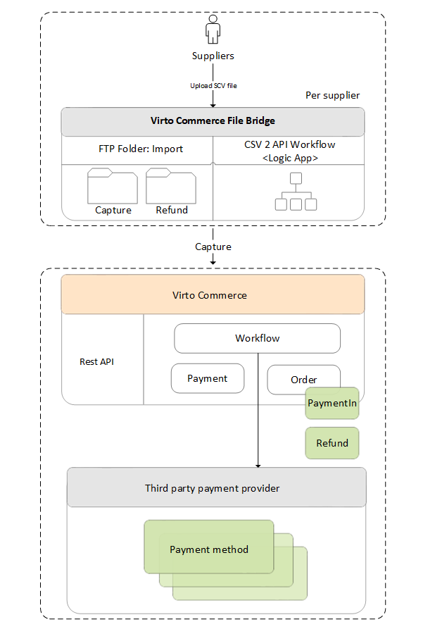

# Simplified integration via CSV file

Sometimes the initial integration with Virto products via the API might be challenging for those users who have never used this method before. For such cases, we've added an option to integrate via CSV file.

{: style="display: block; margin: 0 auto;" width="500"}

In this case, the user:

1. Exports data from ERP in a predefined CSV file.​
1. Uploads it to FTP.​
1. Downloads the result as a file.

This refers to:

* Payment capturing.
* Payment refunding.

Integration via the Payment or Refund Capturing API is also possible. Once integrated, the ability to capture and refund payments appears in the Virto Commerce Back Office.​

 
 
********

    <a href="../new-payment-method-registration">← Registering new payment method </a>
    <a href="../authorize-net">Authorize.net →</a>

