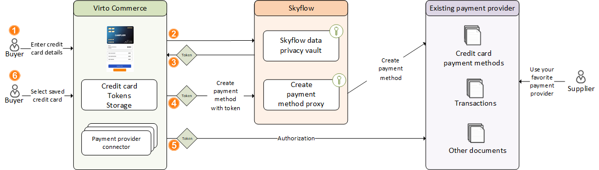
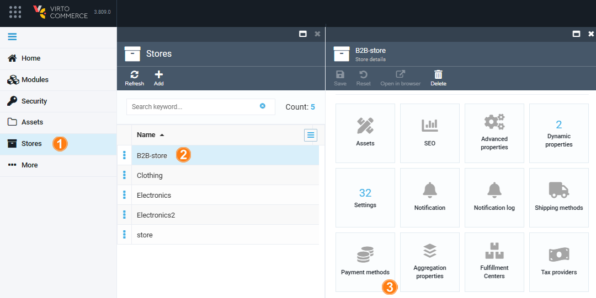
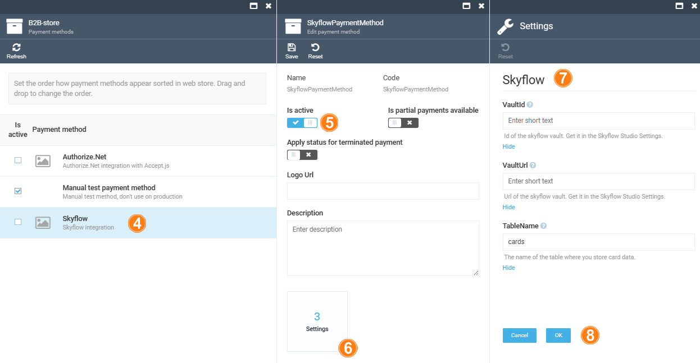

# Integration with Skyflow

The **Skyflow** module facilitates seamless integration with [Skyflow](https://www.skyflow.com/), a Data Privacy Vault service, enabling secure payment processing within Virto Commerce Platform. This integration ensures compliance with industry standards for handling payment data securely while offering a unified experience for credit card transactions. 

## Key features

* **Unified credit card user experience:** Enhance user payment journeys with a consistent credit card transaction experience across multiple payment providers.
* **PCI compliance:** Ensure PCI compliance with Skyflow, simplifying adherence to industry standards for secure payment data handling.
* **Integration with Virto Commerce Frontend:** Seamlessly integrate with [Virto Frontend Application](https://github.com/VirtoCommerce/vc-theme-b2b-vue) to provide a cohesive ecommerce experience.
* **Flexible customization:** Utilize the flexibility of the Virto Commerce Native Extensibility Framework and Skyflow to tailor integrations with a variety of payment providers to meet your specific requirements.
* **Optimized for marketplaces:** Streamline marketplace operations by effortlessly connecting with multiple Payment Service Providers, catering to diverse payment preferences for customers and suppliers.
* **Saved credit card:** Enhance convenience and checkout speed by offering customers the ability to securely save their credit card information for future transactions.

## Prerequisites

1. **Skyflow account:** Create and configure your [Skyflow Account](https://www.skyflow.com/) to take full advantage of the module.
2. **Authorize.NET account:** Create and configure your [Authorize.NET Account](https://www.authorize.net/) for seamless integration with the module.
3. **Installation:** Install the Skyflow Module to start using its powerful features and functionality.

## Architecture

{: width="25"} **Order placement:**

* As a customer, I add items to my cart and proceed to checkout.
* On the payment selection page, I see a **Credit card** option.

{: width="25"} **Credit card payment form:**

* I select the **Credit card** payment method.
* The Frontend displays a credit card form built with PCI compliance and Skyflow integration, maintaining the current design of the Platform.
* I enter my credit card details securely into the form.

{: width="25"} **Tokenization process:**

* I submit the form, and the payment process utilizes Skyflow for PCI-compliant Credit Card storage.
* Skyflow tokenizes my credit card information securely.

{: width="25"} **Transaction processing:**

* The tokenized credit card information is seamlessly integrated with Payment processing through Skyflow.
* The transaction is created successfully via Authorize.NET.

{: width="25"} **Payment document creation:**

* A Payment document is automatically created within Virto Commerce Payment Processing for the credit card transaction.
* This payment document includes all necessary details for tracking and processing the transaction within the Virto Commerce Platform.

{: width="25"} **Saved credit card:**

* The Skyflow-generated token for credit card is stored within the Virto Commerce payment document securely.
* Virto Commerce can save the token and use later as a saved credit card.

## Setup

To integrate Skyflow with Virto Commerce for secure payment processing:

1. [Configure Skyflow.](skyflow.md#configure-skyflow)
1. [Configure Virto Commerce.](skyflow.md#configure-virto-commerce)

### Configure Skyflow

Skyflow configuration includes creating:

1. [Roles.](skyflow.md#create-roles)
1. [Authorize .NET connectors](skyflow.md#create-authorizenet-connectors)

#### Create roles

To create a role:

1. Sign in to Skyflow Portal.
1. Create a system role named **Vault Editor** for frontend operations. This role will be responsible for sending card data to Skyflow.
1. When creating a connection, the second system role is automatically generated and associated with the connection.

#### Create Authorize.NET connectors

To create Authorize.NET connectors:

1. Create a new connector.
1. Modify Connector via RestAPI:
  * If default connections are not suitable (e.g., mismatched card number format), modify the connector via RestAPI.
  * Use the **Update Outbound Connection** endpoint to adjust the connector's configuration according to your requirements.
1. Generate and save credentials file.

### Configure Virto Commerce

Configuring Virto Commerce includes:

1. [Appsettings.json configuration.](skyflow.md#configure-appsettingsjson)
1. [Virto Commerce back office setup.](skyflow.md#setup-virto-commerce-back-office)

#### Configure appsettings.json

Configure the **appsettings.json** file as follows:



#### Setup Virto Commerce back office 

To setup Virto Commerce back office:

1. Go to Virto Commerce Back Office and click **Stores** in the main menu. 
1. In the next blade, select a store.
1. In the **Store details** blade,  click on the **Payment methods** widget.

    

1. In the **Payment methods** blade, select **Skyflow**.
1. In the **Edit payment method** blade, activate the Skyflow payment method.

    

1. Click **Save** in the toolbar to save the changes.

The Skyflow payment method has been activated for the Store.

## Customization

To customize the module:

1. Integrate it with Payment Providers:
    * By default, the module supports Authorize.NET payment provider.
    * To integrate with another provider or implement custom orchestration:
        * Create a new Virto Commerce Module.
        * Implement [IPaymentClient](https://github.com/VirtoCommerce/vc-module-skyflow/blob/dev/src/VirtoCommerce.Skyflow.Core/Services/IPaymentClient.cs#L6) interface.
        * Register `IPaymentClient` in `IPaymentClientFactory`.
1. Use `SkyflowPaymentMethod` class for:
    * `initializePayment` (in GraphQL): Returns a token for frontend operations.
    * `authorizePayment`: Invokes `IPaymentClientFactory` to obtain an instance of `IPaymentClient` for processing transactions using the required Connection.

 
 
********

    <a href="../authorize-net">← Authorize.net </a>
    <a href="../cybersource">CyberSource →</a>

