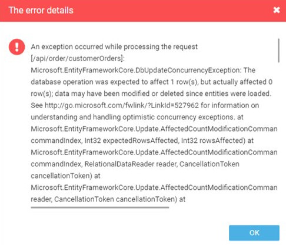

# Handling Concurrency Conflicts 

Concurrency conflicts refer to situations where multiple processes or threads attempt to access and modify the same shared resource simultaneously, leading to data inconsistencies and errors. Effective concurrency conflict handling ensures that only one process can access and modify the shared resource at any given time, thereby preventing conflicts and maintaining data integrity.

{: width="25"} [Handling Concurrency Conflicts](https://learn.microsoft.com/en-us/ef/core/saving/concurrency?tabs=data-annotations)

If the same data gets modified at the same time EF Core's `SaveChanges()` throws a `DbUpdateConcurrencyException`. In cases when you need to handle such situations you can overrdie the `CommitAsync` method and handle `DbUpdateConcurrencyException`. 

<details><summary>`client-wins` scenario example</summary>

```cs
    protected async override Task CommitAsync(IRepository repository)
    {
        bool saveFailed;
        var retry = 0;
        do
        {
            saveFailed = false;
            try
            {
                await repository.UnitOfWork.CommitAsync();
            }
            catch (DbUpdateConcurrencyException ex)
            {
                saveFailed = true;
                retry++;
                if (retry == _commitRetriesCount)
                {
                    throw;
                }
                foreach (var entry in ex.Entries)
                {
                    entry.OriginalValues.SetValues(entry.GetDatabaseValues());
                }
            }
        } while (saveFailed);
    }
```
</details>  

## Cart, Order, and xAPI modules

Cart, Order, and xAPI modules have been updated to prevent multiple users from making conflicting changes to the same cart item simultaneously.

For example, the following error notification appears if multiple users try to update the same order at the same time:

