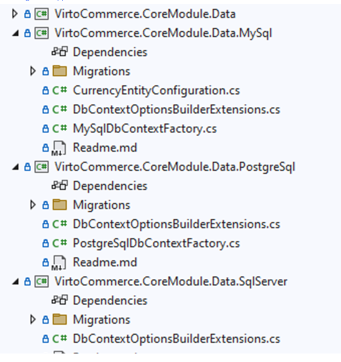
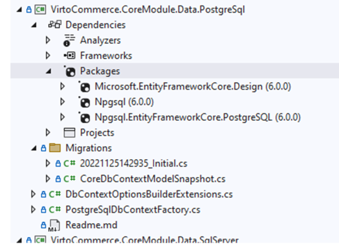
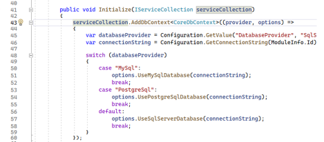
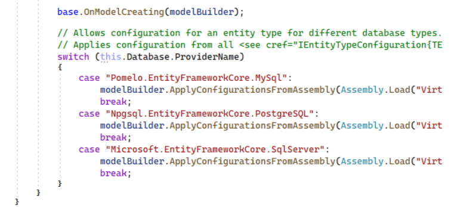

# Create Custom Module with DB Agnostic Approach

Use this technique if you want to develop a module that can work with different database systems without having to rewrite your code for each one.

!!! info
    [Custom modules templates for Dotnet New](/platform/developer-guide/latest/Tutorials-and-How-tos/Tutorials/module-templates-for-dotnet-new) help you generate the basic structure and files for a new module based on some parameters. 

To create a new module with a database agnostic approach:

1. Run the following command to create a CustomerReviews folder containing all the required projects and files for your module:

    ```cmd
    dotnet new vc-module-dba --ModuleName CustomerReviews --Author "Jon Doe" --CompanyName VirtoCommerce
    ``` 

1. Open the solution in Visual Studio.

## Module template features

The template key features  are:

* It generates four projects allowing your module to be database agnostic. Each project provides a specific implementation for working with a particular database system. The CustomerReviews.Data project serves as the common base for all database-related functionality. These projects are:
    * CustomerReviews.Data
    * CustomerReviews.Data.MySql
    * CustomerReviews.Data.PostgreSql
    * CustomerReviews.Data.SqlServer

    {: style="display: block; margin: 0 auto;" }

* The Data.[Provider] projects have a specific structure and configuration for each database system: MySql, PostgreSql, and SqlServer:
    * Migrations folder contains the migration files for the database system.
    * DbContextOptionsBuilderExtensions class contains the helper method for configuring the DbContextOptionsBuilder for specific database provider.
    * [Provider]DbContextFactory class contains implementation of IDesignTimeDbContextFactory for a specific database provider. 
    * Readme.md file contains the instructions for configuring and migration creation the specific database provider.
    
    {: style="display: block; margin: 0 auto;" }

* The Data project contains the common data models and interfaces that are shared by all database systems.
* The Module.Initialize method registers the DbContext service using the AddDbContext extension method from Virto Commerce Platform Core library.

    {: style="display: block; margin: 0 auto;" }

* The OnModelCreating extension method customizes the entity type configuration for different database systems using conditional compilation symbols. You can specify the properties, keys, indexes, relationships, etc. of your entities using a fluent API.

    {: style="display: block; margin: 0 auto;" }

    To use this feature, you need to implement the `IEntityTypeConfiguration<TEntity>` interface in your entity configuration classes. It defines a Configure method that takes an `EntityTypeBuilder<TEntity>` parameter and configures various aspects of the entity type.

    Below is an example implementing this interface for `CurrencyEntity`:

        ```csharp
        public class CurrencyEntityConfiguration : IEntityTypeConfiguration<CurrencyEntity>
        {
            public void Configure(EntityTypeBuilder<CurrencyEntity> builder)
            {
                builder.Property(x => x.ExchangeRate).HasColumnType("decimal").HasPrecision(18, 4);
            }
        }
        ```


<br>
<br>
********

<div style="display: flex; justify-content: space-between;">
    <a href="../configuring-vc-with-db-providers">← Configure VC with DB Providers</a>
    <a href="../transforming-custom-module">Transforming custom modules →</a>
</div>
