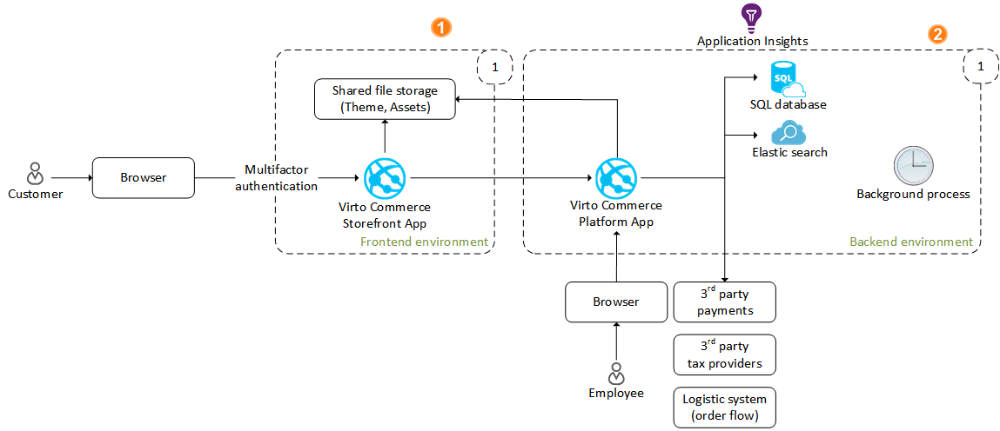
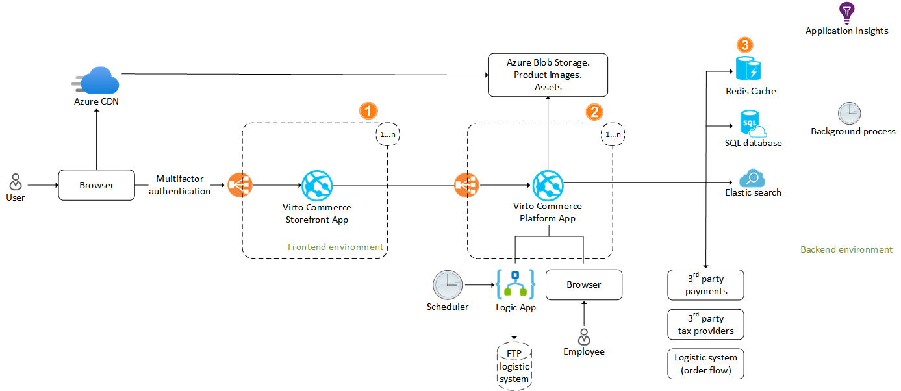
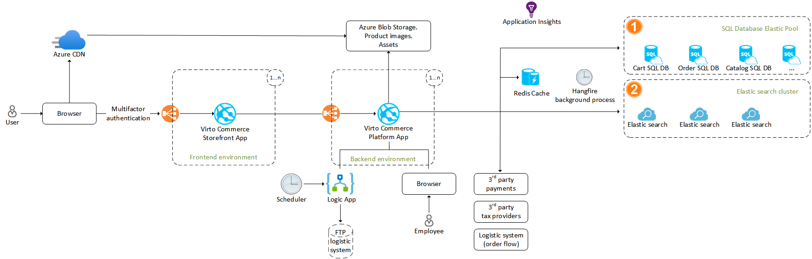
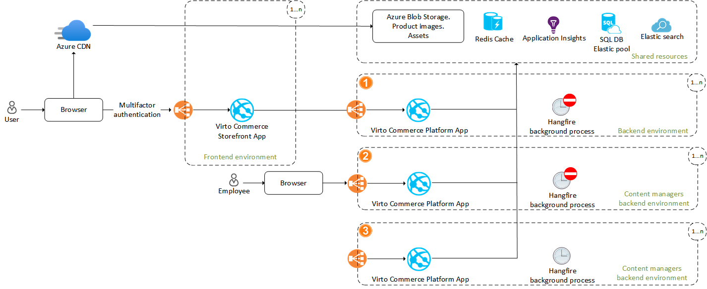

# Scalability

Virto Commerce is a powerful e-commerce solution designed to handle projects of various sizes and complexities. Whether for B2B, B2C, or B2B2C enterprises, marketplaces, or SaaS commerce platforms, Virto Commerce satisfies diverse business needs.

This guide explores its scalability options, ranging from Small to Extra Large configurations. It helps you choose the right Azure services and pricing plans for your specific project needs. Additionally, it explains how to scale solutions built on the Virto Commerce Platform and Frontend Application Kit.

=== "S: Small"

    Perfect for simple projects, proof of concepts, etc.

     

    Key elements:
    
    1.	1x Frontend Applicaton Instance
    2.	1x Backend Instance

=== "M: Medium"

    Ready for production environments and scalability, suitable for MVP launches.

     

    Key elements:

    1.	Multiple Frontend Applicaton Instances
    2.	Multiple Backend Instances
    3.	Redis Cache for Distributed Cache Storage

=== "L: Large"

    Perfect for for complex solutions, leveraging modern Azure services and Virto Commerce capabilities.

     

    Key elements:

    1.	SQL Database Elastic Pool (Segmented modules across different databases: Cart, Order, Catalog, Customers, etc.)
    2.	AzureSearch or Elasticsearch cluster

=== "XL: Extra Large"

    Perfect to optimize resource utilization and costs by segmenting administrative tasks into functional elements. Minimize performance degradation risks across various processes (e.g., Background Jobs for Frontend Applicaton and Content Managers). 

    !!! note
        This environment closely resembles multi-region setups, facilitating high availability and superior performance. 

     

    Key Components:

    1. VC backend environment for Frontend Applicaton (excludes Background Jobs)
    2. VC backend environment for Content Managers (excludes Background Jobs)
    3. VC backend environment for Background Jobs (emphasis on high CPU utilization)

## Sizing Model

This data based on best practices and feedback from multiple custom e-commerce solutions. The actual result can depend on custom implementation, data and configuration.

|**Size**|**Frontend Requests/sec**|**Cart Changes peak/sec**|**Orders per day**|
| --- | --- | --- | --- |
|**S**|10|1|200|
|**M**|100|5|1500|
|**L**|300|50|15000|

For XL size, [request a demo.](https://virtocommerce.com/request-demo)

### Azure Price Calculator

Сonfigure and estimate the costs of Azure products with [Azure Price Calculator](https://azure.microsoft.com/en-us/pricing/calculator/).
