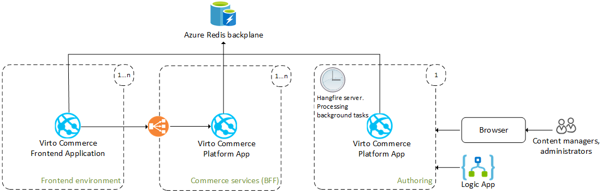

# Scaling Configuration on Azure Cloud

This article explains aspects of setting up the Virto Commerce Platform to use for scaling out an Azure cloud environment. Using scale-out for the Platform allows you to build a more reliable service, and also divides the entire solution into layers and removes the single point of failure.

The diagram below shows proven practices for improving scalability and performance for solutions build on the Virto Commerce Platform: 

 


* **Azure Redis backplane**: Enables broadcasting messages between multiple platform Web Apps to synchronize their local memory caches, ensuring consistent state across instances.
* **VC Frontend Application**: Powers the customer-facing commerce site, serving as the main touchpoint for customers and facilitating their interactions.
* **Commerce services (backend for frontend)**: Handles all requests from frontends to a commercial API with high reliability and performance, deployed across multiple regions and scaled out across multiple server instances.
* **Authoring (backend)**: Processes background jobs, integrates with third-party services, and manages commerce data through the platform’s SPA manager, operating independently to prevent performance and resource consumption issues in platform Web Apps handling commercial services.
* **Hangfire server**: Configured on one or multiple Platform instances to efficiently process Hangfire background jobs.

## Memory cache. Using Redis server backplane

Maintaining consistent cached data is straightforward for single-instance applications with local cache storage, allowing easy control over cache lifecycle and invalidation. However, in scaled-out multiple instances applications, ensuring cache consistency becomes challenging.

While distributed cache could address this challenge, it introduces network latency and requires serialization/deserialization support for all cached data, which can be complex to achieve. Instead, Virto Commerce utilizes a local cache storage approach for each application instance connected to a shared broadcasted service (backplane), receiving invalidation messages.

To address this, a service is needed to which all application instances connect, broadcasting messages when cache data becomes invalid. Redis, an in-memory key-value store supporting a publish/subscribe model, is well-suited for this task. The Virto memory caching Redis backplane employs the pub/sub feature to forward messages to other servers.

When a Platform instance evicts data from its cache, a message for this event is sent to the backplane, which then distributes it to all connected clients via their respective servers. This process ensures cache consistency across multiple instances, as illustrated in the following diagram:

 

Use the Redis backplane for memory cache in **appsettings.json** for setting up as follows: 

```json title="appsettings.json"

    "ConnectionStrings": {
        ...
        //Add RedisConnectionString value to start using Redis server as backplane for memory cache synchronization
        "RedisConnectionString": "vc.redis.cache.windows.net:6380,password={password}=,ssl=True,abortConnect=False"
        ...
    },
```

##  Scale push notifications

The push notification that is used in the manager is built on the [SignalR](https://docs.microsoft.com/en-us/aspnet/core/signalr/introduction?view=aspnetcore-6.0) library.

In order to be able to see all push notifications on the manager, even those sent by different Platform instances, you can use the two scaling modes to configure your Platform to use **Redis Server Backplane** or **Azure SignalR** services. 

{: width="25"} [Set up a Redis backplane for ASP.NET Core SignalR scale-out](https://docs.microsoft.com/en-us/aspnet/core/signalr/redis-backplane?view=aspnetcore-3.1)

When SignalR is running on a server farm (multiple servers), **sticky sessions** must be used. **Sticky sessions** are also called **session affinity** by some load balancers. Azure App Service uses Application Request Routing (ARR) to route requests. Enabling the **ARR Affinity** setting in your Azure App Service enables **sticky sessions**.

!!! note
    **ARR Affinity** setting must be enabled for all Azure apps services where users work with Platform Manager UI.


The following example shows how to configure scaling for push notifications using **Redis backplane** mode. 

```json title="appsettings.json"
...
"ConnectionStrings": {
        ...
        //Add RedisConnectionString value to start using Redis server as backplane for memory cache synchronization
        "RedisConnectionString": "vc.redis.cache.windows.net:6380,password={password}=,ssl=True,abortConnect=False"
        ...
    },
...
"PushNotifications": {
        //Possible values: RedisBackplane | AzureSignalRService | None
        "ScalabilityMode": "RedisBackplane",
        //The URL is used to connect the Platform SignalR /pushNotificationHub hub as client to be able sync the local notifications storage with notifications that are produced by other Platform instances
        //Need to replace this value to a full URL to  /pushNotificationHub on the production server e.g https://your-app-name.azurewebsites.net/pushNotificationHub?api_key={your-vc-api-key}
        "HubUrl": "https://{your-app-name}.azurewebsites.net/pushNotificationHub?api_key={your-vc-api-key}",      
        "RedisBackplane": {
            "ChannelName": "VirtoCommerceChannel"
        }
    }
...
```

## Configure hangfire server to process background jobs in another process

To ensure overall application reliability, it is important to process all background tasks on a separate Platform instance (process). This separation prevents background processing from consuming excessive CPU or other resources, which could otherwise degrade the main application's performance. We strongly recommend using a dedicated Platform instance for processing background jobs.

To configure this setup, set up one Platform instance (**Commerce services** on the diagram above) to only enqueue background jobs. Another Platform instance (**Authoring** on the diagram above) will host the Hangfire server responsible for processing these background jobs, which are retrieved from shared storage.

!!! note
    Ensure that all Client/Servers use the same job storage and `JobStorageType`. Only **Database** is allowed, and all instances must have identical code bases. If a client enqueues a job based on a class that is absent in the server's code, the server will throw a performance exception.

```json title="appsettings.json"
...
"VirtoCommerce": {
    "Hangfire": {
        "JobStorageType": "Database",
        ...
    }
    ...
}
```

## Configuration examples

To illustrate configuration setups, here are examples for different components:

* [Authoring App.](scaling-configuration-on-azure-cloud.md#authoring-app)
* [Commerce Service App.](scaling-configuration-on-azure-cloud.md#commerce-service-app)
* [Frontend App.](scaling-configuration-on-azure-cloud.md#frotend-app)

### Authoring app

To configure the Authoring App:

1. Access the [Authoring App.](https://vc-admin.azurewebsites.net)

1. Configure Azure app general settings:

    ```yaml
    ARR affinity : On
    Platform : 64 bit
    ```

1. Configure the **appsettings.json** file:

    ```json title="appsettings.json"
    "ConnectionStrings": {
            "VirtoCommerce": "Data Source=tcp:dev-odt.database.windows.net,1433;Initial Catalog={db-name};User ID={db-admin-name};Password={password};MultipleActiveResultSets=True;Connection Timeout=30;Trusted_Connection=False;Encrypt=True;"
            "RedisConnectionString": "vc.redis.cache.windows.net:6380,password={password}=,ssl=True,abortConnect=False"
        },
        ...
        "VirtoCommerce": {
            "Hangfire": {
                "JobStorageType": "Database",
                ...
            }
            ...
    "PushNotifications": {
            "ScalabilityMode": "RedisBackplane",     
            "HubUrl": "https://vc-admin.azurewebsites.net/pushNotificationHub?api_key=9fde4353-9a4a-4fe3-9a03-a0c80b4220ff",      
            "RedisBackplane": {
                "ChannelName": "VirtoCommerceChannel"
            }
        }
            ...

    ```

### Commerce service app

To configure the Commerce Service App:

1. Access the [Commerce Service App.](https://bff-vc-admin.azurewebsites.net)

1. Configure Azure app general settings:

    ```yaml
    ARR affinity : Off
    Platform : 64 bit
    ```

1. Configure the **appsettings.json** file:

    ```json title="appsettings.json"
    "ConnectionStrings": {
            "VirtoCommerce": "Data Source=tcp:dev-odt.database.windows.net,1433;Initial Catalog={db-name};User ID={db-admin-name};Password={password};MultipleActiveResultSets=True;Connection Timeout=30;Trusted_Connection=False;Encrypt=True;"
            //Add RedisConnectionString value to start using Redis server as backplane for memory cache synchronization
            "RedisConnectionString": "vc.redis.cache.windows.net:6380,password={password}=,ssl=True,abortConnect=False"
        },
        ...
        "VirtoCommerce": {
            "Hangfire": {
                "JobStorageType": "Database",
                "UseHangfireServer": false, //Set value to false for the Platform instance that you want to stop processing the background jobs
                ...
            }
            ...
        "PushNotifications": {
            //These instances aren't produced any push notifications and don't use for work directly through the Platform manager web interface. Therefore, we don't need to use scaling mode for push notifications 
            "ScalabilityMode": "None"
        }
            ...

    ```

### Frontend app

To configure the Frontend App:

1. Access the [Frontend App.](https://vc-store.azurewebsites.net)

1. Configure Azure app general settings:

    ```yaml
    ARR affinity : On
    Platform : 64 bit
    ```

1. Configure the **appsettings.json** file:

    ```json title="appsettings.json"
    "ConnectionStrings": {        
            "RedisConnectionString": "vc.redis.cache.windows.net:6380,password={password}=,ssl=True,abortConnect=False"
        },
        ...
    ```

{: width="25"} [Scalability options](scalability-options.md)


<br>
<br>
********

<div style="display: flex; justify-content: space-between;">
    <a href="../scalability-options">← Scalability options </a>
    <a href="../../Event-Driven-Development/scaling-configuration-on-azure-cloud">Using domain events →</a>
</div>