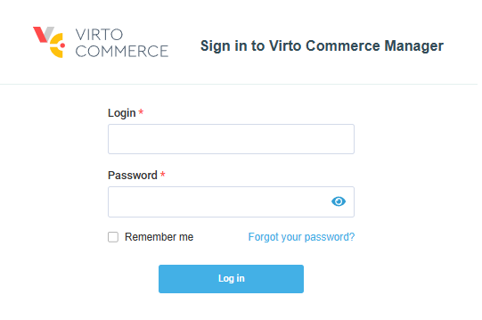
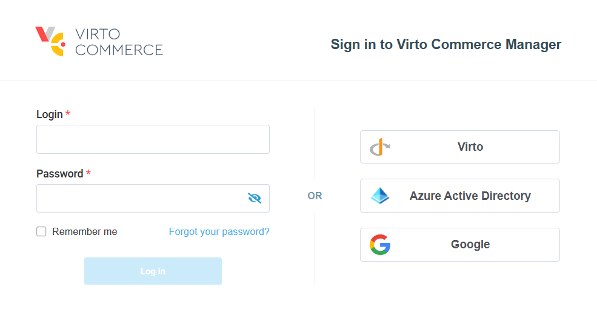

# Overview

The Virto Commerce Platform supports the following authentication methods:  

* [Username and password](issuing-and-using-access-token.md): Users can authenticate using their credentials to obtain access tokens. This approach is straightforward and suitable for simple scenarios where no external identity provider is required.  

    {: style="display: block; margin: 0 auto;" }

* [OpenID connect](oidc.md): Clients can authenticate end-users via an authorization server. It adheres to the OpenID Connect standard, enabling integration with the following identity providers: Entra ID (formerly Azure AD), Google, Virto Commerce.  

    {: style="display: block; margin: 0 auto;" width="600"}

These options provide flexibility, catering to both standalone authentication setups and modern, federated identity solutions.

Enterprise single sign-on is available through OpenID Connect only; SAML is not supported. To connect an identity provider that offers both protocols, for example, Okta or Azure AD, use its OIDC application type.

The Platform exposes a `twoFactorEnabled` flag on `ApplicationUser`, returned as `twoFactorEnabled` on the xAPI `UserType`. There is no built-in TOTP, WebAuthn, or passkey enrollment flow; implement multi-factor authentication through your OIDC identity provider instead.

 
 
********

    <a href="../../overview">← Security overview </a>
    <a href="../../authentication/issuing-and-using-access-token">Issuing and using access token →</a>

