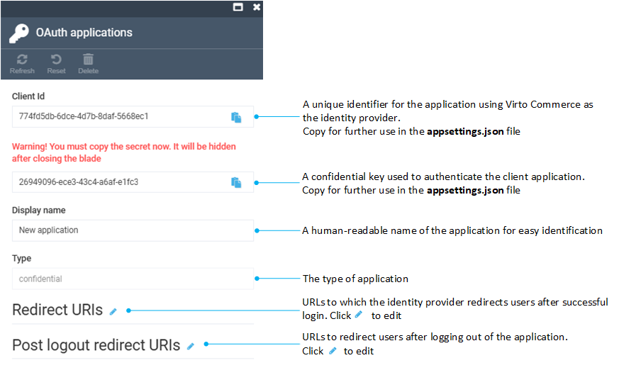
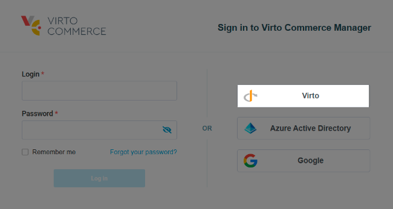

# Use Virto Commerce as Identity Provider

You can register Virto Commerce as an identity provider as follows:

1. In the main menu, click **Security**.
1. In the next blade, click **OAuth applications**. 
1. In the next blade, click **Add** in the toolbar.
1. Configure the following fields:

    

1. Click **OK** to save the changes.

Your new app appears in the OAuth applications list.

## First-time login with Virto

To log in using the Virto authentication provider for the first time:

1. Click **Virto** on the login page.

    

1. Consent to providing access to the following information:

    * **OpenID**: A unique identifier associated with your identity, used to confirm who you are.
    * **Profile**: Basic personal information such as your name and username, used to personalize your experience.
    * **Email**: Your email address, often used for communication and account recovery.

1. You will see an **Access denied** notification:

    {: width="600"}

This message means that you are logged in, but you will not be able to perform until an administrator assigns you the required roles. 