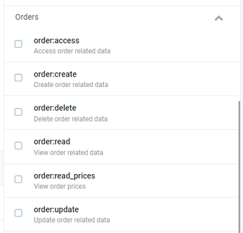

## Defining Global Permissions

In Virto Commerce, all permissions are defined through the design time (from the code) for each action grouped by a feature area. In this example, we will be defining two feature areas with CRUD permissions. We are using constants because we will need attributes that require constant expressions:

```csharp title="ModuleConstants.cs"
 public class ModuleConstants
    {
        public static class Security
        {
            public static class Permissions
            {
                public const string Read = "order:read";
                public const string Create = "order:create";
                public const string Update = "order:update";
                public const string Access = "order:access";
                public const string Delete = "order:delete";
                public const string ReadPrices = "order:read_prices";

                public static string[] AllPermissions = new[] { Read, Create, Update, Access, Delete, ReadPrices };
            }
        }
```

You have to register the permissions in the system in order to be able to use them in authorization checks and for role assignments in the UI:

```csharp title="module.cs"
public void PostInitialize(IApplicationBuilder appBuilder)
 {
     ...
      var permissionsProvider = appBuilder.ApplicationServices.GetRequiredService<IPermissionsRegistrar>();
            permissionsProvider.RegisterPermissions(ModuleConstants.Security.Permissions.AllPermissions.Select(x =>
                new Permission()
                {
                    GroupName = "Orders",
                    ModuleId = ModuleInfo.Id,
                    Name = x
                }).ToArray());
    ...
 }
```

## Permission Localization

Virto Platform Manager supports localization resources for text, captions, tips, etc. This is also true for permission names. This is achieved by adding resources with a special key names into the module localization resource file:

```
_‘permissions:’ + permission.name_
```

Here is an example of localized permission labels:


```json title="Localization/en.VirtoCommerce.Orders.json"
...
"permissions": {
    "order:read": "View order related data",
    "order:create": "Create order related data",
    "order:update": "Update order related data",
    "order:delete": "Delete order related data",
    "order:access": "Access order related data",
    "order:read_prices": "View order prices""
  },
...
```

Here is how it looks in the UI:



## Checking Global Permissions

Global permissions are permissions that do not require any context resources for authorization check. To use such permissions for authorization of your controller methods, you can use the `Authorize` attribute to check a particular permission:

```csharp title="VirtoCommerce.OrdersModule.Web/Controllers/Api/OrderModuleController.cs"
 [HttpPost]
        [Route("")]
        [Authorize(ModuleConstants.Security.Permissions.Create)]
        public async Task<ActionResult<CustomerOrder>> CreateOrder([FromBody]CustomerOrder customerOrder)
        {
            ...
        }
```
