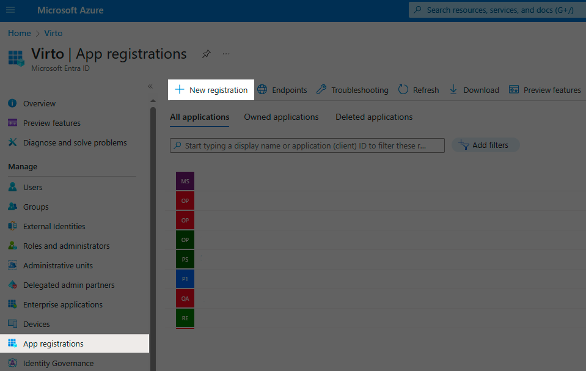
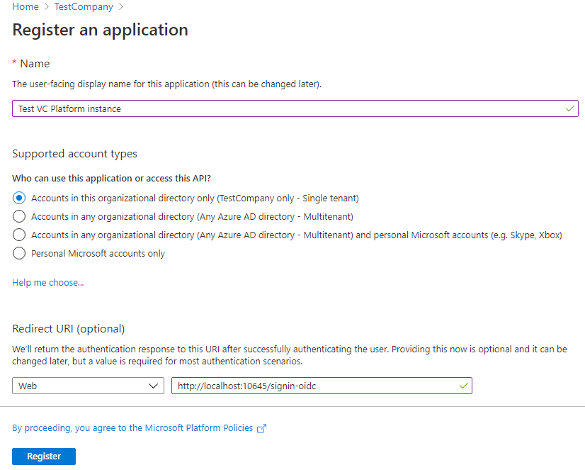
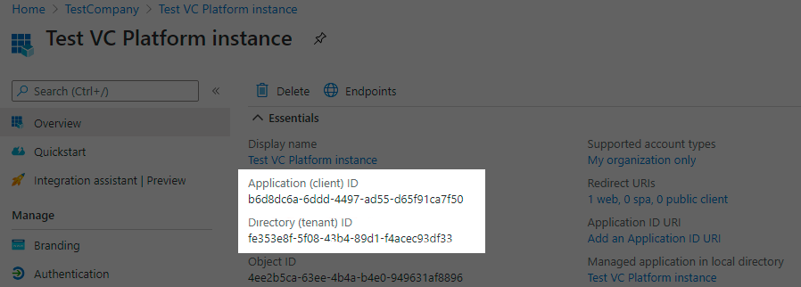
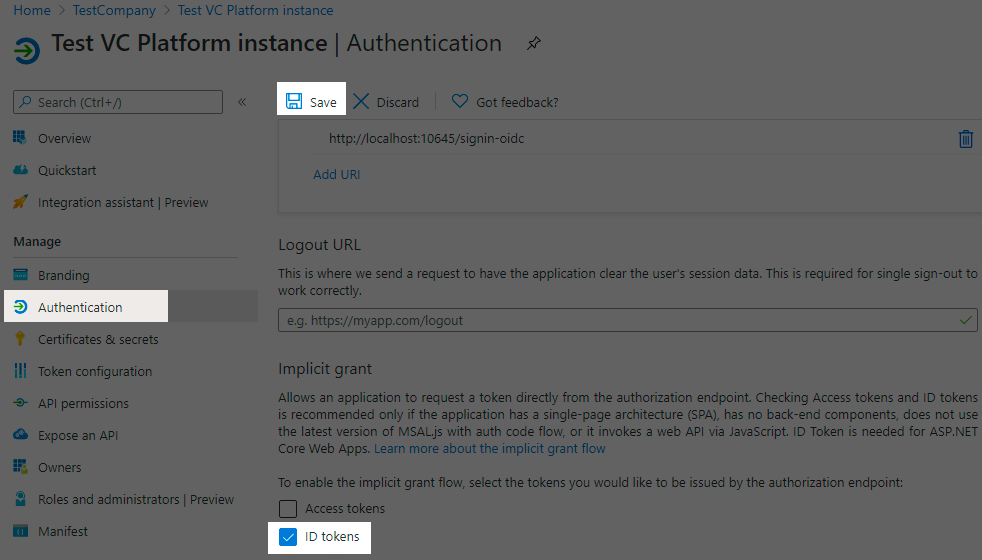
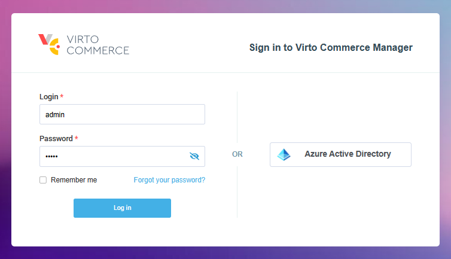
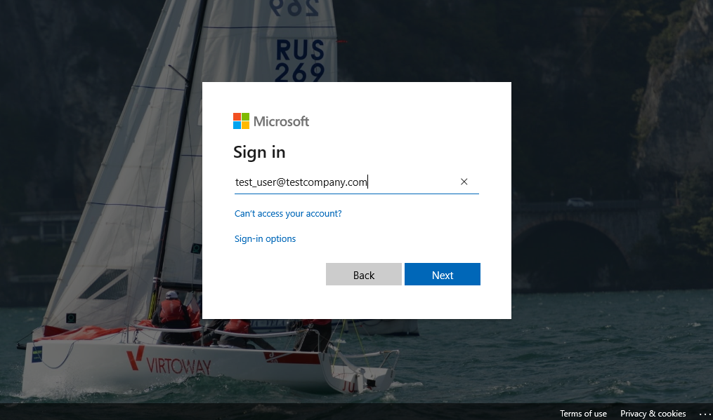
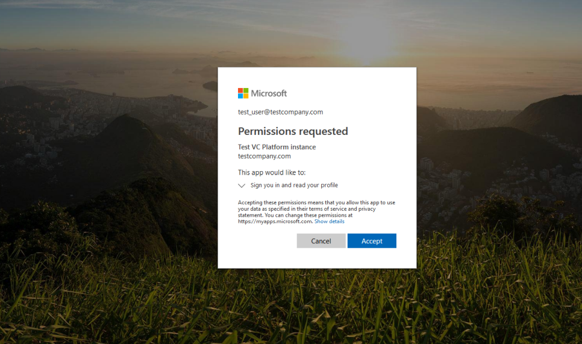
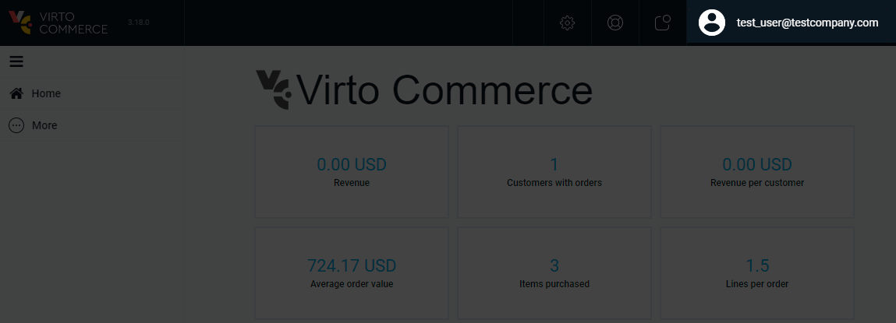

# Azure AD (MS Entra) Authentication Management

This guide provides information about using Azure AD as a single sign-on (SSO) provider.

!!! note
    **Azure Active Directory (Azure AD)** has been renamed to **Microsoft Entra ID**. For the remainder of this guide, these terms are considered synonymous.

{: width="25"} [Azure App Configuration](../../../Tutorials-and-How-tos/How-tos/azure-app-configuration.md)

By default, the Virto Commerce Platform Manager authenticates users with a login and password. However, this method has its drawbacks:

* Each Virto Commerce Platform account must be manually created by an administrator.
* Users are required to remember their login and password and input them each time they sign in to Virto Commerce Platform Manager.

These issues can be solved by enabling sign-in with Azure Active Directory, allowing users of a certain company to sign in or sign up using their Azure AD account.

Azure Active Directory authentication offers several advantages:

* Virto Commerce Platform Manager automatically creates a new account the first time a user signs in, eliminating the need for manual creation by administrators.
* Users do not need to remember another password, as they can use their existing Azure AD account.
* Azure Active Directory employs the single sign-on flow, meaning users who already utilize Microsoft services such as Office 365 or Outlook.com do not need to enter their password to sign in to Virto Commerce Platform Manager.

To implement single sign-on, Virto Commerce Platform utilizes the OpenID Connect protocol provided by the **Microsoft.AspNetCore.Authentication.OpenIdConnect** library.

## Prerequisites

1. Your company has a valid Azure Active Directory tenant. If not, follow the [quickstart guide](https://docs.microsoft.com/en-us/azure/active-directory/fundamentals/active-directory-access-create-new-tenant) to create one.
1. You have an Azure account associated with your company's Azure Active Directory tenant. If you do not have an Azure account yet, [start a free Azure subscription](https://azure.microsoft.com/free/).
1. A Virto Commerce Platform instance is running, either locally or on Azure. Ensure you have privileges to modify its configuration.
1. If managing roles and privileges for users signed up with Azure AD is required, ensure you have administrator access to Virto Commerce Platform Manager.

## Setup

To set up the Azure Active Directory based authentication in Virto Commerce Platform Manager:

1. [Add registration for Virto Commerce Platform in Azure Active Directory.](adding-azure-as-sso-provider.md#add-registration-for-virto-commerce-platform-in-azure-active-directory)
1. [Configure Virto Commerce Platform to use Azure AD Authentication.](adding-azure-as-sso-provider.md#configure-virto-commerce-platform-to-use-azure-ad-authentication)
1. [Test.](adding-azure-as-sso-provider.md#test)

### Add registration for Virto Commerce Platform in Azure Active Directory

1. Sign in to the [Azure Portal](https://portal.azure.com/) using your Azure account.

1. Select Azure Active Directory to access the overview of your company's Azure AD tenant.

1. Navigate to App registrations and click the New registration button to register a new application.

    

1. Provide the necessary information on the **Register an application** screen:

    * **Name**: Application name for your Virto Commerce Platform instance (visible to users on the Azure AD sign-in page).
    * **Supported account types**: Leave the default value.
    * **Redirect URI**: Select Web and enter the external sign-in URL of your Virto Commerce Platform (/signin-oidc), e.g., http://localhost:10645/signin-oidc.

    !!! note
        If your URL is not localhost, HTTPS is required.

    

1. After registration, copy the values from the Application (client) ID and Directory (tenant) ID fields for use in the next step:

    

1. In **Authentication**, enable ID tokens and save the changes:

    

### Configure Virto Commerce Platform to use Azure AD Authentication

To configure Virto Commerce Platform to use Azure AD authentication:

1. Open **appsettings.json** for the Virto Commerce Platform instance.
1. Navigate and find the AzureAd node:

    ```json title="appsettings.json"
    "AzureAd": {
        "Enabled": false,
        "AuthenticationType": "AzureAD",
        "AuthenticationCaption": "Azure Active Directory",
        "ApplicationId": "(Replace this with Application (client) ID, e.g. 01234567-89ab-cdef-0123-456789abcdef)",
        "TenantId": "(Replace this with Directory (tenant) ID, e.g. abcdef01-2345-6789-abcd-ef0123456789)",
        "AzureAdInstance": "https://login.microsoftonline.com/",
        "DefaultUserType": "Manager",
        "UsePreferredUsername": false
    }
	```

1. Modify the following settings:
    1. Set `Enabled` to `true`.
    1. Paste the value of Application (client) ID from app registration in Azure to `ApplicationId`.
    1. Paste the value of Directory (tenant) ID to `TenantId`.

    The updated configuration should look as follows:

    ```json title="appsettings.json"
    "AzureAd": {
        "Enabled": true,
        "AuthenticationType": "AzureAD",
        "AuthenticationCaption": "Azure Active Directory",
        "ApplicationId": "b6d8dc6a-6ddd-4497-ad55-d65f91ca7f50",
        "TenantId": "fe353e8f-5f08-43b4-89d1-f4acec93df33",
        "AzureAdInstance": "https://login.microsoftonline.com/",
        "DefaultUserType": "Manager",
        "UsePreferredUsername": false,
        "Priority": 0
    }
	```

1. Restart your Virto Commerce Platform instance to apply the updated settings.


### Test

1. Navigate to the login page of Virto Commerce Platform Manager and locate the **Sign in with Azure Active Directory** link:

    

1. Click the link to be redirected to the Microsoft sign-in page. You might be asked to sign in with your Microsoft account if you did not sign in with it earlier. Sign in with your Azure account credentials. Make sure this account belongs to the same domain where you registered the application.

    

1. If prompted, grant permission for the application to sign you in and read your account information.

    

1. Upon successful sign-in, you will be redirected back to Virto Commerce Platform Manager, where you will be authenticated:

    


    !!! note
        The account created via Azure AD sign-in is a regular Virto Commerce Platform account with default roles and permissions. Adjustments may be required by the administrator.


## Multitenant Azure AD

If you use the Azure AD authentication and want to allow users from any tenant to connect to your Virto Commerce application, you need to configure the Azure AD app as multi-tenant and use a **wildcard** tenant ID, such as `organizations` or `common` in the authority URL.

You also need to switch **Validate Issuer** from **Default** to **MultitenantAzureAD** mode.

```json title="appsettings.json"
	"AzureAd": {
		"TenantId": "common",
		"ValidateIssuer" : "MultitenantAzureAD",
	},
```

The updated configuration might look like this:
    
```json title="appsettings.json"
	"AzureAd": {
		"Enabled": true,
		"AuthenticationType": "AzureAD",
		"AuthenticationCaption": "Azure Active Directory",
		"ApplicationId": "b6d8dc6a-6ddd-4497-ad55-d65f91ca7f50",
		"TenantId": "common",
		"ValidateIssuer" : "MultitenantAzureAD",
		"AzureAdInstance": "https://login.microsoftonline.com/",
		"DefaultUserType": "Manager",
		"UsePreferredUsername": false,
		"Priority": 0
	},
```

## Advanced details

As mentioned above, when a user signs in with Azure Active Directory for the first time, Virto Commerce Platform automatically creates a new account for them. But what happens if the Virto Commerce Platform account with the same login already exists?

To answer this question, let's explore the Azure Active Directory authentication in Virto Commerce Platform deeper.

1. VC Platform trigegrs **Microsoft.AspNetCore.Authentication.OpenIdConnect** to verify the user's identity. This initiates a standard OpenID Connect flow, redirecting the user to the Azure Active Directory sign-in page and then back to the Virto Commerce Platform.
1. When this flow is over, Virto Commerce Platform receives Azure Active Directory account information for the current user and extracts the **upn** claim value from it.
1. Virto Commerce Platform then attempts to find an existing Virto Commerce Platform account with a login that matches that **upn** claim value. This search can lead to three possible outcomes:
	1. If the account already exists and is associated with the Azure Active Directory account of the signed-in user, no further action is taken, and Virto Commerce Platform authenticates the user using the existing account.
	1. If the account exists but lacks external sign-in information for Azure Active Directory, Virto Commerce Platform updates the account to include this information. All other account details, such as roles, permissions, and personal information, remain unchanged.
	1. If no such account exists yet, Virto Commerce Platform creates a new one and links it to the Azure Active Directory account.

1. If the upn claim is not transferred, resulting in an error message like **Received external login info does not have an UPN claim or DefaultUserName**, you can configure the system to use either the **preferred username** or **email address** claims instead. Use the following settings in the **appsettings.json** file:
 
    ```json title="appsettings.json"
	    {
		    "UsePreferredUsername": true
	    }
    ```

	or:
    
    ```json title="appsettings.json"
	    {
		    "UseEmail": true
	    }
    ```

!!! warning
	If you see the **IDX10205: Issuer validation failed** error, this means you forgot to switch `ValidateIssuer` to `MultitenantAzureAD`.

## Configuration with custom Azure AD app signing keys

If your app has custom signing keys, you can receive the following error upon the `POST https://localhost:5001/signin-oidc` request:

```json title="appsettings.json"
Microsoft.IdentityModel.Tokens.SecurityTokenSignatureKeyNotFoundException: IDX10501: Signature validation failed. Unable to match key
```

If your app uses custom signing keys due to the claim mapping feature, you need to append an appid query parameter containing the app ID. This ensures you receive a **jwks_uri** pointing to your app's signing key information. 

For instance, the URL https://login.microsoftonline.com/{tenant}/v2.0/.well-known/openid-configuration?appid=6731de76-14a6-49ae-97bc-6eba6914391e contains a **jwks_uri** of https://login.microsoftonline.com/{tenant}/discovery/v2.0/keys?appid=6731de76-14a6-49ae-97bc-6eba6914391e.

Here is an example of the updated configuration that resolves the above issue:
    
```json title="appsettings.json"
	"AzureAd": {
		"Enabled": true,
		"AuthenticationType": "AzureAD",
		"AuthenticationCaption": "Azure Active Directory",
		"ApplicationId": "b6d8dc6a-6ddd-4497-ad55-d65f91ca7f50",
		"TenantId": "fe353e8f-5f08-43b4-89d1-f4acec93df33",
		"AzureAdInstance": "https://login.microsoftonline.com/",
		"MetadataAddress": "https://login.microsoftonline.com/fe353e8f-5f08-43b4-89d1-f4acec93df33/v2.0/.well-known/openid-configuration?appid=b6d8dc6a-6ddd-4497-ad55-d65f91ca7f50",
		"DefaultUserType": "Manager",
		"UsePreferredUsername": false
	}
```
