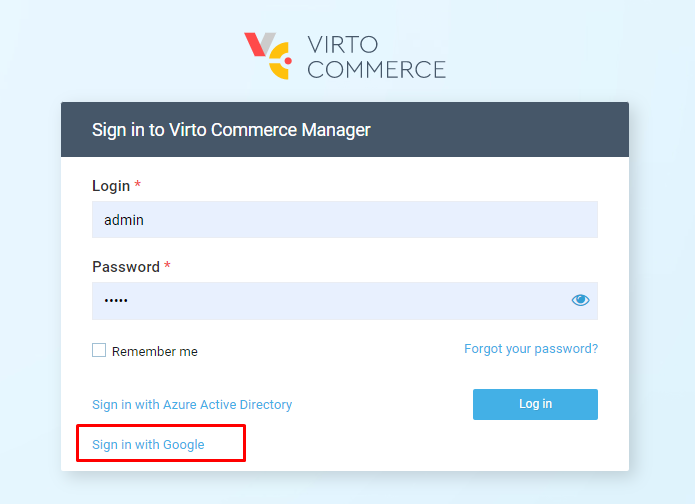

Using Google as an example, this tutorial will show you how to implement a new single sign-on (SSO) provider for an extension module.

## Create Google OAuth 2.0 Client
To use Google APIs in an application with OAuth 2.0, you need authorization credentials that identify the app for Google's OAuth 2.0 server. Your applications will use such credentials to access APIs that you have enabled for that project. 

To create credentials for your project:

1. Go to  [Google API & Services](https://console.cloud.google.com/apis).
1. Create a new project and open the dashboard.
1.   In the **OAuth consent screen** of the dashboard:
    1. Select **User Type > External** and click **CREATE**.
    1. In the **App Information** dialog, type the app name, user support email, and developer contact information.
    1. Skip **Scopes**.
    1. Skip **Test users**.
    1. Review the **OAuth consent screen** and go back to the app dashboard.
    1. In the **Credentials** tab of the app dashboard, select **CREATE CREDENTIALS > OAuth client ID**.
1.   Select **Application type --> Web application** and choose a name.
    
1.   In the **Authorized redirect URIs** section, select **ADD URI** to set the redirect URI. Run the platform using the https scheme. Otherwise, the SSO won't work.

    !!! Note
        * If your platform is running on a local machine, put `https://localhost:10645/signin-google`.

1.  Click **CREATE**.
1.   Save **Client ID** and **Client Secret** to use them in the module.

## Configure Google Sign-in

Store Google Client ID, secret values and other sensitive settings in **KeyVault Storage**. In our example, we use the `appsettings.json` configuration file. Add the following section to the configuration:


```json title="appsettings.json"
"Google": {
    "Enabled": true,
    "AuthenticationType": "Google",
    "AuthenticationCaption": "Google",
    "ClientId": "<your Client ID>",
    "ClientSecret": "<your Client Secret>",
    "DefaultUserType": "Manager"
}
```

## Add Module Extensions

1. Add the Microsoft.AspNetCore.Authentication.Google v6.0 and the latest version of VirtoCommerce.Platform.Security packages to .web project of the custom extension module.
1. Add the basic **GoogleOptions.cs** class.

    ```csharp
    public class GoogleOptions
    {
        public bool Enabled { get; set; }
        public string AuthenticationType { get; set; }
        public string AuthenticationCaption { get; set; }
        public string ClientId { get; set; }
        public string ClientSecret { get; set; }
        public string DefaultUserType { get; set; }
    }
    ```

1.   Add the **GoogleExternalSignInProvider.cs** class. The **IExternalSignInProvider** interface describes the external provider custom behavior.

    ```csharp
    public class GoogleExternalSignInProvider : IExternalSignInProvider
    {
        private readonly GoogleOptions _options;
    
        public bool AllowCreateNewUser => true;
        public int Priority => 200;
        public bool HasLoginForm => false;
   
        public GoogleExternalSignInProvider(IOptions<GoogleOptions> options)
        {
            _options = options.Value;
        }
   
        // Use this method to retrieve the username claim
        public string GetUserName(ExternalLoginInfo externalLoginInfo)
        {
            return externalLoginInfo.Principal.FindFirstValue(ClaimTypes.Email);
        }
   
        // Use this method to get the default user type that'll be assigned to a new user
        public string GetUserType()
        {
            return _options.DefaultUserType;
        }
    }
    ```

1. Configure Google authentication by adding the following code to the  **module.cs** Initialize method:

    ```csharp
    var googleAuthEnabled = Configuration.GetValue<bool>("Google:Enabled");
    if (googleAuthEnabled)
    {
        // add options
        var optionsSection = Configuration.GetSection("Google");
        var options = new GoogleOptions();
        optionsSection.Bind(options);
        serviceCollection.Configure<GoogleOptions>(optionsSection);
   
        // add app builder google sso
        var authBuilder = new AuthenticationBuilder(serviceCollection);
  
        authBuilder.AddGoogle(googleOptions =>
        {
            googleOptions.ClientId = options.ClientId;
            googleOptions.ClientSecret = options.ClientSecret;
        });
    
        // register Google external provider implementation
        serviceCollection.AddSingleton<GoogleExternalSignInProvider>();
        serviceCollection.AddSingleton(provider => new ExternalSignInProviderConfiguration
        {
            AuthenticationType = options.AuthenticationType,
            Provider = provider.GetService<GoogleExternalSignInProvider>(),
        });
    }
    ```

## Sign in with Google

1. Run the platform and open **Log in**. 
1. Select **Google**. You will be redirected to Google for authentication. 
1. Enter your Google credentials. You will be redirected back to the platform:

1. Click **Sign in with Google.**