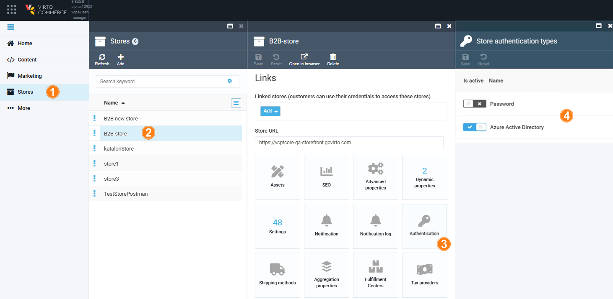
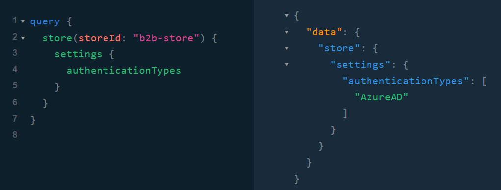
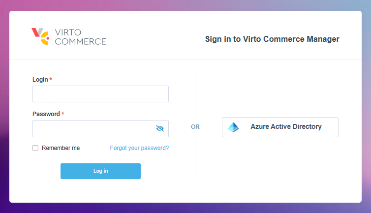

# Add Azure AD as SSO provider

To integrate Azure AD as SSO provider:

1. [Manage backend settings.](azure-ad.md#backend-settings)
1. [Manage Platform settings.](azure-ad.md#platform-settings)


## Backend Settings

Set up the necessary environment variables for the Frontend Application to authenticate users via Azure AD authentication provider:

```
set "Azuread…Enabled=true"
set "AzureAd_ApplicationId=86d04c35-143d-4d3c-aca2-8608e2186282"
set "Azurend…TenantId=bc03e660-5e3a-45c4-bf5c-b75489f78923"
set "AzureAd…ValidateIssuer=MultitenantAzureAD"
```

## Platform Settings

Configure store settings:

1. Click **Stores** in the main menu.
1. In the next blade, select the desired store.
1. In the next blade, click on the **Authentication** widget.
1. In the next blade, enable/disable authentication types for the selected store.

    

    !!! note
        By default, all registered authentication types are enabled.

1. Click **Save** to save the changes.

The GraphQL query confirms that authentication via Azure AD is enabled:

{: width="650"}

The Azure AD authentication button appears on the login page of the Frontend Application:

{: width="700"}

