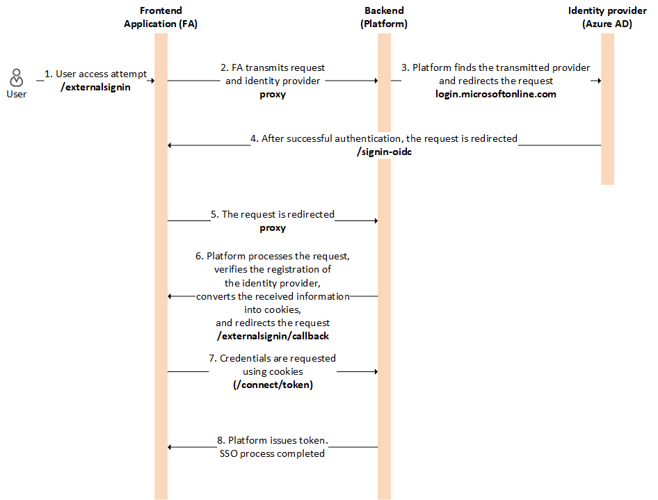

# Overview

Adding SSO providers simplifies user logins. It lets them use trusted platforms' credentials and boosts security by using strong authentication methods.

The SSO process flow is as follows (using Azure AD as an exampe):

{: width="750"}

{: width="25"} [Adding Google as SSO provider](google.md)

{: width="25"} [Adding Azure AD as SSO provider](azure-ad.md)
