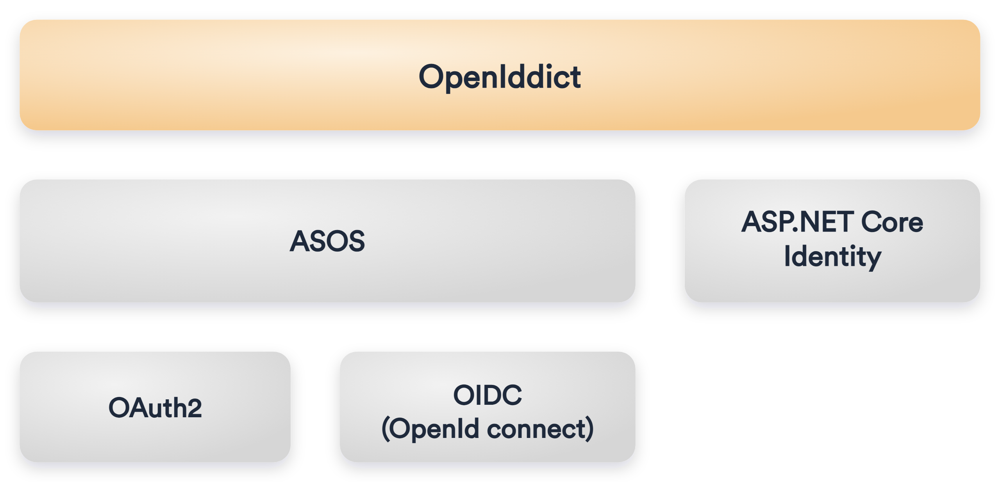

# Authenticate with ASP.NET Core Identity

Virto Platform uses [ASP.NET](http://asp.net/) Core Identity as a membership system.

Using [ASP.NET](http://asp.net/) Core Identity enables several scenarios:

* Creating new user data using the `UserManager type` (`userManager.CreateAsync`).
* Authenticating users through the `SignInManager` type. You can use `signInManager.SignInAsync` to sign in directly, or `signInManager.PasswordSignInAsync` to confirm the user’s password is correct and then sign them in.
* Identifying a user based on information stored in a cookie or barrier token so that requests from a browser could include the signed-in user’s identity and claims

## Issue JWT tokens with OpenIddict

To enable token authentication, ASP.NET Core supports multiple options for using **OAuth 2.0** and **OpenID Connect**. We take advantage of a good third-party library and use **OpenIddict** to provide a simple and easy-to-use solution to implement an OpenID Connect server within the Platform application.

**OpenIddict** is based on `AspNet.Security.OpenIdConnect.Server` (ASOS) to control the **OpenID Connect** authentication flow and can be used with any membership stack, including ASP.NET Core Identity. Also, it supports various token formats, although in Virto Platform, we use only JWT token for authorization because of the following advantages:

* **Stateless:** The token contains all information to identify the user, eliminating the need for session state.
* **Reusability:** A number of separate servers running on multiple Platforms and domains can reuse the same token for authenticating the user. It is easy to build an application that shares permissions with other applications.
* **JWT Security:** No cookies means you have no need to protect against cross-site request forgery attacks (CSRF).
* **Performance:** No server-side lookup to find and deserialize the session on each request; you only need to calculate the HMAC SHA-256 to validate the token and parse its content.

Adding an **OpenID Connect** server to the Platform allows you to support token authentication, as well as to manage all your users using a local password or an external identity provider (e.g. Azure Active Directory) for all your applications in a single place, with the power to control who can access your API and the information that is exposed to each client. 

{: style="display: block; margin: 0 auto;" width="500"}

Virto Platform uses JWT token authentication and OAuth2 Password, Client Credentials and Refresh token flows to issue and consume authorization token for clients.

{: width="25"} [OpenIddict integration to Virto Commerce](https://virtocommerce.com/blog/how-to-secure-aspnet-core-applications-with-openiddict-using-virto-commerce-platform)

{: width="25"} [Understanding OAuth2](http://www.bubblecode.net/en/2016/01/22/understanding-oauth2/)

{: width="25"} [ASP.NET core authentication](https://docs.microsoft.com/aspnet/core/security/authentication/identity)

{: width="25"} [Resource-based authentication](https://docs.microsoft.com/en-us/aspnet/core/security/authorization/resourcebased?view=aspnetcore-3.0)

{: width="25"} [ASP.NET Core authorization](https://docs.microsoft.com/aspnet/core/security/authorization/introduction)

{: width="25"} [Role-based authorization](https://docs.microsoft.com/aspnet/core/security/authorization/roles)

{: width="25"} [Custom policy-based authorization](https://docs.microsoft.com/aspnet/core/security/authorization/policies)

## OWASP Top 10

Virto Commerce does not publish an OWASP Top 10 mapping. Some of the categories are addressed by framework defaults rather than Platform-specific code: EF Core's parameterized queries mitigate SQL injection in first-party modules, and Razor's automatic output encoding mitigates cross-site scripting in server-rendered views. JWT bearer authentication removes the cookie-based CSRF vector for API calls, as noted above. The cookie-based admin session path is hardened separately.

{: width="25"} [Session revocation and cookie hardening](#session-revocation-and-cookie-hardening)

Custom modules that build raw SQL or render unescaped user input are responsible for their own mitigations.

## Session revocation and cookie hardening

The Platform hardens the application cookie scheme (`.VirtoCommerce.Identity.Application`) so that a captured or expired admin cookie cannot be replayed to reach protected panels such as the Security users list. Three mechanisms work together:

* **Server-side revocation on sign-out:** `SecurityController.Logout()` calls `UserManager.UpdateSecurityStampAsync(user)` before `SignOutAsync()`. Rotating the security stamp invalidates every previously issued cookie at the next stamp validation. This applies to the cookie scheme only. OpenIddict bearer tokens keep their existing revocation path.
* **Short revalidation interval:** The cookie is revalidated against the user's security stamp on the configurable `SecurityStampValidationInterval` (default 5 minutes). Set it to `00:00:00` for per-request validation, which rejects a stale or revoked cookie immediately.
* **Explicit cookie flags:** The application cookie is issued with `HttpOnly`, `SecurePolicy=Always`, `SameSite=Lax`, a configurable `CookieExpireTimeSpan` (default 60 minutes), and bounded `CookieSlidingExpiration`. These are scoped to the application cookie and leave the global `MinimumSameSitePolicy` unchanged.

For the configurable keys, see the [Authorization settings](../../Configuration-Reference/appsettingsjson.md#authorization) in the appsettings.json reference.

 
 
********

    <a href="../overview">← Security overview </a>
    <a href="../passwords-management">Passwords management →</a>

