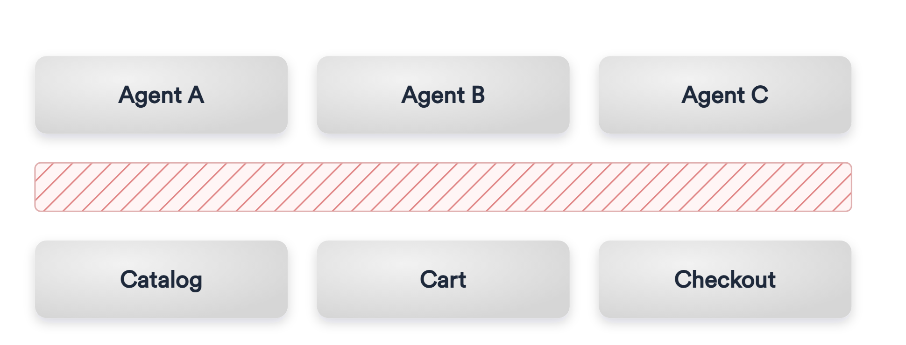
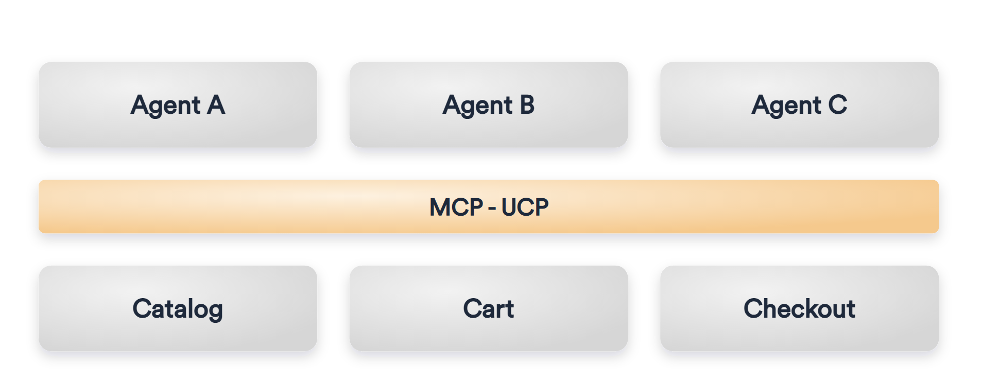
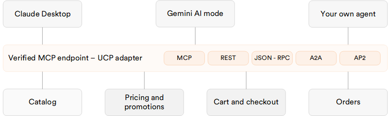

# Virto Commerce UCP Module (Preview)

The Virto Commerce **UCP** module exposes HTTP APIs for Universal Commerce Protocol (UCP) on top of existing Virto Commerce Platform capabilities.

It provides public UCP endpoints for discovery, catalog, cart, checkout handoff, geography, and order tracking operations. Requests are adapted to in-process Virto Commerce xAPI calls and platform services without an additional HTTP hop inside the platform process. The module also exposes a Streamable HTTP MCP endpoint at `/ucp/mcp`.

Canonical public UCP endpoints are published without the `/api` prefix.

The UCP module is a protocol adapter. It does not replace the **Catalog**, **Cart**, **Orders**, **xAPI**, **Store**, or **Marketing** modules. It provides a compact UCP-oriented HTTP surface for external clients while delegating commerce behavior to existing Virto Commerce modules.

UCP lets any compliant AI agent discover, browse, and check out a store through one verified endpoint. It replaces a custom integration per agent or surface. The store stays the merchant of record, keeping its own checkout, customer data, and pricing rules.

Every AI surface that wants to sell a store's products used to need its own adapter, with custom contracts, auth, and mapping per surface. UCP collapses that into one protocol: build once, and every compliant agent can transact.

-   __Before:__

    ---

    

-   __After:__

    ---

    

## Integration architecture

Agents connect to a single verified MCP endpoint. This UCP adapter delegates to existing Virto Commerce capabilities, with no data duplication and no parallel checkout.

{: style="display: block; margin: 0 auto;" }

## Supported ecommerce flow

UCP standardizes what shopping does rather than how a store's pages look. The same flow runs in chat, voice, or visual commerce. Each stage maps to the module's endpoints:

{: style="display: block; margin: 0 auto;" }

Try our interactive demo to explore key features in action:

  
  

    <iframe loading="lazy" class="sl-demo" src="https://app.storylane.io/demo/4zux2o39dumz?embed=inline" name="sl-embed" allow="fullscreen" allowfullscreen style="position:absolute;top:0;left:0;width:100%!important;height:100%!important;border:1px solid rgba(63,95,172,0.35);box-shadow: 0px 0px 18px rgba(26, 19, 72, 0.15);border-radius:10px;box-sizing:border-box;"></iframe>
  

## Key features

The module provides the following capabilities:

* **UCP discovery profile**: `/.well-known/ucp` publishes supported capabilities, default store metadata, endpoint metadata, headers, auth shape, integration guidance, payment handlers, and structured error codes.
* **Catalog search and product details**: catalog search and product detail lookup through in-process **xCatalog** GraphQL.
* **Cart assembly**: create, buyer-scoped list, get, and full-state update through **xCart** GraphQL with UCP replacement semantics.
* **Checkout handoff**: checkout snapshot and hosted handoff with address prefill. Temporary handoff sessions are stored through `IDistributedCache` with TTL. Redis is recommended for production. An in-memory fallback is registered for local and single-node deployments.
* **Order tracking**: order status, totals, line items, and shipment tracking by order id, order number, or cart id after handoff.
* **Geography lookup**: country and region resolution through the platform `ICountriesService` for checkout address normalization.
* **Streamable HTTP MCP server**: `/ucp/mcp` with typed UCP commerce tools for the installed Frontend, built on the official C# MCP SDK.
* **Buyer context propagation**: header-based B2B buyer delegation through `X-Buyer-User-Id` and `X-Buyer-Organization-Id`.
* **Structured UCP errors**: machine-readable error codes with correlation id support.
* **OpenTelemetry observability**: correlated tracing and metrics across the UCP operation, the xAPI call, and downstream dependencies. See [Observability](configuration.md#observability).

!!! note
    New UCP features are coming soon: delivery and payment method selection, carrier-level shipment tracking, faceted catalog filters, and OAuth2 or OIDC buyer delegation.

## Architecture

The module is an in-process adapter over xAPI. A UCP request is processed as follows:

1. A client calls a canonical UCP endpoint.
1. The controller accepts the HTTP request and delegates work to a UCP service.
1. The service normalizes the UCP request context: store, currency, culture, pagination, and buyer headers.
1. Catalog operations are translated to xCatalog GraphQL queries.
1. Cart operations are translated to xCart GraphQL queries and mutations.
1. `IXApiInProcessExecutor` runs GraphQL inside the current platform process.
1. The service maps xCatalog, xCart, Orders, Store, and platform dictionary data back to UCP response models.

Buyer delegation is header-based, through the following headers:

- `X-Buyer-User-Id`
- `X-Buyer-Organization-Id`

The service adds buyer claims to the principal used for xAPI execution. Delegated B2B context then flows through existing Virto Commerce authorization and context mechanisms.

## Module structure

The module is organized into the following projects.

| Project | Purpose |
| --- | --- |
| `VirtoCommerce.UCP.Core` | Protocol models, service contracts, module constants, options, and errors. |
| `VirtoCommerce.UCP.Data` | Provider-neutral UCP application services and integration logic. |
| `VirtoCommerce.UCP.ExperienceApi` | xAPI schema marker for the module. |
| `VirtoCommerce.UCP.Web` | Module entry point, controllers, filters, GraphQL executor, and DI registrations. |
| `VirtoCommerce.UCP.Tests` | Unit tests for discovery, catalog, cart, checkout handoff, geography, and order tracking behavior. |

The module does not define a UCP database model and does not run module database migrations.

## Dependencies

The module manifest declares the following runtime dependencies.

| Module | Version |
| --- | --- |
| `VirtoCommerce.Xapi` | `3.1001.0` |
| `VirtoCommerce.XCatalog` | `3.1000.0` |
| `VirtoCommerce.XCart` | `3.1016.0` |
| `VirtoCommerce.Store` | `3.1004.0` |
| `VirtoCommerce.Orders` | `3.1000.0` |
| `VirtoCommerce.Marketing` | `3.1000.0` |

Target framework: `.NET 10`.

The module also declares `VirtoCommerce.OpenTelemetry` `3.1001.0` as an optional dependency, used for [observability](configuration.md#observability). The **UCP** module starts normally when it is not installed.

 
 
********

    <a href="../../Background-Jobs/overview">← Background Jobs</a>
    <a href="../quickstart">Quickstart →</a>

