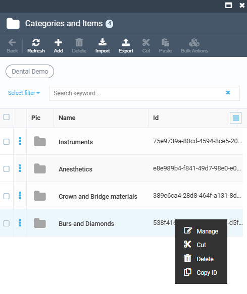

## Import products, prices and stock quantities from CSV

To bulk add new products, along with their prices and stock quantities at each fulfillment center, you can use the CSV file import option.

!!! note
    Importing products to catalogs requires the preinstalled [Catalog CSV Import module](https://github.com/VirtoCommerce/vc-module-catalog-csv-import).

Importing information from a CSV file includes the following steps:

1. [Creating price list.](catalog-creation.md#create-price-list)
1. [Preparing a CSV file.](catalog-creation.md#prepare-csv-file)
1. [Importing your CSV file to catalog.](catalog-creation.md#import-csv-file-to-catalog)
1. [Connect your store to your catalog.](catalog-creation.md#connect-store-to-virtual-catalog)
1. [Creating price list assignment.](catalog-creation.md#create-price-list-assignment)

### Create price list

1. Create a new price list (Dental Demo in our case) according to [this guide](https://docs.virtocommerce.org/platform/user-guide/pricing/creating-new-price-list/#create-new-price-list). 
1. Copy the Id of the created price list to clipboard.

!!! note
    If not set by default, you can find the Price list Id column by clicking the hamburger menu in the top right corner and then checking **Id**:

    

### Prepare CSV file

1. Create a CSV file containing all the necessary columns, i.e., product name, Id, SKU, price, price list Id, etc. To create a new catalog within this guide, we will [download this sample file](DentalDemo-Catalog.csv) to use as a template. 

1. Paste the copied price list Id to the **PriceListId** column.

    

1. Add a **CategoryPath** column to specify the product's separate category in a catalog as follows:

    

1. Copy the ID of the newly created categories:

    

    Then paste it to the **CategoryID** column:

     

1. Copy the fulfillment center ID from the Inventory module:
    
    

    Then paste it to the **FulfillmentCenterId** column:

    

    You may also specify quantities in stock in the **Quantity** column.

1. Fill the **PrimaryImage** column with links to images to provide a product's image.
1. Specify **ListPrice** to display regular product price.
1. Add and fill in other columns according to your requirements.

Your CSV file is ready for import.

### Import CSV file to catalog

Import your CSV file according to [this guide](https://docs.virtocommerce.org/platform/user-guide/catalog/import-catalog/).

After importing is finished, you can see your catalog is filled with products. Each product has a full description:

Now you need to assign your price list to your catalog. You may assign it to the physical catalog, that you have already created or to a virtual catalog. For demonstration purposes, we will show you how to create a virtual catalog.

### Connect store to catalog

1. Click **Stores** in the main menu.
1. In the next blade, select your store (Dental Demo Store in our case).
1. In the next blade, select your catalog from the dropdown list (Dental Store in our case).

    

1. Click **Save** in the toolbar.

Now your store displays products from your catalog.

### Create price list assignment

Create a price list assignment to connect the price list (**Dental Demo** in our case) to the store displayed in the Frontend Application (**Dental Demo Store** in our case).

1. In the main menu, click **Pricing**.
1. In the next blade, click **Price Lists**.
1. In the next blade, select the required price list (**Dental Demo** in our case).
1. In the next blade, click on the **Assignments** widget. 
1. In the next blade, click **Add** in the top toolbar.
1. In the next blade, fill in the fields as follows:

    

1. Click **Create**.

Your new assignment appears in the list of assignments.

## View results on frontend

1. In the main menu, click **Stores**.
1. In the next blade, click on the required store (**Dental Demo Store** in our case).
1. In the next blade, click **Open in browser** in the top toolbar.

{: width="750"}

The catalog categories are displayed as follows:

The CSV file columns are displayed as follows:

The properties are displayed as facets:

The product properties are also displayed in the product cards:

## View results on frontend

1. In the main menu, click **Stores**.
1. In the next blade, click on the required store (**Dental Demo Store** in our case).
1. In the next blade, click **Open in browser** in the top toolbar.

{: width="750"}

The catalog categories are displayed as follows:

The CSV file columns are displayed as follows:

