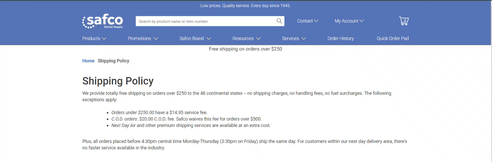
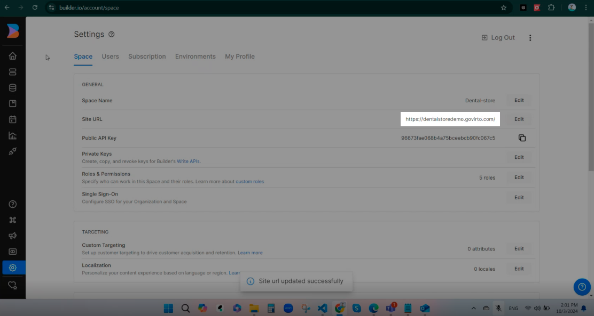
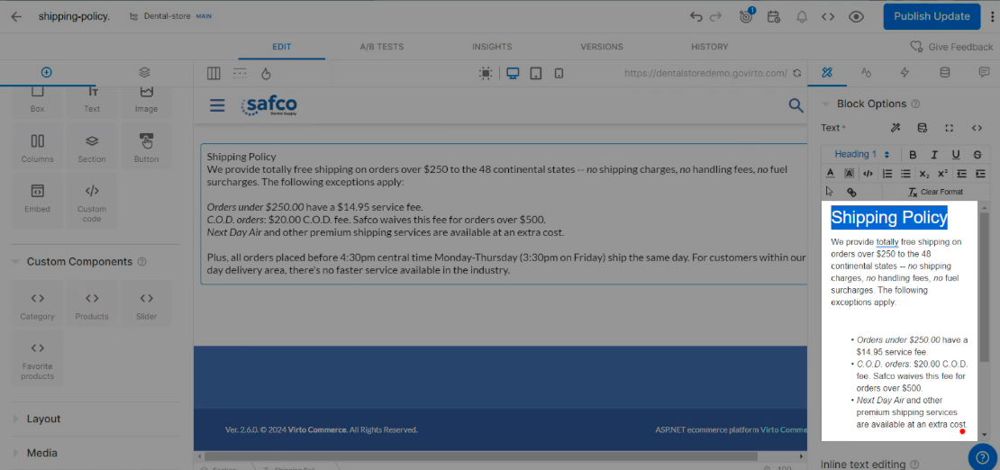
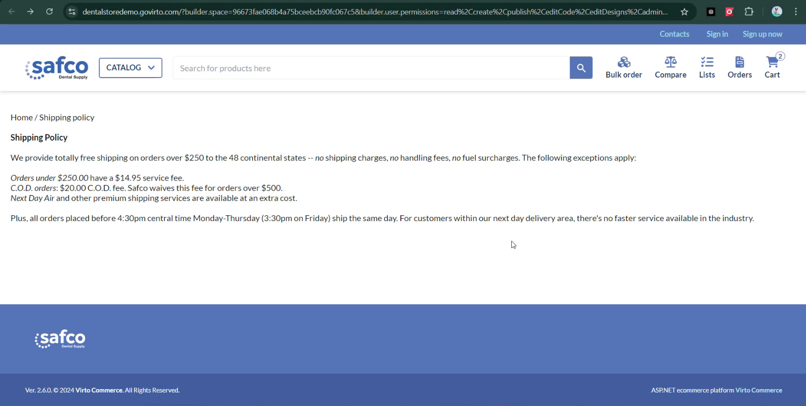

# Create Page in Builder.io

Builder.io is an intuitive solution that allows anyone on your team to manage Frontend Application pages without having to rely on developers. As long as Virto Frontend Application has native integration with Builder.io, you can start using it right away:

1. Enable Builder.io using [this guide](https://docs.virtocommerce.org/platform/user-guide/integrations/builder-io/getting-started/).
1. Start using Builder.io according to [this guide](https://docs.virtocommerce.org/platform/user-guide/integrations/builder-io/use-builder-io/).

{: width="25"} [Builder.io Integration](https://docs.virtocommerce.org/platform/user-guide/integrations/builder-io/overview/)

## Create **Shipping Policy** page

Let's create the Shipping Policy page in Builder.io using the following example:

1. Open your space in Buidler.io, then click **New Entry**. 
1. Enter page name and URL, then click **Create Page**:

    

1. Make sure the site URL is specified correctly (**Settings** --> **Space** tab --> **Site URL**). https://dentalstoredemo.govirto.com/ in our case

    

1. The newly created page already contains a header and a footer that maintain the UI and design of the Virto Frontend Application. Let's add a **Section** block to our page.

    ! note
        In Builder.io, the Section block is a layout container used for organizing and structuring content on a page. It allows you to create distinct content sections that you can style, position, and modify independently. For better content segmentation, group blocks with similar themes or ideas within a single section.

1. Add a **Text** block into the section. Type or paste text into the block options segment:

    

1. Correct the formatting.
1. Click **Publish** in the top right corner. 

Now you can preview your page:

