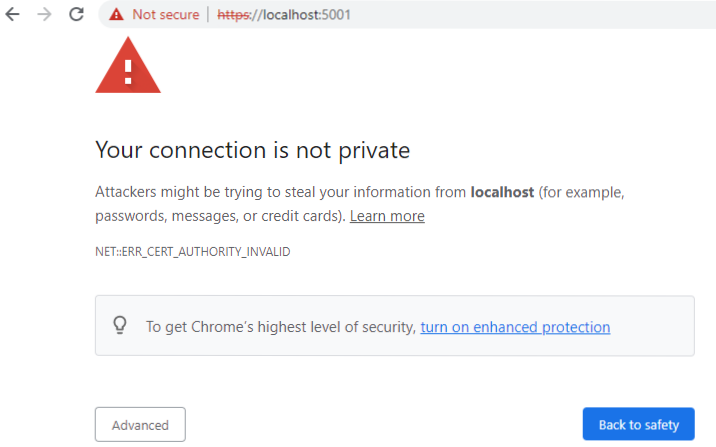

# Setting up Self-signed SSL Certificate

Running Virto Commerce Platform with HTTPS requires using an SSL certificate. When it comes to non-production applications or development and testing scenarios, you can use a self-signed certificate. 

{: width="25"} [First Time Launch](../Installation-Guide/windows.md#perform-initial-sign-in) 

Although such a certificate implements full encryption, the visitors of your website will see a browser warning saying the certificate should not be trusted.

When you first launch the platform with HTTPS enabled at [https://localhost:5001](https://localhost:5001/), you may also get this warning:

This is because it is a locally generated, untrusted SSL certificate.

If this warning appears:

1. Run `dotnet dev-certs https --trust`

1. Click **Yes** in a popup dialog asking to install this localhost certificate:

    

1. Close your browser and open it again at [https://localhost:5001](https://localhost:5001/). The trusted **Secure** badge appears in your browser (a lock icon):

    

{: width="25"} [Microsoft .NET guide on self-signed certificates](https://docs.microsoft.com/en-us/dotnet/core/additional-tools/self-signed-certificates-guide)

