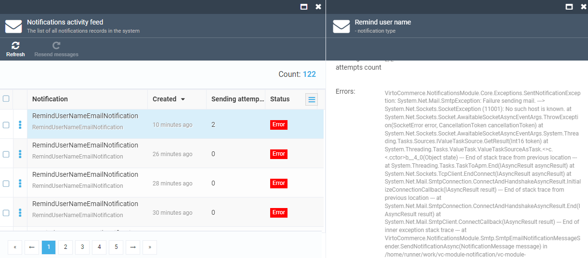

# Configure Email Notifications
Virto Commerce Platform enables sending email notifications for various system events, such as restoring passwords, customer order processing, etc. To send such notifications, use a third-party email service provider by setting up an mail gateway so that the Platform may start sending emails. Currently, there are two gateway options: SMTP and SendGrid.

## Prerequisites

* [Notification module](https://github.com/VirtoCommerce/vc-module-notification)

## Configure SMTP email settings

To enable sending notifications through Gmail:

1. Enable **2-Step Verification** on your Google Account if it is not already active:
   Go to [Google Account Security](https://myaccount.google.com/security) --> **How you sign in to Google** --> **2-Step Verification**.

1. Generate an **App Password**:
   Go to [https://myaccount.google.com/apppasswords](https://myaccount.google.com/apppasswords), enter a name (e.g. VirtoCommerce), and click **Create**. Copy the generated 16-character password.

    !!! note
        App Passwords are only available when 2-Step Verification is enabled. If you do not see the App Passwords option, check that your account is not a managed Workspace account with App Passwords disabled by an administrator.

1. Edit the **Notifications** section in the **appsettings.json** file:

    ```json title="appsettings.json"
    ...
    "Notifications": {
        "Gateway": "Smtp",
        "DefaultSender": "noreply@gmail.com", //the default sender address
        "Smtp": {
            "SmtpServer": "http://smtp.gmail.com",
            "Port": 587, //TLS port
            "Login": "", //Your full Gmail address (e.g. you@gmail.com)
            "Password": "" //The password that you use to log in to Gmail
        },
    },
    ....
    ```

!!! warning
    After modifying the **appsettings.json** file, restart the application to apply the changes.

## Configure SendGrid email settings
To work with the SendGrid settings:

1. Register a SendGrid account according to [this SendGrid article](https://docs.sendgrid.com/for-developers/partners/microsoft-azure-2021).

1. Edit the **Notifications** section in the **appsettings.json** file:

    ```json title="appsettings.json"
    ...
    "Notifications": {
        "Gateway": "SendGrid",
        "DefaultSender": "noreply@gmail.com", //the default sender address
        "SendGrid": {
            "ApiKey": "your API key", //SendGrid API key
        },
    },
    ....
    ```

## Test notification sending process

To test your notifications, use REST Admin API queries that require a valid access token.

To test whether an email has been sent successfully:

1. Run the query:

    ```
    curl -X POST "https://localhost:5001/api/notifications/send" -H  "accept: text/plain" -H  "Authorization: Bearer {access_token}" -H  "Content-Type: application/json-patch+json" -d '{"type":"RemindUserNameEmailNotification","from":"no-reply@mail.com","to":"{your email}"}''
    ```

1. In case of success, you will receive a test email on your email account. Otherwise, go to **Notifications** → **Notification activity feed** to see which error(s) led to a failure:




<br>
<br>
********

<div style="display: flex; justify-content: space-between;">
    <a href="../01-setting-up-self-signed-ssl-cert">← Setting  up self-signed SSL certificate</a>
    <a href="../03-configuring-asset-blob-storage">Configuring asset blob storage →</a>
</div>