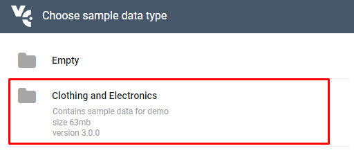

# Import Sample Data

To help you explore Virto Commerce's capabilities, we provide a sample dataset that you can import to automatically populate various entities. On the first launch, the platform displays a wizard that will prompt you to choose and import sample data. Currently, we offer the **B2B Sample Store** sample dataset, which includes products, categories, customers, and other demo data that help developers and platform managers learn how Virto Commerce works.

{: style="display: block; margin: 0 auto;" }

Sometimes you might not want to import sample data right away and can skip this step. If so, you will have to manually import it later.

## Import Sample Data Manually

To import sample data manually:

1. Click **Settings** in the main menu of the Virto Commerce Platform.
1. In the next blade, select **Platform**.
1. Click **Setup**.
1. In the next blade, click on the **Import sample data** widget:

    {: style="display: block; margin: 0 auto;" }

1. Confirm sample data installation.
1. Select **B2B Sample Store** in the popup window. 
1. Wait for the sample data to be downloaded and imported into your system. 

Now you have a complete sample dataset that is ready to use.

