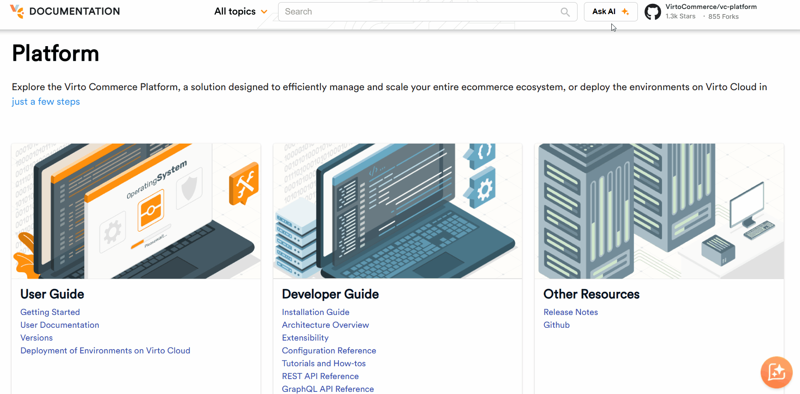

# AI Assistance

Virto Commerce provides three complementary AI-grounding tools. They differ in setup effort and in the stage of work they suit best, from one-off questions to active coding sessions. Pick the one that matches your workflow, or combine all three:

| Tool            | Effort                                  | Best for                                                                  |
|-----------------|-----------------------------------------|---------------------------------------------------------------------------|
| [Virto OZ](#virto-oz)       | Zero install, built into the docs site.  | Browsing-while-reading, step-by-step guides with links to actual articles. |
| [llms.txt](#llmstxt)    | Zero install, works in any chat.        | One-off questions, evaluating Virto Commerce, no tooling commitment.       |
| [Context7 MCP](#context7-mcp)  | One-time MCP install in your editor.     | Active coding sessions, persistent project work, code generation.         |

## Virto OZ

Virto OZ is an integrated AI-powered assistant designed to help users navigate, learn, and work more efficiently with Virto Commerce. It provides instant, context-aware support across the documentation, offering explanations, examples, and guidance based on the user’s current topic or query.

<br>
<br>


With Virto OZ, you can:

Ask questions in native language and get precise, documentation-based answers. Virto OZ handles typos perfectly, ensuring you get accurate results even with small mistakes.
Receive relevant links to related topics for deeper learning.
Save time by exploring features, configurations, and best practices directly within the documentation.

<br>
{: width="25"} [Virto OZ interactive demo](/platform/user-guide/virto-oz)

### Using Virto OZ as an MCP connector

Beyond the in-docs widget, Virto OZ is also available as a Model Context Protocol (MCP) connector. This lets you query Virto Commerce documentation directly from Claude Web, Claude Desktop, and Claude Code without leaving your client. The connector can be enabled at two scopes:

* **Organization scope**. This setup covers Claude Web and Claude Desktop. An Anthropic Console administrator adds the **VirtoOZ** connector to your organization once. After that, every member of the organization can use it in Claude Web and Claude Desktop with no further setup on their part.

* **User scope**. This setup covers Claude Code on an individual developer's machine. Register the connector with one CLI command:

    ```
    claude mcp add --transport http --scope user virtooz https://virtooz.virtocommerce.com/v1/
    ```

    The `--scope user` flag makes the connector available across all your Claude Code sessions on this machine. Use `--scope project` instead to commit the MCP configuration to **.mcp.json** in a repository so teammates inherit it automatically.

## llms.txt

Using **llms.txt** is the fastest way to ground any AI assistant on current Virto Commerce documentation. It does not require installation, MCP server, editor plugin, just a URL you paste into a prompt:

```
Before answering, please read https://docs.virtocommerce.org/llms.txt to learn about the latest Virto Commerce documentation, then answer my question: What are the main extensibility options in Virto Commerce?
```


<br>
{: width="25"} [Using llms.txt](../Tutorials-and-How-tos/How-tos/using-llms-txt.md)


## Context7 MCP

When using an AI assistant for Virto Commerce specific issues, the generated output may only appear correct. This happens because language models are trained on static datasets. Since Virto Commerce evolves continuously, the AI-generated content may reference outdated patterns.

To eliminate this, Virto Commerce documentation is now available through Context7, an MCP (Model Context Protocol) server that provides AI assistants with access to current official documentation during prompt execution.

Context7 retrieves version-specific documentation and relevant code examples directly from Virto Commerce documentation and source repositories, allowing AI-generated responses to be grounded in current platform behavior rather than historical training data.

After configuring Context7 as an MCP server in your editor or AI client, append use context7 to platform-specific prompts to trigger documentation retrieval before generation:

```
Implement a custom pricing calculator service in a Virto Commerce module. use context7
```
<br>
<br>
{: width="25"} [Using Context7](../Tutorials-and-How-tos/How-tos/using-context7.md)

<br>
<br>
********

<div style="display: flex; justify-content: space-between;">
    <a href="../quick-start">← Quick start </a>
    <a href="../system-requirements">System requirements →</a>
</div>