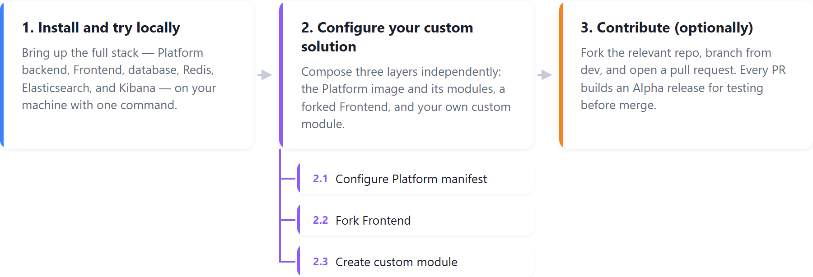

# Quick Start

This guide gets you from a fresh machine to a running Virto Commerce solution in three stages:

* [Install and explore locally.](#install-and-try-locally)
* [Configure your own customizations.](#configure-your-custom-solution)
* [(Optionally) contribute back.](#contribute-optionally) 

{: style="display: block; margin: 0 auto;" }

## Install and try locally

Use `start-local` to bring up the full Virto Commerce stack (Platform backend, Frontend, database, Redis, Elasticsearch, and Kibana) on your machine in one PowerShell command:

```powershell
$installSCript = Invoke-WebRequest -Uri "https://raw.githubusercontent.com/VirtoCommerce/start-local/dev/VirtoLocal_create_local_files.ps1" -UseBasicParsing; Set-Content -Path ".\VirtoLocal_create_local_files.ps1" -Value $installSCript.Content; .\VirtoLocal_create_local_files.ps1
```

Open `http://localhost:8090` and sign in with `admin` / `store` to access the Platform admin.

<br>
{: width="20"} [Local install with start-local. Prerequisites, lifecycle commands, customization, and troubleshooting](Installation-Guide/start-local.md)

!!! note
    Virto Commerce also offers a hosted demo (trial) environment for evaluating the Platform without installing it. Access is granted to authorized users only.

## Configure your custom solution

A Virto Commerce solution is **composed**, not forked. Customize three layers independently.

1. Configure the Platform:

    !!! warning
        **Do not fork the Platform backend.** Forking `vc-platform` and tracking an upstream remote puts you on the "customize-by-source-modification" path, which breaks [seamless delivery](../Extensibility/overview.md#seamless-delivery) and creates a long-term merge tax on every update. The Platform source is published for transparency only.

    You do **not** need a platform fork to get source control and deployment from your own repository:

    * **Platform image:** Use the Virto-provided platform Docker image as-is — you do not build or maintain your own. Select the image and the modules to install; custom images you upload appear in the same dropdown.
    * **Customizations:** Keep each custom module in its own repository and ship it as a package (see [Create a custom module](#configure-your-custom-solution) below).
    * **Source-controlled deployment:** Drive deployment from your own Git repository with [GitOps](/platform/deployment-on-cloud/latest/enable-gitops/). Your deploy repo references the platform image, module artifacts, and frontend; Virto Cloud syncs from it. See [Backend customization on Virto Cloud](/platform/deployment-on-cloud/latest/backend-customization/) for the end-to-end flow.

    Then:

    1. Define which modules to install via a [package.json](https://github.com/VirtoCommerce/vc-modules/blob/master/modules_v3.json).
    1. Configure runtime behavior via [appsettings.json](../Configuration-Reference/appsettingsjson.md). 

1. Fork the [Frontend](https://github.com/VirtoCommerce/vc-frontend) for branding and customization. Track upstream to receive releases.

1. Create a custom module:

    1. Scaffold the module:

        ```powershell
        dotnet new install VirtoCommerce.Module.Template
        dotnet new vc-module --ModuleName MyModule --Author "Me" --CompanyName MyCompany
        ```

    1. Build the package:

        ```powershell
        vc-build compress
        ```

    1. Install the resulting **ZIP** via **Modules → Advanced → Install from file**, then iterate.

    1. Use the [Extensibility Framework](../Extensibility/overview.md) to add entities, override services, extend APIs, and add admin UI without forking.

{: width="20"} [Custom module guide](../Tutorials-and-How-tos/Tutorials/creating-custom-module.md)

{: width="20"} [vc-build](../CLI-tools/overview.md)

{: width="20"} [Deploying on Virto Cloud](/platform/deployment-on-cloud/latest/deploy-on-virto-cloud/)

## Contribute (optionally)

Virto Commerce welcomes contributions: code, docs, bug reports, and feature ideas. Follow this path to submit your first pull request.

1. Fork the relevant repo:
    * [vc-platform](https://github.com/VirtoCommerce/vc-platform)
    * [vc-module-catalog](https://github.com/VirtoCommerce/vc-module-catalog)
    * [vc-frontend](https://github.com/VirtoCommerce/vc-frontend), or another.
1. Branch from **dev** (not **master**): `git checkout -b feature/short-description`.
1. Push to your fork and open a PR against upstream **dev**.
1. **Sign the CLA** when prompted on your first PR.
1. Each PR builds an [Alpha release](../Updating-Virto-Commerce-Based-Project/release-strategy-overview.md) so you can test before merge.


You now have the foundation to explore, extend, and contribute to the Virto Commerce Platform.

<br>
<br>
********

<div style="display: flex; justify-content: space-between;">
    <a href="../..">← Overview </a>
    <a href="../ai-quick-start">AI assistance →</a>
</div>

