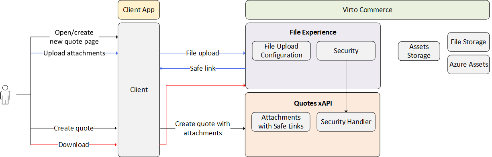

# xFile

The **xFile** module manages all file-related operations for various client applications. 

Its architecture is designed to:

* Support different file providers.
* Offer an intuitive developer experience.
* Facilitate extensible post-processing.
* Seamlessly integrate with xAPI (GraphQL).

??? "Architecture"

    

    The file upload solution generally operates as follows:

    1. The developer integrates a form onto the quote page to gather files.
    2. Users attach files to the form.
    3. The form transmits the files to the **VirtoCommerce.FileExperienceApi** module.
    4. This module processes the files, generating secure links for them, and returns these links.
    5. The quote page then stores these links.

This function is now used on our Frontend to [attach files to the created quotes](/storefront/user-guide/latest/shopping/submit-quotes). However, developers can now add the file uploader to any segment, such as the Order module.  

## Key features

The xFiles modules provides the following features:

* **Isolation**: File upload operations are scoped, allowing for defined settings and isolation from mutations. The process involves uploading files to blob storage and then manipulating them via xAPI, creating the Xapi.FileUpload module.
* **Intuitive developer experience**: The file upload process supports different upload processes with customizable validation rules, such as file extensions, count, size limits, and antivirus scanning. Developers can access core validation settings by scope for client-side validation.
* **Extensible post processing**: File upload process supports post-processing actions like AI integration, leveraging a pipelines architecture for extensibility.
* **Ready to use with client applications**: xAPI supports file usage with mutations and queries, enabling seamless integration with client applications.
* **Security**: Anonymous file uploads are disabled by default, ensuring a security-first approach. Clean answers are provided for security inquiries.

| Queries               	                            | Objects                                                      	            | Mutations                                 |
|----------------------------------------------------	|-------------------------------------------------------------------------	|----------------	                        |
| [fileUploadOptions](Queries/fileUploadOptions.md) 	| [FileUploadScopeOptionsType](Objects/FileUploadScopeOptionsType.md)   	| [deleteFile](Mutations/deleteFile.md) 	|

