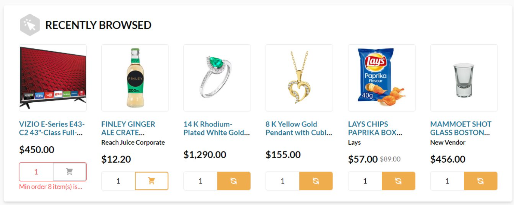

# recentlyBrowsed ==~query~==

This query allows you to retrieve a list of products recently browsed by the user.

## Arguments

| Argument                       | Description                                                                                     |
|--------------------------------|-------------------------------------------------------------------------------------------------|
| `storeId` ==String!==          | The ID of the store to retrieve recently browsed products from.                                  |
| `cultureName` ==String==       | The language to retrieve data in.                                                               |
| `currencyCode` ==String==      | A standardized code for the specific currency.                                                  |
| `maxProducts` ==Int==          | The maximum number of recently browsed products to return.                                      |

## Possible return

| Possible return                                                   | Description                                                               |
|-------------------------------------------------------------------|---------------------------------------------------------------------------|
| [`GetRecentlyBrowsedResponseType`](../object/GetRecentlyBrowsedResponseType.md)  | Defines the properties and fields associated with the recently browsed products response. |

## Example

=== "Query"
    ```json linenums="1"
    {
      recentlyBrowsed(
        storeId: "B2B-Store"
        cultureName: "en-US"
        currencyCode: "USD"
        maxProducts: 6
      ) {
        products {
          id
          name
          code  
        }
      }
    }
    ```

=== "Return"
    ```json linenums="1"
    {
      "data": {
        "recentlyBrowsed": {
          "products": [
            {
              "id": "product-1",
              "name": "VIZIO E-Series E43-C2 43\" Class Full-HD TV",
              "code": "VIZIO-E43-C2"
            },
            {
              "id": "product-2",
              "name": "FINLEY GINGER ALE CRATE",
              "code": "FINLEY-GINGER"
            },
            {
              "id": "product-3",
              "name": "14K Rhodium-Plated White Gold Ring with Emerald",
              "code": "RING-14K-WHITE"
            },
            {
              "id": "product-4",
              "name": "8K Yellow Gold Pendant with Cubic Zirconia",
              "code": "PENDANT-8K-GOLD"
            },
            {
              "id": "product-5",
              "name": "LAYS CHIPS PAPRIKA BOX",
              "code": "LAYS-PAPRIKA"
            },
            {
              "id": "product-6",
              "name": "MAMMOET SHOT GLASS BOSTON",
              "code": "MAMMOET-SHOT-GLASS"
            }
          ]
        }
      }
    }
    ```

    